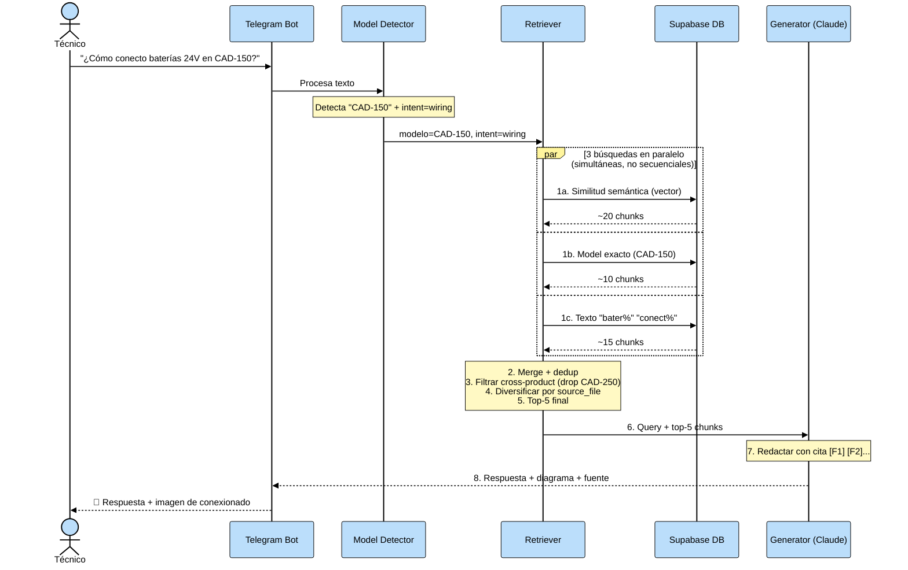
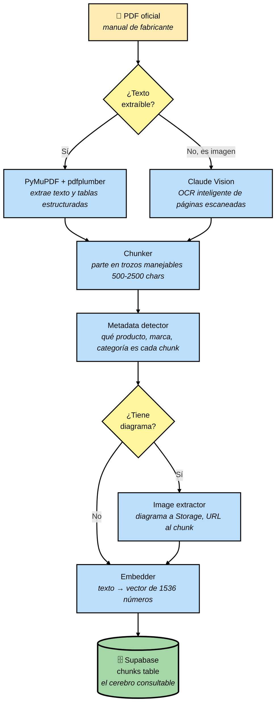
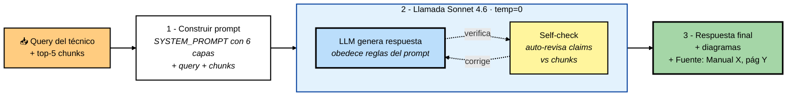
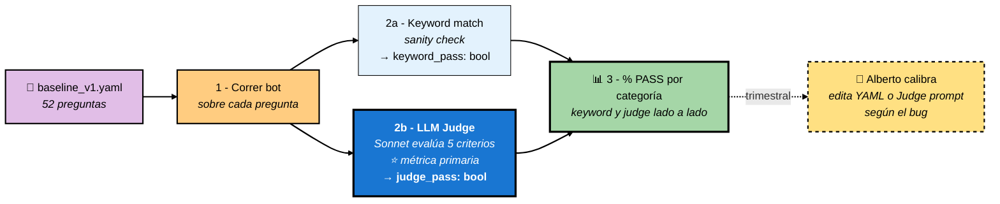
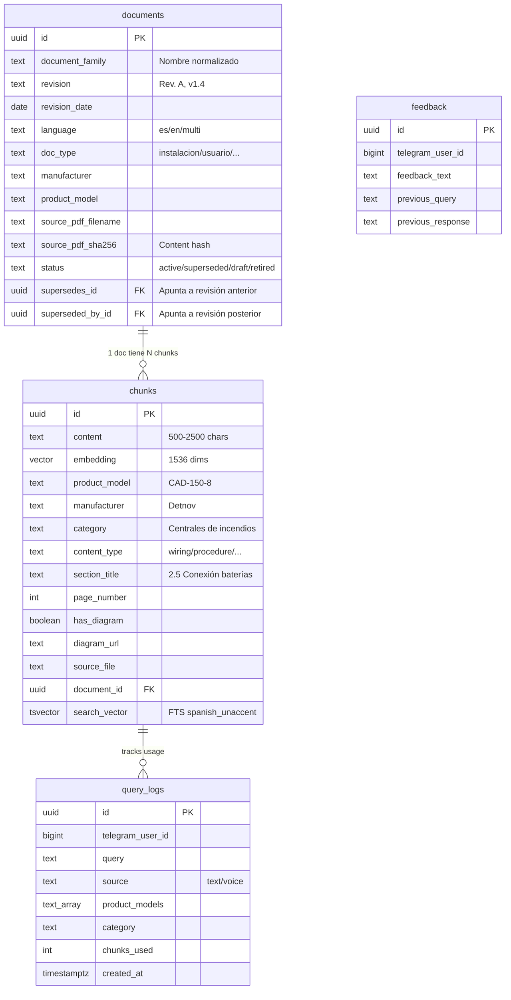

# Technical Bot — Arquitectura explicada

> **Propósito:** explicar cómo funciona el sistema de forma accesible (no hace falta ser ingeniero), por qué cada pieza es necesaria, y qué mejoras tenemos planificadas.
>
> **Audiencia:** Alberto (decisiones estratégicas), inversores (entender el valor técnico), y onboarding técnico futuro.
>
> **Cómo mantener este doc:** cada vez que añadamos/cambiemos algo arquitectural, actualizamos la sección relevante + la fecha + el changelog al final. Reglas concretas en §7.
>
> **📍 Mapa canónico:** este doc explica **cómo funciona** el sistema (y su estado). El **roadmap + qué sigue** es canónico en `PLAN_RAG_2026.md`; el *por qué* de las decisiones de impacto med/alto en `docs/DECISIONS.md`. El banner de abajo resume el estado; para el plan vigente, ver PLAN.

---

> ## ⚡ Estado del sistema
>
> **El estado vigente + el rumbo NO viven aquí**: son canónicos en
> [`PLAN_RAG_2026.md`](PLAN_RAG_2026.md) (bloque "Estado actual"); la traza histórica de
> sesiones, en [`HISTORY.md`](HISTORY.md). Este doc explica **cómo funciona** el sistema; sus
> cifras se reconcilian al cierre de sesión (§7), pero ante discrepancia manda el PLAN.
>
> Resumen estable (s58 — 10 jun 2026): producción = `chunks_v2` (25.090 chunks / 1.012 docs /
> 31 marcas / 587 modelos; Voyage-4-large 1024 + contextual-retrieval al 100%), retrieve-wide
> 50 → rerank LLM 5 → generador `claude-sonnet-4-6` (con `stop_reason`/`output_tokens`
> instrumentados, s58); HyDE off; identidad de producto data-driven (`config/manufacturers/`
> + sidecar). Eval: **51 golds = 39 dev + 12 held-out embargados** (embargo en puerta +
> lectores-directos), juez GPT-5.5 + K-mayoría. **Baseline K=5 FRESCO (s58, DEC-039)** vía
> `scripts/bvg_kmajority.py` (contexts congelados + juez nuevo congelado de la ventana +
> run-manifest DEC-021 §F): PASS-control fijado 10/39, residual 26 clasificado
> (retrieval-localizado 8 / generación 4 / indeterminado 8), truncamiento descartado.
> Ventana de freeze del corpus ABIERTA (ninguna ingesta hasta cerrar el ciclo A/B→held-out).

## 1. Visión general en 60 segundos

**Qué es:** un chatbot que responde preguntas técnicas de PCI (Protección Contra Incendios) usando **únicamente los manuales oficiales** de los fabricantes que tengamos ingestados. No inventa, cita fuente (*"Manual X, página Y"*), y si no tiene la información lo admite.

**En qué se diferencia de Google / ChatGPT:**

| | Google / ChatGPT | Technical Bot |
|---|---|---|
| Fuentes | Webs, foros, marketing | Solo manuales oficiales |
| Cita verificable | ❌ | ✅ (Manual X, pág. Y) |
| Mezcla fabricantes | ❌ mezcla libremente | ✅ respeta aislamiento |
| Revisión del manual | ❌ última indexada | ✅ gestiona supersede |
| Diagramas del manual | ❌ | ✅ adjunta schemas |
| Admite no saber | ❌ inventa | ✅ *"no tengo esta info"* |
| Voz / Telegram | ❌ | ✅ |

**Dominio:** PCI (Protección Contra Incendios). Fabricantes cubiertos: **31 marcas** en `chunks_v2` (núcleo Notifier/Morley/Detnov + Kidde/Aritech/Edwards/Securiton/Xtralis/Spectrex/Pfannenberg/… — las nuevas entran por el seam de identidad data-driven `config/manufacturers/` + provenance del portal, DEC-035). Plan de expansión: 30+ fabricantes adicionales + dominios vecinos (rociadores, CCTV, control de acceso).

**Contexto estratégico:** Fontiber Industrial Partners está en fase de due-diligence M&A. El chatbot es un multiplicador de valor del grupo: técnicos que antes tardaban 10 min buscando en manuales ahora preguntan y responden en 30 seg. Post-adquisición se despliega en las empresas del grupo.

---

## 2. Vista de pájaro — diagrama completo

### Diagrama 1 — Flujo principal (INGESTA + CONSULTA)

> 💡 **Si las flechas aún se ven tenues en el preview de VS Code:** abre `Ctrl+,` (Settings), busca `markdown-mermaid` y cambia `Markdown-mermaid: Light Mode Theme` y `Dark Mode Theme` a `default`. Eso fuerza fondo claro independiente del tema del editor.

**Cómo leer el diagrama:**

- **INGESTA** (azul, a la izquierda): camino offline que se ejecuta al añadir manuales. Termina metiendo chunks en la DB.
- **DB** (verde, centro): la base de conocimiento. Es el único punto que conecta los dos mundos.
- **CONSULTA** (naranja, a la derecha): camino en tiempo real cuando un técnico pregunta. Lee de la DB pero no la modifica.

**Tres actores:**
- **INGESTA** (arriba, azul) — offline. Cuando añades un manual nuevo, este flujo lo procesa y lo almacena en la DB. Se hace una vez por PDF.
- **DB (en medio, verde)** — la "base de conocimiento". Es el único punto de conexión entre ingesta y consulta. Almacena ~150k chunks.
- **CONSULTA** (abajo, naranja) — tiempo real. Cada vez que un técnico pregunta, este flujo se activa. Consulta la DB pero no la modifica.

### Diagrama 2 — EVAL (proceso de verificación, separado)

EVAL no es independiente al 100%: **reusa la pipeline de CONSULTA** (ejecuta las 52 preguntas del eval contra el bot real). Pero conceptualmente es una capa de medición aparte — no modifica ni ingesta ni corpus, solo observa.

**Feedback loop:** los resultados del eval informan qué cambiar en INGESTA (si el problema es corpus) o en CONSULTA (si es retriever/generator). Por eso el desarrollo es "eval-driven": ningún cambio se commitea sin medir delta.

---

## 3. El viaje de una pregunta — paso a paso

Supongamos: el técnico pregunta *"¿Cómo se conectan las baterías de 24V en la Detnov CAD-150?"*

> 💡 **El bloque negro `par`** es la notación de Mermaid para **paralelo** — las 3 búsquedas ocurren al mismo tiempo (usando `ThreadPoolExecutor` en Python), no una tras otra. Cada una devuelve chunks de la DB independientemente; luego se hace merge. El `and` entre ellas es parte de la sintaxis (no es operación lógica).

**Qué pasa a nivel humano:**

1. **Técnico pregunta** — texto o voz desde Telegram, en cualquier rincón de una obra.
2. **El bot entiende qué modelo** — regex + LLM detectan *"CAD-150"* y tipo de pregunta (conexionado).
3. **Busca en la base de datos** — tres búsquedas en paralelo:
   - *Vector* (entiende el significado): "baterías 24V" es semánticamente similar a "alimentación DC 24V"
   - *Keyword* (modelo exacto): CAD-150
   - *Content* (texto literal): "bater" / "conect"
4. **Filtra ruido** — drop chunks de OTROS productos (CAD-250) y otras marcas.
5. **Diversifica entre manuales** — si CAD-150 tiene 2 manuales (Usuario + Instalación), garantiza chunks de ambos.
6. **Claude redacta la respuesta** — con los 5 chunks + la pregunta, compone una respuesta citando cada afirmación.
7. **Adjunta diagrama** — si el chunk tenía un esquema de cableado, lo envía como imagen.

**Tiempos típicos:** 3-6 segundos end-to-end. La parte lenta es el LLM redactando (3-4s).

---

## 4. Los 4 procesos clave en detalle

### 4.1 INGESTA — "crear el cerebro"

**Qué hace cada etapa y por qué es necesaria:**

**(1) Parseo del PDF** — un PDF no es texto directo sino una estructura compleja con columnas, tablas e imágenes. PyMuPDF + pdfplumber capturan texto y tablas. Claude Vision actúa como fallback cuando el texto está "pintado" (screenshots, pantallazos de menús, diagramas).

> **Por qué importa:** una parte significativa de los manuales PCI tienen tablas de specs con estructura compleja. Sin pdfplumber, perdemos esas tablas. Sin Vision, perdemos los pantallazos de menús (que dominan en manuales de software/configuración). Los tres extractores son complementarios.

**(2) Chunking** — dividir un manual de 100 páginas en ~500 fragmentos manejables (500-2500 caracteres cada uno). La razón es doble: (a) los LLMs tienen límite de contexto, (b) queremos recuperar solo lo relevante, no el manual completo.

> **Por qué importa:** si chunkeamos mal (muy grande → no cabe en el prompt; muy pequeño → pierde contexto), la calidad cae dramáticamente. El chunker trabaja por secciones reconocidas del manual (títulos 1.1, 2.3, etc.). Mejora futura planificada: "semantic chunking" usando similitud de embeddings para detectar límites naturales.

**(3) Metadata extraction** — para cada chunk detectamos: qué producto describe (ej: CAD-150), qué marca (Detnov), qué categoría (Centrales de incendios), y qué tipo de contenido es (procedure / specification / wiring / troubleshooting / general).

> **Por qué importa:** sin metadata, el retriever no puede filtrar por "solo Detnov" o "solo wiring". Filtrar antes del LLM = mayor precisión en la respuesta.

**(4) Extracción de imágenes** — si un chunk tiene un diagrama/esquema asociado, lo extraemos como imagen aparte, lo subimos a Supabase Storage, y guardamos la URL en el chunk.

> **Por qué importa:** el bot adjunta diagramas de cableado / esquemas de conexión en la respuesta al técnico. Sin este paso, solo podría describir los diagramas con texto.

**(5) Embedding** — convertimos cada chunk en un vector de 1536 números. Vectores que representan conceptos similares están "cerca" entre sí en un espacio multidimensional.

> **Por qué importa:** las búsquedas "¿consumo en reposo?" deben encontrar chunks con "current draw" aunque no compartan palabras. Embedding lo resuelve. Coste: ~$0.02 por cada 1M tokens procesados.

> **Concepto técnico: ¿por qué exactamente 1536 dimensiones?** Es la dimensión de salida estándar del modelo OpenAI `text-embedding-3-small`. Menos dimensiones (p.ej. 512) darían embeddings más baratos pero peor calidad semántica (más colisiones entre conceptos distintos). Más dimensiones (p.ej. 3072 de `text-embedding-3-large`) son ~4× más caras y ~2× más lentas de buscar sin mejora significativa en nuestro dominio PCI. **1536 es el sweet spot calidad/coste/latencia.**

**(6) Storage en Supabase** — Postgres con la extensión `pgvector` almacena los embeddings y permite búsqueda por similitud coseno. Las imágenes van a Supabase Storage (bucket `manual-images`).

> **Por qué importa:** Supabase consolida DB + storage + auth + vector search en un único servicio managed. Alternativa sería manejar Pinecone + S3 + Postgres por separado (3 servicios, 3 costes, 3 integraciones). Para el tamaño actual del corpus (~168k chunks), pgvector ivfflat con `lists=100` ofrece latencia sub-segundo.

**Corpus actual:** ~168k chunks distribuidos en ~1.064 documentos, cubriendo 3 fabricantes PCI (Detnov 18.7k, Notifier 116.9k, Morley 32.0k). Arquitectura diseñada para escalar a 30+ fabricantes (ver §6b).

---

### 4.2 RETRIEVAL — "encontrar el fragmento correcto"

**Por qué retrieval es el paso más crítico del sistema:**

El LLM solo ve los fragmentos que le pasamos. Si el retrieval no trae el chunk correcto → el LLM no puede responder correctamente. **Garbage in, garbage out.** Cada etapa del diagrama resuelve una parte distinta del problema "¿qué fragmentos son realmente relevantes para esta pregunta?".

**Qué hace cada etapa y por qué es necesaria:**

**(1) Detectar modelo + intent** — antes de buscar nada, el sistema analiza la query para extraer (a) qué modelo de producto menciona el usuario (ej. *"CAD-150"* vía regex sobre el texto), y (b) qué tipo de pregunta es: wiring / spec / troubleshooting / procedure.

> **Por qué importa:** si sabemos el modelo, podemos filtrar drásticamente qué chunks son candidatos. Si sabemos el intent, podemos priorizar chunks con `content_type` correspondiente (ej. para una query wiring, priorizamos chunks de conexionado sobre chunks de specs).

**(2) Tres búsquedas en paralelo** — ejecutamos 3 consultas SQL **simultáneamente** (no una tras otra) usando `ThreadPoolExecutor`. Cada una ataca la base de datos con un enfoque distinto:

- **Vector search** — calcula el embedding de la query y busca chunks con embeddings cercanos en el espacio vectorial (similitud coseno). Captura equivalencia de significado: *"consumo en reposo"* encuentra chunks con *"current draw at rest"* aunque no compartan palabras.
- **Keyword search** — busca por `product_model` literal en la BD. Captura referencias explícitas a modelos: *"CAD-150"* matchea `CAD-150-8`, `CAD-150-4`, etc.
- **Content search** — busca texto literal en el campo `content` (SQL `ilike` o full-text search). Captura palabras clave del usuario: *"batería"*, *"conexionado"*.

> **Por qué 3 en paralelo y no solo 1:** cada enfoque tiene fortalezas y debilidades complementarias. Vector es bueno en semántica pero flojo con términos técnicos raros. Keyword es perfecto cuando el usuario nombra el modelo pero inútil si no lo hace. Content matchea texto literal pero falla con sinónimos. Los 3 combinados dan **mejor recall** que cualquiera individual. El paso siguiente (merge + dedup) los fusiona.

> **Concepto técnico: full-text search (FTS).** Para búsqueda de texto literal en español, Postgres usa un índice `tsvector` que normaliza palabras (*"menús"* → *"menu"*), elimina acentos (*"configuración"* → *"configuracion"*), y permite búsqueda sub-segundo sobre cientos de miles de chunks. Sin FTS, buscar una palabra requeriría escanear chunk por chunk.

**(3) Merge + dedup** — las 3 búsquedas devuelven sets de chunks que pueden solaparse (el mismo chunk puede aparecer en las 3). Esta etapa los unifica, quita duplicados, y ordena por una score combinada.

> **Por qué importa:** sin dedup, el siguiente paso recibiría el mismo chunk 2-3 veces, desperdiciando slots del top-k final. La score combinada pondera cada fuente según su fiabilidad (vector es más débil que keyword si el modelo se menciona explícitamente).

**(4) Filter cross-product** — descarta chunks cuyo `product_model` NO coincide con el modelo de la query. Si el usuario pregunta por CAD-150, los chunks de CAD-250 se eliminan aunque la similitud vectorial los haya traído.

> **Por qué importa:** la similitud semántica puede traer chunks de productos hermanos (CAD-150 ↔ CAD-250 son ambos centrales de incendio y tienen vocabulario muy similar). Sin este filtro, el bot mezclaría specs del producto equivocado en la respuesta. Este filtro también protege contra **cross-brand contamination**: una query sobre un detector Detnov no debe recibir chunks de un detector Notifier, aunque ambos sean "detectores ópticos de aspiración".

**(5) Filter lifecycle** — descarta chunks cuyo documento padre ha sido marcado como `superseded` (reemplazado por una revisión más reciente), `retired` (obsoleto), o `draft` (aún no publicado).

> **Por qué importa:** cuando subimos una revisión nueva de un manual, la vieja queda marcada como `superseded` pero NO se borra (para auditoría). Este filtro garantiza que el bot solo cita revisiones activas. Un técnico no quiere recibir procedimientos del manual Rev. A cuando ya existe Rev. C.

> **Nota técnica sobre el orden:** idealmente este filtro iría integrado en la SQL del paso (2) como un `JOIN` a la tabla `documents` con `WHERE status='active'`. Hoy se aplica después del merge porque algunos chunks aún no tienen `document_id` linkeado (chunks ingestados antes de la introducción del document lifecycle). Cuando se complete el backfill de `document_id` en todos los chunks, el filtro se moverá upstream.

**(6) Diversify by source_file** — cuando un producto tiene varios manuales (ej. CAD-250 tiene Manual Usuario + Manual Instalación + Guía Avanzada + Manual Software), esta etapa garantiza que el top-k final tenga representación de TODOS ellos mediante un algoritmo round-robin.

> **Por qué importa:** sin diversificación, el top-k podría quedar dominado por el manual más voluminoso (el de más chunks), dejando fuera manuales complementarios donde puede estar la respuesta. Ejemplo real: una pregunta sobre batería de CAD-150 tiene la respuesta en el Manual Instalación (pocos chunks totales) pero el Manual Usuario (muchos chunks) suele dominar la similitud. Sin diversify, el bot no vería la respuesta correcta.

**(7) Reranker** — re-ordena los candidatos según una puntuación de relevancia más fina que la similitud vectorial cruda. Considera factores como: ¿el chunk responde exactamente a la pregunta (no solo está relacionado)? ¿el título de sección es coherente con la query? ¿el `content_type` es el adecuado?

> **Por qué importa:** la similitud vectorial mide proximidad semántica, pero no necesariamente relevancia accionable. Un chunk puede estar cerca semánticamente y no responder la pregunta concreta. El reranker es un "segundo juicio" que eleva chunks con alta probabilidad de responder. Es equivalente a tener un bibliotecario humano ordenando los libros candidatos antes de entregárselos al lector.

> **Concepto técnico: reranker.** Implementación actual: un LLM ligero ordena los 15-20 candidatos según relevancia. Alternativas en el mercado: Cohere Rerank, cross-encoders BERT, modelos de rankeado entrenados específicamente para RAG. Migrar a un reranker dedicado es una mejora planificada.

**(8) Top-5 final** — los 5 chunks mejor ordenados pasan al Generator. Este número es un trade-off: pocos chunks (2-3) dan respuestas cortas con riesgo de miss; muchos chunks (15+) producen "lost in the middle" (los LLMs atienden peor a chunks en el medio del contexto) + mayor coste + mayor latencia.

> **Concepto técnico: top-k.** El número 5 no es mágico, es una elección calibrada para nuestro dominio. Mejora planificada: separar `retrieve top_k=15` (amplio, para el reranker) de `generate top_k=5` (lo que ve el LLM). Esto maximiza recall sin sacrificar precisión.

---

**Aclaración Retriever vs Reranker (entre §2 y §4.2):**

En el diagrama de vista de pájaro (§2) mostramos `Retriever` y `Reranker` como dos cajas separadas por claridad pedagógica. En realidad, el Reranker es el **paso 7 dentro del Retriever** — la pipeline completa de retrieval incluye el reranker internamente. El `Top 5 chunks` final del diagrama §4.2 es exactamente lo que va al Generator en §2.

---

### 4.3 GENERATION — "responder con fuente"

**Qué hace cada etapa y por qué es necesaria:**

**(1) Construir prompt** — esta etapa ensambla todo el input que recibirá el LLM en una única estructura de texto. Combina tres elementos:

- **SYSTEM_PROMPT** — las reglas de comportamiento del bot (identidad, política de citación, anti-alucinación, formato de salida). Es el "manual de instrucciones" que el LLM lee antes de generar cualquier cosa.
- **Query del técnico** — la pregunta tal como la escribió.
- **Top-5 chunks** — los fragmentos del corpus seleccionados por el retriever, formateados como `[Fragmento 1]`, `[Fragmento 2]`, etc. para que el LLM pueda referenciarlos.

> **Por qué importa:** el LLM no tiene "memoria" entre llamadas. TODO lo que necesita saber para esta pregunta concreta debe estar en el prompt. Si olvidamos añadir una regla crítica o un chunk relevante, el LLM no puede "consultarlo después".

> **Concepto técnico: las 6 capas del SYSTEM_PROMPT.** Para prevenir alucinaciones, el prompt incluye 6 capas de defensa en texto literal:
> 1. **Identidad explícita** — *"Eres experto PCI, trabajas con manuales oficiales de Detnov, Notifier, Morley. Respondes solo con información de los fragmentos proporcionados."*
> 2. **Regla CERO INVENCIÓN** — *"Cada valor numérico, sección, norma o producto que menciones debe aparecer LITERALMENTE en algún `[Fragmento N]`. Si no está, di 'el manual no especifica X'."*
> 3. **Anti-ejemplos** — casos documentados de alucinaciones pasadas (cable lengths inventadas, normas erróneas) para que el modelo vea qué NO hacer.
> 4. **Citación inline obligatoria** — *"Cada afirmación técnica debe llevar inmediatamente el marker `[F<n>]` que indica de qué fragmento viene."*
> 5. **Self-check final** — *"Antes de enviar tu respuesta, revisa que cada número / nombre de sección / norma aparezca literalmente en los fragmentos."*
> 6. **Política cross-brand** — *"Si la query mezcla fabricantes distintos, admite limitación y remite a cada uno. NO infieras compatibilidad entre marcas."*
>
> El prompt es una instrucción al modelo, **no una garantía**. Claude Sonnet 4.6 la respeta la mayoría de las veces pero queda un residuo de alucinaciones. En sesión 13 (23 abril 2026) se exploró una **validación post-generación cross-model** con Claude Opus auditando las respuestas de Sonnet, pero el experimento fue **net-neutral sobre el eval** (+1 PASS con +7/-9 churn — ruido, no señal) y reveló problemas estructurales (falsos positivos, casos edge como clarificaciones y catalog-listing). Revertido; `src/rag/validator.py` queda como dead-code preservado por si futuras iteraciones prueban otra arquitectura. Ver `TECH_DEBT.md` entrada 11i para el análisis completo.

**(2) Llamada única al LLM (Claude Sonnet 4.6, temperature=0)** — el prompt completo se envía al modelo a través de la API de Anthropic. Una única llamada, una única respuesta. Dentro de esa llamada, el modelo hace dos cosas conceptuales: **genera** la respuesta candidata y **auto-verifica** cada afirmación contra los chunks ANTES de emitir el output final.

> **Por qué la auto-verificación está DENTRO de la misma llamada y no es una segunda llamada:** el SYSTEM_PROMPT incluye explícitamente la instrucción *"antes de emitir tu respuesta, revisa que cada claim esté literalmente en los chunks"*. El LLM respeta esa regla durante su propio **chain-of-thought interno**, no hace una segunda llamada al API. Al técnico le llega UNA respuesta tras UNA petición HTTP, típicamente en 3-6 segundos. El loop punteado Sonnet ↔ Self-check en el diagrama representa ese proceso mental interno, no round-trips de red.

> **Concepto técnico: ¿qué es `temperature` en un LLM?** Es un parámetro de la API que controla cuánta variabilidad introduce el modelo al generar cada token:
> - `temperature = 0` → el modelo siempre elige la opción más probable. **Determinista**: misma query → misma respuesta exacta.
> - `temperature = 0.7` (default en muchas APIs) → introduce randomness; dos llamadas iguales devuelven textos distintos.
> - `temperature = 1.0` → alta variabilidad; útil para brainstorming creativo, pésimo para tareas factuales.
>
> Elegimos **0** por dos razones:
> - **Reproducibilidad** — imprescindible para el eval. Si `temperature > 0`, correr el eval 10 veces daría 10 resultados distintos y no podríamos saber si un cambio de código mejora o empeora.
> - **Exactitud técnica** — un técnico no quiere que mañana la respuesta sea ligeramente distinta para la misma pregunta. Quiere el dato del manual, siempre igual.

> **Concepto técnico: chain-of-thought.** Técnica donde el LLM, antes de dar el output final, "razona paso a paso" internamente. Aplicado a self-check: el modelo genera una respuesta candidata, la revisa contra los chunks, corrige afirmaciones sin soporte, y solo entonces emite el output. Todo dentro del mismo forward pass del modelo.

**(3) Respuesta final** — el output estructurado que le llega al técnico. Incluye:

- El texto de la respuesta con citation markers `[F1]`, `[F2]`, etc. tras cada afirmación factual.
- Diagramas / esquemas adjuntos si el retriever identificó chunks con `has_diagram=true` relevantes.
- Sección de **Fuente** al final citando el manual, página, y (cuando aplicable) revisión del documento.

> **Por qué el formato importa:** para un técnico en obra, la diferencia entre *"conecta a 24V"* y *"conecta a 24V [F3] · Fuente: Manual Instalación CAD-150, página 9, Rev. 001"* es auditable vs anecdótico. El segundo le permite verificar en el manual físico si tiene dudas. Sin citation markers, el bot se vuelve un oráculo opaco — peligroso para decisiones técnicas con implicaciones de seguridad.

---

### 4.4 EVAL — "medir si mejoramos"

**El eval en 5 pasos** (resumen operativo):

1. **YAML de entrada**: 52 preguntas, cada una con `expected_behavior` (`answer` / `ask_clarification` / `admit_no_info`) y una lista de `expected_keywords` que deben aparecer en la respuesta. **No hay "respuesta esperada" completa** — escribir 52 respuestas modelo y mantenerlas al día sería inviable.
2. **Runner**: envía solo la pregunta al bot. El bot ejecuta su pipeline completa (retriever + reranker + generator) y devuelve una respuesta.
3. **2 scorers evalúan en paralelo**:
   - **Keyword match**: compara la respuesta del bot vs `expected_keywords` del YAML → `keyword_pass: bool`.
   - **LLM Judge** (Sonnet 4.6): recibe `(query, respuesta del bot, chunks que usó el retriever, expected_behavior)` y evalúa 5 criterios — `faithful / relevant / helpful / honest / behavior_match`. `judge_pass = True` solo si los 5 son True simultáneamente.
   - **Sutileza clave**: el judge NO compara contra una respuesta modelo (no existe). Compara la respuesta del bot contra los **chunks que el retriever le dio**. Si los chunks son flojos, ese límite se propaga al veredicto.
4. **Baseline reportado**: el **`judge_pass`** (nodo azul oscuro del diagrama) es la métrica primaria — actualmente **50/52 judge PASS (96%)** tras sesión 20. `keyword_pass` se mantiene en paralelo como sanity check. Las **discrepancias** entre ambas métricas guían la calibración:
   - `keyword=FAIL ∧ judge=PASS` → bot usó sinónimo legítimo no previsto (ej. *"anular"* por *"aislar"*) → ampliar YAML con OR-syntax.
   - `keyword=PASS ∧ judge=FAIL` → bot escribió las keywords pero inventó algo que el judge detectó → investigar alucinación.
   - Concordancia (ambos PASS o ambos FAIL) → alta confianza en el veredicto.
5. **Calibración periódica** (trimestral o tras delta sospechoso): Alberto revisa 6-10 casos y, según el tipo de error detectado, edita:
   - **El YAML**: si las keywords son frágiles, si `expected_behavior` estaba mal planteado, o si la pregunta es ambigua.
   - **El prompt del judge**: si el judge tiene sesgos sistemáticos (ejemplos reales en sesión 11: truncaba chunks a 500 chars; malinterpretaba citation markers `[F<n>]` como nombres de producto).

**Por qué necesitamos un eval:**

Sin eval, cualquier cambio de código es **acto de fe**. Con ~150k chunks y 3 subsistemas interconectados (ingesta, retrieval, generation), probar manualmente es ilusión: no podemos hacer 52 preguntas a mano cada vez que tocamos una línea. El eval automatiza la verificación: cada cambio → 52 queries → número concreto → decisión basada en datos. Convierte el desarrollo en científico en vez de anecdótico. Además permite:

- **Detectar regresiones** — un fix que rompe 5 preguntas previamente OK se ve inmediatamente en el delta.
- **Comparar alternativas** — si dudas entre dos implementaciones, corres el eval con ambas y eliges por evidencia.
- **Comunicar progreso** — *"subimos el baseline del 54% al 72%"* es concreto y creíble; *"ahora funciona mejor"* no lo es.

**Qué hace cada etapa y por qué es necesaria:**

**(0) Escritura de preguntas (input humano)** — antes de que el eval pueda correr, un humano con conocimiento del dominio (Alberto o un técnico PCI) escribe el set de preguntas en `baseline_v1.yaml`. Cada entrada tiene: la pregunta en lenguaje natural, el `expected_behavior` (answer / ask_clarification / admit_no_info), y keywords esperadas.

> **Por qué importa:** **la calidad del eval = la calidad de las preguntas.** Si las preguntas son triviales, el baseline siempre parecerá alto pero no reflejará el rendimiento real. Las 52 preguntas actuales están diseñadas para cubrir 5 patrones típicos de interacción técnico-bot (ver tabla de categorías abajo).

> **Canal complementario — captura orgánica vía bot productivo:** además del YAML curado, el bot Telegram en producción guarda cada `(query, transcripción, respuesta, chunks_usados, bot_version)` en `query_logs` (con consent RGPD explícito vía `/accept`). El script `scripts/review_logs.py` exporta este corpus a CSV/Excel para curar nuevas preguntas representativas del uso real. Esto cubre 3 tiers de eval con distinto sesgo: **curated** (52 preguntas escritas, precisión y cobertura intencional), **DG-grade** (queries de directores generales en fase DD, sesgo gerencial-técnico), y **field-grade** (instaladores reales, pendiente). Decisiones arquitecturales grandes esperan a que los 3 tiers concuerden.

**(1) Runner: ejecutar el bot sobre cada pregunta** — el runner invoca exactamente la misma pipeline de CONSULTA que usa un técnico en Telegram. Toma cada una de las 52 queries del YAML y obtiene la respuesta completa + los chunks que el retriever entregó + el `observed_behavior` (cómo se clasificó la respuesta del bot).

> **Por qué importa:** el eval debe medir **exactamente lo que vería un técnico**, no una versión simplificada. Si usáramos un pipeline paralelo "solo para eval", podríamos engañarnos midiendo algo que no es el producto real.

**(2a) Keyword match** — compara la respuesta del bot contra un set de palabras clave esperadas (ej. para *"¿cómo conectar baterías CAD-150?"* las keywords pueden ser *["batería", "24v", "polaridad", "fusible"]*). Si la respuesta contiene las keywords esperadas → hit.

> **Por qué importa:** es una señal rápida y barata (no cuesta API). Pero es **frágil**: no maneja sinónimos, conjugaciones o estructuras distintas. *"batería"* es lo mismo que *"pila"* pero keyword match no lo sabe. Por eso es solo una de dos señales; la otra es el LLM Judge.

**(2b) LLM-as-Judge** — un LLM externo (Claude Sonnet 4.6) lee la respuesta + los chunks + la query, y juzga la calidad según 5 dimensiones.

> **Por qué importa:** el judge es el patrón dominante en la industria (RAGAS, DeepEval) para evaluación RAG. Supera las limitaciones del keyword match porque entiende sinónimos, conjugaciones y razonamiento técnico. Sin embargo tiene sus propios problemas (ver "calibración humana" más abajo).

> **Concepto técnico: ¿sobre qué base evalúa el judge?**
>
> El judge recibe como input: (1) la query, (2) la respuesta del bot, (3) los chunks recuperados por el retriever, (4) el `expected_behavior` del YAML.
>
> **Lo que el judge NO ve** (sutileza crítica):
> - ❌ El PDF original — solo los chunks que el retriever seleccionó.
> - ❌ Conocimiento externo (Google, su pre-training, etc.).
> - ❌ El manual completo — solo los chunks top-5.
> - ❌ La realidad técnica PCI — no sabe si un valor es correcto en el mundo físico.
>
> **Consecuencia:** el eval NO mide calidad absoluta. Mide *"calidad del bot dada la retrieval que le damos"*. Implicaciones:
> 1. Si el retriever falla y el bot admite "no tengo info", el judge puede pasarlo como `admit_no_info correcto` cuando la realidad es un bug de retrieval.
> 2. Si un chunk está corrupto (mal extraído del PDF), el judge lo toma como verdad y puede penalizar respuestas correctas.
> 3. Si la respuesta es más completa que los chunks (el modelo cruza info de varios fragmentos), el judge puede marcarla "unfaithful" aunque sea técnicamente cierta.

**(2b.i) Los 5 criterios internos del judge** — el judge emite veredicto `True/False` en cada una de estas 5 dimensiones, y `judge_pass = True` solo si las 5 son True simultáneamente:

| Dimensión | Pregunta que se hace el judge |
|---|---|
| `faithful` | ¿Cada afirmación del bot aparece literal en los chunks? |
| `relevant` | ¿La respuesta aborda la pregunta, o divaga? |
| `helpful` | ¿Aporta algo accionable al técnico? |
| `honest` | ¿Admite limitaciones cuando corresponde? |
| `behavior_match` | ¿El tipo de respuesta (answer / clarify / admit) coincide con el `expected_behavior` del YAML? |

> **Por qué exigir las 5 y no un promedio:** un bot que es 80% faithful + 80% helpful + 80% honest + 80% relevant + 80% behavior_match da un promedio de 80%, pero la respuesta concreta puede ser inútil (falla en helpful en una pregunta crítica). Exigir las 5 dimensiones True simultáneamente alinea el eval con la realidad binaria del técnico: *o la respuesta le sirve, o no*.

**(3) % PASS por categoría** — por cada pregunta se guardan los 2 booleanos (`keyword_pass`, `judge_pass`) en el JSON log. El reporte final agrega: % `keyword_pass` y % `judge_pass` global + desglose por las 5 categorías de pregunta (happy_path, cross_manual, missing_context, ambiguous_model, not_in_db). Incluye análisis de fails con las razones concretas (keyword missing, judge rationale, retrieval logs). **No hay PASS combinado** — ambas métricas se reportan en paralelo porque tienen sesgos distintos.

> **Por qué dos métricas en paralelo y no una combinada:** keyword es determinista pero frágil (no maneja sinónimos), judge es flexible pero LLM (puede tener sesgos). Si ambos concuerdan, confianza alta. Si discrepan, revela bug de keyword list, judge o YAML. Una sola métrica combinada perdería esa información de discrepancia.

> **Por qué desglose por categoría:** un % global de 60% oculta mucha información. Si happy_path está al 90% y cross_manual al 10%, sabemos exactamente dónde trabajar.

**Calibración periódica por humano (feedback loop dashed, NO en cada run)** — cada ~3 meses o cuando se observa un delta sospechoso, Alberto toma una muestra de 6-10 casos del último eval y compara: ¿keyword_pass y judge_pass coinciden con lo que diría un humano razonable leyendo los mismos chunks + respuesta? El feedback tiene **dos destinos posibles según qué encuentre**:

1. **Si el keyword match falla en casos donde el bot respondió bien pero usó sinónimos** (ej: *"anular"* en vez de *"aislar"*) → Alberto edita `baseline_v1.yaml` para añadir OR-patterns (`aislar|anular`). Esto afecta a 2a.
2. **Si el judge da veredictos injustos sistemáticamente** (ej: truncaba chunks a 500 chars en sesión 11, o trataba citation markers `[F<n>]` como nombres de producto) → Alberto edita el prompt del judge en `scripts/run_eval.py`. Esto afecta a 2b.

Ambas correcciones se re-ejecutan contra el eval para medir el delta real del fix. Esto NO es validación de cada eval (eso lo hace el analista mirando el % PASS al instante); es **mantenimiento de los 2 instrumentos de medida** (YAML + Judge prompt).

> **Por qué es imprescindible:** el judge NO es infalible. Ejemplo histórico real: el judge tenía truncación de 500 chars por chunk, lo que hacía que ignorara contenido relevante después de ese límite; también confundía los citation markers `[F<n>]` del bot con nombres de producto fabricados. Ambos bugs hacían que el baseline aparentara 29% cuando el real era 54%. **Calibrar el judge = corregir el instrumento de medida antes de confiar en los datos.** Sin esto, una métrica baja puede ser bug del judge, no fallo del bot.

---

**Las 52 preguntas en 5 categorías:**

| Categoría | N | Qué testea |
|---|---|---|
| `happy_path` | 20 | Query con respuesta en corpus → bot debe responder con cita |
| `cross_manual` | 8 | Query mezcla fabricantes → bot debe admitir limitación |
| `missing_context` | 8 | Query ambigua → bot debe pedir clarificación |
| `ambiguous_model` | 8 | Query con modelo ambiguo → bot debe clarificar |
| `not_in_db` | 8 | Producto NO en corpus → bot debe admitir |

**Las tres capas humanas del eval:**

| Capa | Responsable | Cadencia |
|---|---|---|
| Escritura de preguntas | Humano con dominio PCI | Una vez + expansión cuando haya más fabricantes o técnicos reales |
| Audit del YAML (¿sigue correcto el `expected_behavior`?) | Humano con dominio PCI | Cada pocos meses o tras cambios de política |
| Calibración del judge (¿sigue midiendo bien?) | Humano con dominio PCI | Cuando el delta es sospechoso o el judge se actualiza |

Las flechas punteadas en el diagrama representan la capa (5) de intervención humana: NO ocurre en cada run del eval (sería impagable), sino puntualmente cuando el delta merece investigación o cuando se toca el propio judge.

---

## 5. Modelo de datos (qué vive dónde)

**Notas:**
- `documents` es la tabla master que gestiona revisiones y supersede chains (una revisión nueva no borra la vieja, la marca como `superseded`).
- `chunks.document_id` vincula cada fragmento a su documento padre, permitiendo filtrar chunks de revisiones obsoletas.
- `query_logs` y `feedback` están **activas en producción** desde sesión 21 — capturan cada consulta del técnico (con consent RGPD vía `/accept`) para análisis y mejora continua. Caveat: hoy solo loggean queries que pasan por la rama RAG completa; los shortcuts (greeting, catalog, etc.) no se loggean (TECH_DEBT #31).

---

## 6. Gap analysis — dónde estamos vs best practices 2026

| Best practice | Nuestro estado | ROI | Cuándo |
|---|---|---|---|
| Retrieval híbrido (vector + keyword + rerank) | ✅ | — | Ya hecho |
| LLM-as-judge con calibración humana | ✅ | — | Ya hecho |
| Source grounding + cita inline | ✅ | — | Ya hecho |
| Document lifecycle (revisiones, supersede) | ✅ Phase 1 | — | Phase 2-3 pendientes |
| Observability (query_logs + response + bot_version + RGPD consent) | ✅ | — | Ya hecho |
| **Logging completo de shortcuts (greeting/catalog/etc) en query_logs** | ⚠️ solo rama RAG | Bajo (gap de métricas de uso) | TECH_DEBT #31 |
| **Query rewriting / multi-query** | ❌ | Alto (+15-25% recall) | Sesión 14-15 |
| **RAGAS metrics (5 dimensiones)** | ❌ (solo overall_pass) | Alto (atribución) | Sesión 14-15 |
| **RLS en todas las tablas (defensa anon key)** | ⚠️ solo `user_consent` | Medio (defensa en profundidad) | TECH_DEBT pendiente |
| Migrations versionadas | ⚠️ parcial | Medio (reproducibilidad) | Sesión 14+ |
| CI gate (tests + chequeo estático de deps, bloquea merge en PR) | ✅ hecho (PR #10) | — evita regresiones de build/test | `.github/workflows/ci.yml` + branch protection (`tests` requerido, `enforce_admins`) |
| Eval automático en CI | ❌ | Medio (necesita secrets/APIs en CI) | Post-deploy |
| Model routing (Haiku/Sonnet/Opus) | ❌ (solo Sonnet) | Medio (-50% coste) | Post-deploy |
| Semantic chunking | ❌ (regla fija) | Bajo-medio | Post-deploy |
| Structured output (JSON) | ❌ | Bajo | Opcional |
| Caching | ❌ | Bajo | Post-deploy |

---

## 6b. ¿Estamos preparados para escalar a más fabricantes?

**Respuesta corta:** la arquitectura **core** escala bien, pero el **boilerplate por fabricante** no. Para 30+ fabricantes necesitamos tooling.

**Lo que YA escala (sin cambios):**
- **Schema de DB** — `manufacturer`, `product_model`, `category`, `document_family` son campos libres; no están cableados a nombres específicos.
- **Retriever** — opera con cualquier `manufacturer` / `product_model`. La detección de modelo en la query se alimenta del **catálogo dinámico** (`data/model_catalog.json`, generado desde el `product_model` del corpus): añadir un fabricante = regenerar el snapshot, sin tocar regex. Probado con Detnov/Notifier/Morley + reconocimiento ya activo de Spectrex/Xtralis/Pfannenberg/Securiton/Argus.
- **Generator** — el SYSTEM_PROMPT detecta dinámicamente qué fabricantes tiene disponibles vía `get_available_manufacturers()`. Añadir un nuevo fabricante no requiere tocar el prompt.
- **Eval** — el judge es agnóstico al fabricante. Añadir preguntas de Simplex, Apollo, Esser, Bosch, etc. es solo YAML.
- **Diversificación multi-doc** — funciona con N manuales por producto, sin límite hardcoded.
- **Supabase + pgvector** — capacidad sobrada. Corpus actual 168k chunks; pgvector soporta millones sin degradación significativa en nuestra configuración (ivfflat lists=100).

**Lo que NO escala (fricción por fabricante):**

| Tarea | Hoy | Problema a 30 fabricantes |
|---|---|---|
| **MODEL_PATTERN regex** ✅ Resuelto | Sustituido por el catálogo dinámico (ver "YA escala"); el regex queda como seed/fail-safe | Añadir fabricante = regenerar `data/model_catalog.json`, cero edición de regex |
| **Overrides de metadata** | Dict `{MANUFACTURER}_SOURCE_FILE_TO_MODEL` en `chunker.py` | Centenares de entradas por fabricante en Python |
| **Scraping** | Script custom por fabricante (Notifier auth, Morley auth) | 30 scripts distintos, lógica duplicada |
| **Document type detection** | Regex por filename, específico por fabricante | Crece linealmente en complejidad |
| **Categorización de productos** | Reglas en Python con overrides por manufacturer | Necesita llevarse a config |

**Qué hay que hacer antes del fabricante ~10:**

1. ~~Externalizar MODEL_PATTERN a YAML~~ — **resuelto de otra forma (mejor)**: catálogo dinámico desde el corpus (`scripts/build_model_catalog.py` → `data/model_catalog.json`). Data-driven supera el YAML-por-fabricante: el modelo se reconoce al ingestarlo, sin que nadie escriba regex ni YAML. Falta limpiar atribución/junk de `product_model` (#6).
2. **Externalizar overrides a YAML** (TECH_DEBT #1 sub-item) — mismo patrón para metadata overrides. Permite a un técnico PCI corregir mappings sin tocar Python.
3. **Template de scraping** — framework común para scrapers auth-protected. Cada fabricante define solo los selectores CSS y el flujo de login. Reutilizamos la pipeline de descarga, parse, ingesta.
4. **Test de regresión cross-manufacturer** — expandir los tests existentes para que cubran mínimo 1 pregunta del eval por fabricante ingresado. Garantiza que añadir Bosch no rompe Detnov.
5. **Observability multi-manufacturer** (TECH_DEBT #8) — dashboards segmentados por fabricante. Cuando llegas a 30, necesitas saber cuál tiene más gaps.

**Qué hay que hacer antes del fabricante ~30:**

6. **Migration tooling profesional** — `supabase db push` versionado, no SQL ad-hoc en dashboard. Cuando 30 fabricantes tienen schemas levemente distintos, reproducir entornos es crítico.
7. **Model routing** (TECH_DEBT #16 sub-item) — clasificador que elige Haiku / Sonnet / Opus según complejidad de la query. A 30 fabricantes, el volumen crece y el coste se vuelve relevante.
8. **Multi-tenant architecture** — si el bot se despliega en varias empresas del grupo, cada una puede necesitar su propio corpus filtrado (o su propia vista del corpus global). No está implementado; corpus actual es single-tenant.

**Estimación de coste por nuevo fabricante tras el tooling:**

| Fase | Tiempo sin tooling | Tiempo con tooling |
|---|---|---|
| Descarga manuales | 4-8h (manual o scraper ad-hoc) | 1-2h (template scraper) |
| Ingesta + QA | 2-4h (regex tuning, override edits) | 30min (YAML config edit) |
| Eval expansion | 2-3h (escribir 5-10 preguntas típicas) | 1h (mismo) |
| **Total por fabricante** | **8-15h** | **2-3h** |

**Verdict estratégico:** **el core arquitectural escala**. La decisión *"cuándo invertir en tooling"* es empírica: mientras el trabajo manual por fabricante cuesta <10h y hay <5 fabricantes, el tooling no paga. A partir del fabricante ~7-10, el ROI del tooling se vuelve claro. **Recomendación:** planificar el sprint de tooling (TECH_DEBT #1 + template scraper) **antes de empezar la ingesta masiva post-M&A**. Si se hace después, duplicamos trabajo.

---

## 7. Cómo mantener este documento

**Regla simple:** este archivo es la "single source of truth" de la arquitectura. Cuando cambia algo estructural del sistema, se actualiza la sección relevante de este documento. El objetivo es que el documento siempre describa el **estado actual**, no el histórico.

### Protocolo de actualización

1. **Cuando modificas código que cambia un diagrama o flujo:**
   - Localiza la sección afectada (§4.1 ingesta, §4.2 retrieval, §4.3 generation, §4.4 eval).
   - Actualiza el diagrama Mermaid si cambian los pasos.
   - Actualiza la descripción de las etapas si cambia el comportamiento.
   - Nunca añadas marcadores temporales tipo "nuevo de X", "añadido tras Y". El documento refleja lo que hay, no cuándo se añadió.

2. **Cuando añades un TECH_DEBT arquitectural:**
   - Refleja el gap en §6 "Gap analysis" con su prioridad/ROI.

3. **Cuando cierras un ítem del gap analysis:**
   - Mueve el componente a la descripción del proceso relevante (§4.1–§4.4) como funcionalidad existente.
   - Elimina la entrada de §6 (ya no es gap).

4. **Regla obligatoria de cierre de sesión (Alberto, 23 abril 2026):**
   - **Antes de cerrar cualquier sesión** (commit final + push + resumen de entrega), Claude debe **revisar este documento y actualizar las cifras/estados que hayan cambiado** durante la sesión:
     - Corpus size (chunks totales, docs totales, breakdown por fabricante) — query a BD si hubo ingesta.
     - Baseline eval (judge %, por categoría) — si se corrió eval nuevo.
     - Entradas de §6 Gap analysis si algún TECH_DEBT se movió de `❌` a `✅` o cambió de sesión objetivo.
     - Referencias temporales tipo "Sesión N" cuando N ya ha pasado sin cerrar el ítem → subir a "Sesión N+1" o aterrizar en `TECH_DEBT`.
   - No está permitido cerrar sesión con cifras stale conocidas. Si no hay cambios arquitecturales, basta con verificar y dejar constancia.

### Regla de Alberto para explicar a inversores

Si no sabrías explicar este documento en 10 minutos con powerpoint básico, algo falta. **Señales de alarma:**
- Una sección usa jerga sin definir → añadir definición.
- Un diagrama tiene >10 nodos → simplificar o partir en 2.
- El "Por qué importa" no es claro → reescribir hasta que lo sea.

### Herramientas

- **Mermaid:** renderiza automáticamente en GitHub, VS Code (extensión "Markdown Preview Mermaid Support"), Notion, y el plugin Claude Code preview.
- **Exportar a PDF para inversores:** Markdown → Pandoc → PDF, o simplemente Print-to-PDF desde VS Code preview.

---

## Apéndice A — Glosario técnico ↔ lenguaje de negocio

| Término técnico | Qué significa en negocio |
|---|---|
| Chunk | Fragmento de manual, ~1.500 palabras |
| Embedding | Representación numérica de un texto (vector de 1.536 números) |
| Similitud coseno | Cómo de "cerca" están dos textos en significado (1 = idénticos, 0 = sin relación) |
| pgvector | Extensión de Postgres que permite búsqueda por similitud vectorial |
| FTS (Full-Text Search) | Búsqueda por palabra clave en el texto (como CTRL+F pero más inteligente) |
| Tsvector | Formato interno de Postgres para FTS (lista de palabras "stemmed") |
| Unaccent | Función que normaliza acentos ("menú" → "menu") para búsqueda |
| Retrieval | Proceso de encontrar los chunks relevantes para una query |
| Reranker | Segunda pasada que re-ordena los chunks según relevancia |
| LLM-as-judge | Usar otro LLM para validar si una respuesta es correcta |
| RAG | Retrieval-Augmented Generation (el patrón de todo esto) |
| Hallucination (alucinación) | Inventar datos que no están en el corpus |
| Faithfulness | Propiedad de que cada afirmación esté respaldada por un chunk |
| Superseded | Documento reemplazado por una revisión más nueva |
| Cross-brand / cross-product | Mezclar info de marcas o productos distintos (mala práctica) |

## Apéndice B — Decisiones arquitecturales clave (y por qué)

**¿Por qué Supabase y no Pinecone + AWS?**
Simplicidad. Un servicio resuelve DB + vector search + storage + auth. Para nuestra escala (<1M chunks) no hay diferencia de performance. Si escalamos 10x, migración a Pinecone + Postgres separado es opción abierta.

**¿Por qué OpenAI embeddings y no Cohere / Voyage AI?**
Calidad / precio está bien. text-embedding-3-small cuesta $0.02 por 1M tokens y tiene buen rendimiento en español. Voyage AI es mejor específicamente para código; no aplica.

**¿Por qué Claude Sonnet 4.6 y no GPT-4 / Gemini?**
Claude tiene mejor instrucción-following en castellano técnico y temperature=0 más estable. Además, Anthropic publica prompt caching (reducción de coste) y extended thinking (para queries complejas) — ambos disponibles cuando los necesitemos.

**¿Por qué Telegram y no WhatsApp / app propia?**
Telegram tiene bot API gratuita + voz nativa + no requiere número business pago (WhatsApp sí). Técnicos lo adoptan trivialmente. App propia = 6+ meses + $100k desarrollo.

**¿Por qué temperature=0?**
Reproducibilidad. Con cualquier valor > 0, la misma query produciría respuestas distintas cada vez, haciendo imposible el eval-driven development.
