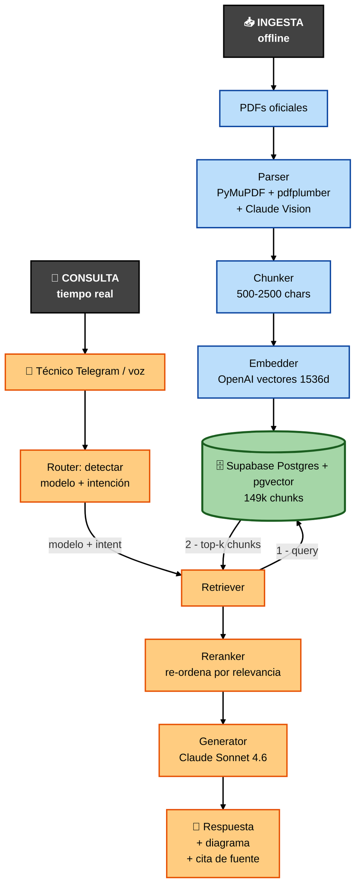
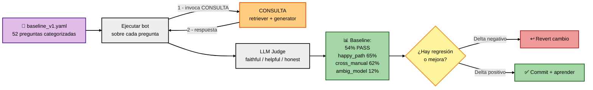
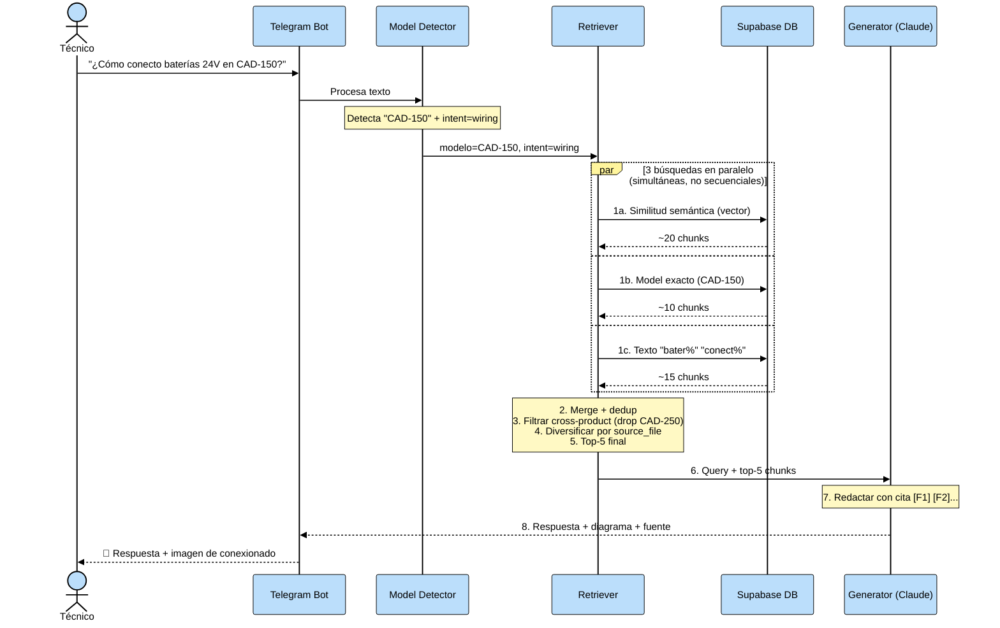
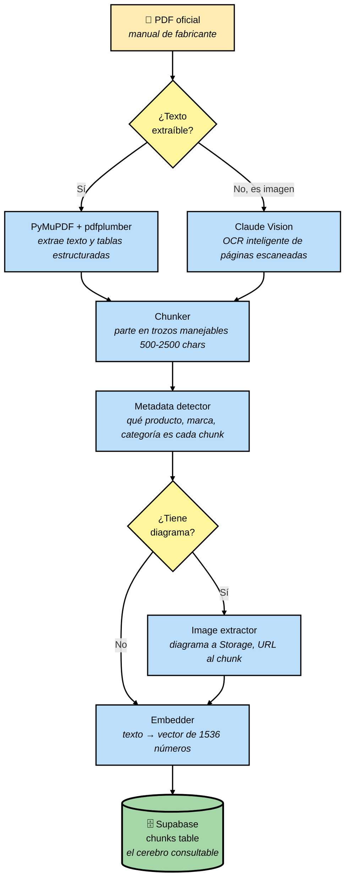
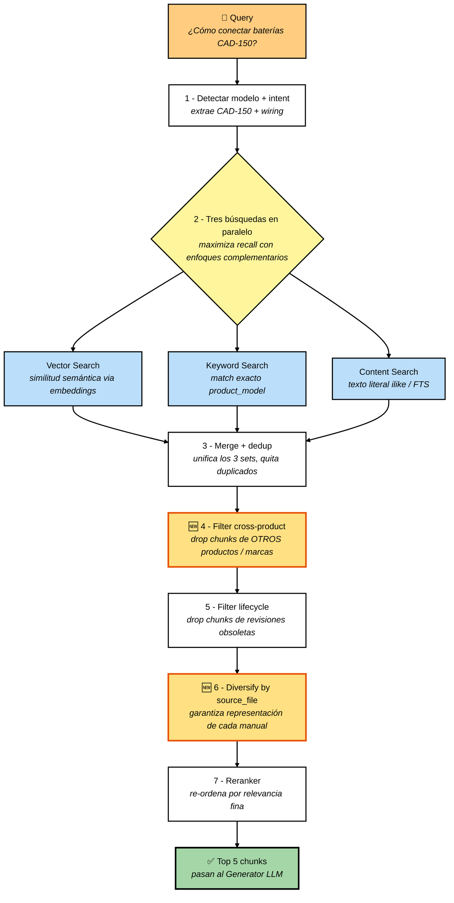
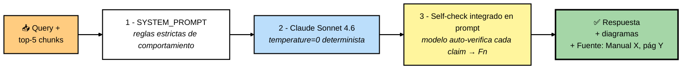
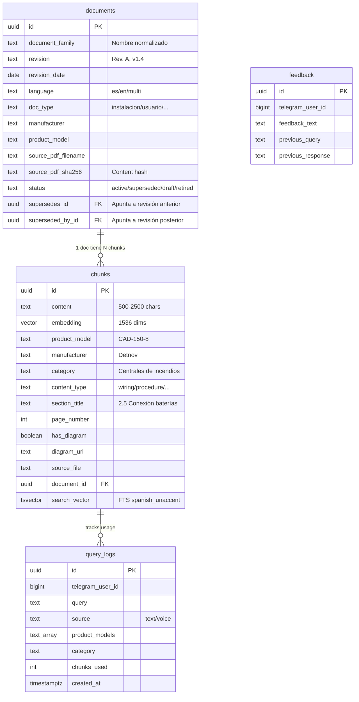

# Technical Bot — Arquitectura explicada

> **Propósito:** explicar cómo funciona el sistema de forma accesible (no hace falta ser ingeniero), por qué cada pieza es necesaria, y qué mejoras tenemos planificadas.
>
> **Audiencia:** Alberto (decisiones estratégicas), inversores (entender el valor técnico), y yo-futuro (onboarding rápido al volver de pausa).
>
> **Última actualización:** 2026-04-22 (sesión 12 — post Sprints 3+4).
>
> **Cómo mantener este doc:** cada vez que añadamos/cambiemos algo arquitectural, actualizamos la sección relevante + la fecha + el changelog al final. Reglas concretas en §7.

---

## 1. Visión general en 60 segundos

**Qué es:** un chatbot que responde preguntas técnicas de PCI (Protección Contra Incendios) usando **únicamente los manuales oficiales** de los fabricantes que tengamos ingestados. No inventa, cita fuente (*"Manual X, página Y"*), y si no tiene la información lo admite.

**En qué se diferencia de Google / ChatGPT:**

| | Google / ChatGPT | Technical Bot |
|---|---|---|
| Fuentes | Webs, foros, marketing | Solo manuales oficiales |
| Cita verificable | ❌ | ✅ (Manual X, pág. Y) |
| Mezcla fabricantes | ❌ mezcla libremente | ✅ respeta aislamiento |
| Revisión del manual | ❌ última indexada | ✅ gestiona supersede |
| Diagramas del manual | ❌ | ✅ adjunta schemas |
| Admite no saber | ❌ inventa | ✅ *"no tengo esta info"* |
| Voz / Telegram | ❌ | ✅ |

**Dominio:** PCI (Protección Contra Incendios). Fabricantes cubiertos hoy: Detnov, Notifier, Morley. Plan: 30+ fabricantes + expansión a rociadores / CCTV / control acceso.

**Contexto estratégico:** Fontiber Industrial Partners está en fase de due-diligence M&A. El chatbot es un multiplicador de valor del grupo: técnicos que antes tardaban 10 min buscando en manuales ahora preguntan y responden en 30 seg. Post-adquisición se despliega en las empresas del grupo.

---

## 2. Vista de pájaro — diagrama completo

### Diagrama 1 — Flujo principal (INGESTA + CONSULTA)

> 💡 **Si las flechas aún se ven tenues en el preview de VS Code:** abre `Ctrl+,` (Settings), busca `markdown-mermaid` y cambia `Markdown-mermaid: Light Mode Theme` y `Dark Mode Theme` a `default`. Eso fuerza fondo claro independiente del tema del editor.

**Cómo leer el diagrama:**

- **INGESTA** (azul, a la izquierda): camino offline que se ejecuta al añadir manuales. Termina metiendo chunks en la DB.
- **DB** (verde, centro): la base de conocimiento. Es el único punto que conecta los dos mundos.
- **CONSULTA** (naranja, a la derecha): camino en tiempo real cuando un técnico pregunta. Lee de la DB pero no la modifica.

**Tres actores:**
- **INGESTA** (arriba, azul) — offline. Cuando añades un manual nuevo, este flujo lo procesa y lo almacena en la DB. Se hace una vez por PDF.
- **DB (en medio, verde)** — la "base de conocimiento". Es el único punto de conexión entre ingesta y consulta. 149k chunks a día de hoy.
- **CONSULTA** (abajo, naranja) — tiempo real. Cada vez que un técnico pregunta, este flujo se activa. Consulta la DB pero no la modifica.

### Diagrama 2 — EVAL (proceso de verificación, separado)

EVAL no es independiente al 100%: **reusa la pipeline de CONSULTA** (ejecuta las 52 preguntas del eval contra el bot real). Pero conceptualmente es una capa de medición aparte — no modifica ni ingesta ni corpus, solo observa.

**Feedback loop:** los resultados del eval informan qué cambiar en INGESTA (si el problema es corpus) o en CONSULTA (si es retriever/generator). Por eso el desarrollo es "eval-driven": ningún cambio se commitea sin medir delta.

---

## 3. El viaje de una pregunta — paso a paso

Supongamos: el técnico pregunta *"¿Cómo se conectan las baterías de 24V en la Detnov CAD-150?"*

> 💡 **El bloque negro `par`** es la notación de Mermaid para **paralelo** — las 3 búsquedas ocurren al mismo tiempo (usando `ThreadPoolExecutor` en Python), no una tras otra. Cada una devuelve chunks de la DB independientemente; luego se hace merge. El `and` entre ellas es parte de la sintaxis (no es operación lógica).

**Qué pasa a nivel humano:**

1. **Técnico pregunta** — texto o voz desde Telegram, en cualquier rincón de una obra.
2. **El bot entiende qué modelo** — regex + LLM detectan *"CAD-150"* y tipo de pregunta (conexionado).
3. **Busca en la base de datos** — tres búsquedas en paralelo:
   - *Vector* (entiende el significado): "baterías 24V" es semánticamente similar a "alimentación DC 24V"
   - *Keyword* (modelo exacto): CAD-150
   - *Content* (texto literal): "bater" / "conect"
4. **Filtra ruido** — drop chunks de OTROS productos (CAD-250) y otras marcas.
5. **Diversifica entre manuales** — si CAD-150 tiene 2 manuales (Usuario + Instalación), garantiza chunks de ambos.
6. **Claude redacta la respuesta** — con los 5 chunks + la pregunta, compone una respuesta citando cada afirmación.
7. **Adjunta diagrama** — si el chunk tenía un esquema de cableado, lo envía como imagen.

**Tiempos típicos:** 3-6 segundos end-to-end. La parte lenta es el LLM redactando (3-4s).

---

## 4. Los 4 procesos clave en detalle

### 4.1 INGESTA — "crear el cerebro"

**Qué hace esto y por qué es necesario:**

**(1) Parseo del PDF** — un PDF no es texto directo, es una estructura compleja con columnas, tablas y a veces imágenes de texto escaneado. PyMuPDF + pdfplumber capturan texto y tablas; Claude Vision lee las páginas cuando el texto está "pintado" (screenshots, diagramas).

> **Por qué importa:** el 30% de los PDFs Detnov tienen tablas de specs con estructura compleja. Sin pdfplumber, perdemos esas tablas. Sin Vision, perdemos los pantallazos de menús (que son el 90% de los nuevos manuales MC-380 / MS-416 que ingestamos hoy).

**(2) Chunking** — un manual de 100 páginas se parte en ~500 fragmentos. Cada fragmento tiene ~1500 palabras. La razón es doble: (a) los LLMs tienen límite de contexto, (b) queremos recuperar solo lo relevante, no el manual completo.

> **Por qué importa:** si chunkeamos mal (muy grande → no cabe en el prompt; muy pequeño → pierde contexto), la calidad cae dramáticamente. Hoy chunkeamos por secciones reconocidas (títulos 1.1, 2.3, etc.). Mejora futura: "semantic chunking" usando similitud de embeddings.

**(3) Metadata extraction** — para cada chunk detectamos: qué producto describe (CAD-150), qué marca (Detnov), qué categoría (Centrales de incendios), y qué tipo de contenido es (procedure / specification / wiring / troubleshooting / general).

> **Por qué importa:** sin metadata, el retriever no puede filtrar por "solo Detnov" o "solo wiring". El filtrado antes del LLM = mayor precisión.

**(4) Embedding** — convertimos cada chunk en un vector de 1536 números. Vectores que representan conceptos similares están "cerca" entre sí en un espacio multidimensional.

> **Por qué importa:** las búsquedas "¿consumo en reposo?" deben encontrar chunks con "current draw" aunque no compartan palabras. Embedding lo resuelve. **Coste:** ~$0.02 por cada 1M tokens = ~$3 por cada ingesta completa del corpus actual.
>
> **¿Por qué exactamente 1536 dimensiones?** Es la dimensión de salida estándar del modelo OpenAI `text-embedding-3-small`. No la elegimos arbitrariamente: OpenAI entrenó ese modelo para que 1536 coordenadas capturen fielmente la semántica de cualquier texto corto/medio. Menos dimensiones (p.ej. 512) darían embeddings más baratos pero peor calidad semántica (más colisiones entre conceptos distintos). Más dimensiones (p.ej. 3072 de `text-embedding-3-large`) son ~4× más caros y ~2× más lentos de buscar sin mejora significativa en nuestro dominio PCI. **1536 es el sweet spot calidad/coste/latencia para nuestro caso.**

**(5) Storage en Supabase** — Postgres con extensión `pgvector` almacena los embeddings + permite búsqueda por similitud coseno. Las imágenes van a Supabase Storage (bucket `manual-images`).

> **Por qué importa:** Supabase nos da DB managed + storage + auth + vector search en un único servicio. Alternativa sería manejar Pinecone + S3 + Postgres por separado (3 servicios, 3 costes, 3 integraciones).

**Estado actual:**

| Componente | Estado |
|---|---|
| Parser PDF | ✅ Funciona |
| Vision fallback | ✅ Funciona (pero hoy no lo activamos por defecto por coste) |
| Chunker | ⚠️ Bugs conocidos: duplicación ×80 en 3 docs (TECH_DEBT #7); umbral mínimo descarta páginas útiles (#15) |
| Metadata | ✅ Product model detection cubre Detnov + Notifier + Morley |
| Embedder | ✅ OpenAI, batch adaptive |
| Storage | ✅ Supabase Pro + Micro |

**Corpus actual:** 866 documentos ≈ 149k chunks de 3 fabricantes. Hoy añadimos 3 manuales CAD-250 + SGD-151.

---

### 4.2 RETRIEVAL — "encontrar el fragmento correcto"

**🆕 = añadido hoy (sesión 12, Sprints 3+4).**

**Cómo funcionan las 3 búsquedas en paralelo:**

Usamos `ThreadPoolExecutor` de Python que ejecuta las 3 consultas SQL **simultáneamente** (no una tras otra). Cada una ataca la DB con un enfoque distinto:

- **Vector search** — embedding de la query → busca chunks con embeddings cercanos en el espacio vectorial (similitud coseno). Captura "equivalencia de significado": *"consumo en reposo"* encuentra chunks con *"current draw at rest"* aunque no compartan palabras.
- **Keyword search** — regex por `product_model` sobre la BD. Captura referencias explícitas a modelos: *"CAD-150"* matchea `CAD-150-8`, `CAD-150-4`, etc. No usa embedding; es literal.
- **Content search** — `ilike` / FTS sobre el campo `content`. Captura palabras clave del usuario: *"batería"*, *"conexionado"*. Funciona bien para términos técnicos concretos.

**Por qué 3 en paralelo y no solo 1:** cada una tiene fortalezas y debilidades. Vector es bueno en semántica pero flojo en términos técnicos raros. Keyword es perfecto cuando el usuario nombra el modelo pero inútil si no lo hace. Content matchea texto literal pero falla con sinónimos. Los 3 combinados dan **mejor recall** que cualquiera individual. El merge + dedup posterior los fusiona.

**Sobre el orden del filtro lifecycle (paso 5):**

Buena observación — **podría ir antes**. Hoy ejecutamos `Search → Merge → Filter cross-product → Filter lifecycle → Diversify → Rerank`. Si el filtro lifecycle fuese en SQL (integrado en la query original con un `JOIN` a `documents WHERE status='active'`), evitaríamos traer chunks superseded solo para descartarlos después.

No lo hacemos hoy porque requiere joins cross-table y complicaría cada una de las 3 queries. Además, chunks legacy (los 866 docs pre-refactor) no tienen `document_id` aún, lo que rompería el filtro SQL. Cuando completemos la migración de `document_id` en todos los chunks (TECH_DEBT #4 Phase 2), será el momento de mover el filtro upstream.

**Confirmación del flujo "Retriever → Reranker → Generator":**

Sí, hay ambigüedad en los diagramas de §2 vs §4.2 que merece aclaración:

- En **§2** (vista de pájaro) tratamos `Retriever` y `Reranker` como dos cajas separadas. Es una simplificación pedagógica.
- En **§4.2** (detalle) el `Reranker` es el **paso 7 dentro del Retriever** — es decir, la pipeline de retrieval incluye el reranker internamente. El `Out [Top 5 chunks]` del diagrama §4.2 es exactamente lo que va al Generator en §2.

En el código real (`retrieve_chunks()` en `src/rag/retriever.py`), el reranker LLM se llama DENTRO de retrieve_chunks. La función devuelve los top-k ya re-rankeados.

Para eliminar confusión, considero actualizar el diagrama §2 para mostrar "Retrieval pipeline" como una sola caja que abre en §4.2. Pendiente decisión.

---

**Por qué retrieval es el paso más crítico:**

El LLM solo ve los fragmentos que le pasamos. Si el retrieval no trae el chunk correcto → el LLM no puede responder correctamente. **Garbage in, garbage out.**

Por eso hoy arreglamos 4 bugs del retriever:
- **Multi-doc retrieval** — antes: si CAD-250 tenía 4 manuales, solo traía chunks de uno. Después: trae de todos.
- **Cross-product** — antes: query CAD-150 traía chunks CAD-250 por similitud semántica. Después: filtrados.
- **Cross-brand** — antes: query ASD535 (Detnov) traía chunks MINILÁSER 25 (Notifier). Después: filtrados.
- **FTS Spanish unaccent** — antes: `fts.menú` no encontraba "menú" en el corpus. Después: sí.

**Estado actual:**

| Componente | Estado |
|---|---|
| Vector search | ✅ pgvector ivfflat, threshold 0.3 |
| Keyword search | ✅ imatch con word-boundary + digit-guard (TECH_DEBT #11 resuelto sesión 11) |
| Content search | ✅ PostgREST ilike |
| Reranker | ✅ Custom LLM-based |
| Filter cross-product | ✅ Añadido hoy (commit a6a45c3) |
| Diversify multi-doc | ✅ Añadido hoy (commit a6a45c3) |
| FTS spanish_unaccent | 🔄 Repoblando en background |

---

### 4.3 GENERATION — "responder con fuente"

**¿Qué es `temperature` en este contexto?**

Parámetro de la API del LLM que controla **cuánta variabilidad** introduce al generar cada token:
- `temperature = 0` → el modelo siempre elige la opción más probable. **Determinista**: misma query → misma respuesta exacta.
- `temperature = 0.7` (default para creatividad) → introduce randomness. Dos llamadas iguales devuelven textos distintos.
- `temperature = 1.0` → alta variabilidad; útil para brainstorming, pésimo para tareas factuales.

**Elegimos 0** por dos razones:
1. **Reproducibilidad** — imprescindible para el eval. Si `temperature > 0`, correr el eval 10 veces daría 10 resultados diferentes y no sabríamos si un cambio de código mejora o empeora.
2. **Exactitud técnica** — un técnico haciendo una pregunta de cableado NO quiere que mañana la respuesta sea ligeramente distinta. Quiere el dato del manual, siempre igual.

**¿Cómo funciona el anti-alucinación en el prompt?**

El SYSTEM_PROMPT incluye varias capas de defensa en texto literal:

1. **Identidad explícita** — *"eres experto PCI, trabajas con manuales oficiales de Detnov, Notifier, Morley. Respondes solo con información de los fragmentos proporcionados."*
2. **Regla "CERO INVENCIÓN"** — *"cada valor numérico, sección, norma o producto que menciones debe aparecer LITERALMENTE en algún `[Fragmento N]`. Si no está, di 'el manual no especifica X'."*
3. **Anti-ejemplos** — dos casos reales documentados de alucinaciones pasadas (cable lengths inventadas, normas UNE-EN erróneas) para que el modelo vea qué NO hacer.
4. **Citación inline obligatoria** — *"cada afirmación técnica debe llevar inmediatamente el marker `[F<n>]` que indica de qué fragmento viene."*
5. **Self-check final** — *"antes de enviar tu respuesta, revisa que cada número / nombre de sección / norma aparezca literalmente en los fragmentos."*
6. **Política cross-brand** — *"si la query mezcla fabricantes distintos, admite limitación y remite a cada uno. NO infieras compatibilidad entre marcas."*

**Por qué es "necesario pero insuficiente":** el prompt es una instrucción al modelo, no una garantía. Claude Sonnet 4.6 la respeta ~80% de las veces. Queda un residuo de alucinaciones (ej: inventar "sección 4.3.6" cuando el índice real llega solo a 4). Para cerrar ese residuo se necesita validación estructural post-generación (TECH_DEBT, pendiente — no el validator mismo-modelo que probamos y revertimos en sesión 11).

**¿El paso 3 "self-check" es un re-envío al LLM o parte de la misma respuesta?**

**Es parte de la misma respuesta.** No hay una segunda llamada al LLM con "valida lo que escribiste". En su lugar, el SYSTEM_PROMPT **obliga al modelo a auto-verificar internamente** antes de finalizar el output. Concretamente, la instrucción *"revisa que cada número aparezca literalmente antes de enviar"* hace que el modelo tenga ese paso como parte de su chain-of-thought, no como un round-trip de red.

**El técnico NO ve regeneración** — para él es una única respuesta en ~4-6s. Lo que en el diagrama aparece como "Check → Out" es el modelo autoconsistente consigo mismo en el mismo turno.

**¿Por qué no un segundo LLM que valide?** Lo intentamos (iteración H, sesión 11). Pasar la respuesta por un validator mismo-modelo (Sonnet validando Sonnet) NO mejoró el eval — bajó 1 punto. Razón: ambos comparten blind spots. Catalogado como **lección #9** (validator cross-model debe ser modelo DIFERENTE, p.ej. Opus revisando Sonnet). Pendiente de ensayar con arquitectura diferente.

**Estado actual:**

| Componente | Estado |
|---|---|
| Modelo | ✅ Sonnet 4.6 |
| Temperature | ✅ 0 (reproducible) |
| Anti-alucinación prompt | ✅ Commit c0786b6 |
| Citación inline [F<n>] | ✅ Commit 6a256fc |
| Diagramas adjuntos | ✅ Commit 70035f8 |
| Validator cross-model (Opus → Sonnet) | 🟡 Pendiente. Validator mismo-modelo ya probado y descartado (iteración H, sesión 11, revertido). |

---

### 4.4 EVAL — "medir si mejoramos"

```mermaid
flowchart LR
    Human[👤 Alberto / técnico<br><i>escribe y revisa las 52 preguntas</i>] --> YAML
    YAML[📝 baseline_v1.yaml<br><i>52 preguntas + behavior esperado + keywords</i>] --> Runner[1 - Correr bot<br><i>invoca CONSULTA sobre cada pregunta</i>]
    Runner --> Score1[2a - Keyword match<br><i>señal rápida, frágil</i>]
    Runner --> Score2[2b - LLM-as-Judge<br><i>Claude Sonnet 4.6 evalúa respuesta</i>]
    Score2 --> J{3 - ¿PASS?<br><i>faithful + helpful<br>+ honest + behavior</i>}
    Score1 --> Combine[4 - Combine scores]
    J --> Combine
    Combine --> Report[📊 % PASS por categoría<br><i>análisis de fails para guiar fixes</i>]
    Report -.->|calibración trimestral<br>detecta bugs del judge| HumanReview[👤 Alberto revisa<br>6-10 casos manualmente]
    HumanReview -.->|ajuste judge| Score2

    style Human fill:#ffe082,stroke:#000000,color:#000000,stroke-width:2px
    style YAML fill:#e1bee7,stroke:#000000,color:#000000,stroke-width:2px
    style Runner fill:#ffcc80,stroke:#000000,color:#000000,stroke-width:2px
    style Score1 fill:#bbdefb,stroke:#000000,color:#000000,stroke-width:2px
    style Score2 fill:#bbdefb,stroke:#000000,color:#000000,stroke-width:2px
    style J fill:#fff59d,stroke:#000000,color:#000000,stroke-width:2px
    style Combine fill:#ffffff,stroke:#000000,color:#000000,stroke-width:2px
    style Report fill:#a5d6a7,stroke:#000000,color:#000000,stroke-width:3px
    style HumanReview fill:#ffe082,stroke:#000000,color:#000000,stroke-width:2px

    linkStyle default stroke:#000000,stroke-width:2px
```

**¿Por qué necesitamos un eval?** Sin eval, cualquier cambio de código es **acto de fe**. Cambiamos el prompt, cambiamos el retriever, subimos un manual nuevo… y solo sabemos si mejoró si alguien prueba manualmente. Con 149k chunks y 3 subsistemas interconectados, **probar manualmente es ilusión**. El eval automatiza la verificación: cada cambio → 52 queries → número concreto → decisión basada en datos. Es lo que convierte el desarrollo en científico en vez de anecdótico. Además permite:
- **Detectar regresiones** — un fix que rompe 5 preguntas previamente OK se ve inmediatamente en el delta.
- **Comparar alternativas** — si dudas entre dos implementaciones, corres el eval con ambas y eliges por evidencia.
- **Comunicar progreso** — *"subimos el baseline del 54% al 72%"* es concreto y creíble; *"ahora funciona mejor"* no lo es.

**Dónde entra la intervención humana:**

Tres puntos distintos (dos recurrentes, uno de calibración):

1. **Escritura de preguntas (recurrente):** las 52 preguntas de `baseline_v1.yaml` las escribe Alberto usando su conocimiento del dominio PCI + del corpus. Las preguntas están diseñadas para cubrir los 5 patrones típicos (`happy_path`, `cross_manual`, `missing_context`, `ambiguous_model`, `not_in_db`). **Calidad del eval = calidad de las preguntas.** Con 52 captura cobertura decente, pero el plan (post M&A) es expandir a 80+ con técnicos reales.

2. **Audit del YAML (periódico):** cada pocos meses, Alberto revisa si el `expected_behavior` de cada pregunta sigue siendo correcto. En sesión 12 descubrimos que 6 de 8 preguntas `cross_manual` tenían `expected_behavior: answer` cuando la política correcta era `admit_no_info`. Sin esa revisión, el judge habría estado penalizando al bot por hacer lo correcto.

3. **Calibración del judge (puntual):** cuando el judge empieza a dar resultados sospechosos, Alberto revisa 6-10 casos manualmente leyendo los chunks reales y verificando si el veredicto del judge es correcto. En sesión 11 descubrió dos bugs del judge (truncación 500 chars + no reconocía citation markers) que al arreglar subieron el baseline de 29% aparente → 54% real. **El judge no es infalible — necesita recalibración periódica.**

Las flechas punteadas del diagrama reflejan la (3): el human review NO ocurre en cada run del eval (sería carísimo), sino cuando el delta del eval es sospechoso o cuando un cambio de código toca el propio judge.

**52 preguntas en 5 categorías:**

| Categoría | N | Qué testea |
|---|---|---|
| `happy_path` | 20 | Query con respuesta en corpus → bot debe responder con cita |
| `cross_manual` | 8 | Query mezcla fabricantes → bot debe admitir limitación |
| `missing_context` | 8 | Query ambigua → bot debe pedir clarificación |
| `ambiguous_model` | 8 | Query con modelo ambiguo → bot debe clarificar |
| `not_in_db` | 8 | Producto NO en corpus → bot debe admitir |

**Por qué LLM-as-judge:** keyword match es frágil (sinónimos, conjugaciones). Un LLM externo (Sonnet 4.6) lee el chunk + la respuesta y juzga si es faithful, helpful, honest. Es el patrón dominante en 2026 (RAGAS, DeepEval).

**Por qué calibrar el judge:** Alberto revisó 6 preguntas manualmente en sesión 11 y descubrió 2 bugs del judge (truncación 500 chars + no reconocía markers `[F<n>]`). Al arreglar esos bugs, el baseline saltó de 29% aparente → **54% real**. Sin calibración humana, perseguíamos un problema falso.

**Baselines registrados:**

| Fecha | Run | Keyword PASS | Judge PASS |
|---|---|---|---|
| 19 abril | Pre-fix retriever Notifier/Morley | 9/52 (17%) | — |
| 20 abril | Post-fix multi-manufacturer | 11/52 (21%) | 15/52 (29%) |
| 21 abril | **Post judge calibration** | 12/52 (23%) | **28/52 (54%)** ← último committed |
| 22 abril | **(pendiente)** Post Sprints 3+4 | TBD | TBD |

---

## 5. Modelo de datos (qué vive dónde)

**Notas:**
- `documents` existe desde sesión 7 (migration 001) para gestionar revisiones y supersede chains.
- `chunks.document_id` ya está vinculado en los 866 docs existentes (backfill sesión 7).
- `query_logs` y `feedback` son tablas preparadas pero aún no escritas — se usarán post-deploy para observability (TECH_DEBT #8).

---

## 6. Gap analysis — dónde estamos vs best practices 2026

| Best practice | Nuestro estado | ROI | Cuándo |
|---|---|---|---|
| Retrieval híbrido (vector + keyword + rerank) | ✅ | — | Ya hecho |
| LLM-as-judge con calibración humana | ✅ | — | Ya hecho |
| Source grounding + cita inline | ✅ | — | Ya hecho |
| Document lifecycle (revisiones, supersede) | ✅ Phase 1 | — | Phase 2-3 pendientes |
| **Query rewriting / multi-query** | ❌ | Alto (+15-25% recall) | Sesión 14-15 |
| **RAGAS metrics (5 dimensiones)** | ❌ (solo overall_pass) | Alto (atribución) | Sesión 14-15 |
| **Observability (query_logs activos)** | ⚠️ tablas creadas, no escritas | Bloqueante pre-deploy | TECH_DEBT #8 |
| Migrations versionadas | ⚠️ parcial | Medio (reproducibilidad) | Sesión 13 |
| CI con eval automático | ❌ | Medio (evita regresiones) | Post-deploy |
| Model routing (Haiku/Sonnet/Opus) | ❌ (solo Sonnet) | Medio (-50% coste) | Post-deploy |
| Semantic chunking | ❌ (regla fija) | Bajo-medio | Post-deploy |
| Structured output (JSON) | ❌ | Bajo | Opcional |
| Caching | ❌ | Bajo | Post-deploy |

---

## 6b. ¿Estamos preparados para escalar a más fabricantes?

**Respuesta corta:** la arquitectura **core** escala bien, pero el **boilerplate por fabricante** no. Para 30+ fabricantes necesitamos tooling.

**Lo que YA escala (sin cambios):**
- **Schema de DB** — `manufacturer`, `product_model`, `category`, `document_family` son campos libres; no están cableados a nombres específicos.
- **Retriever** — opera con cualquier `manufacturer` / `product_model`. Ya probado con 3 fabricantes.
- **Generator** — el SYSTEM_PROMPT detecta dinámicamente qué fabricantes tiene disponibles vía `get_available_manufacturers()`. Añadir un nuevo fabricante no requiere tocar el prompt.
- **Eval** — el judge es agnóstico al fabricante. Añadir preguntas de Simplex, Apollo, Esser, Bosch, etc. es solo YAML.
- **Diversificación multi-doc** — funciona con N manuales por producto, sin límite hardcoded.
- **Supabase + pgvector** — capacidad sobrada. Corpus actual 149k chunks; pgvector soporta millones sin degradación significativa en nuestra configuración (ivfflat lists=100).

**Lo que NO escala (fricción por fabricante):**

| Tarea | Hoy | Problema a 30 fabricantes |
|---|---|---|
| **MODEL_PATTERN regex** | Hardcoded en `retriever.py` por fabricante | Regex de 500+ líneas; imposible mantener |
| **Overrides de metadata** | Dict `{MANUFACTURER}_SOURCE_FILE_TO_MODEL` en `chunker.py` | Centenares de entradas por fabricante en Python |
| **Scraping** | Script custom por fabricante (Notifier auth, Morley auth) | 30 scripts distintos, lógica duplicada |
| **Document type detection** | Regex por filename, específico por fabricante | Crece linealmente en complejidad |
| **Categorización de productos** | Reglas en Python con overrides por manufacturer | Necesita llevarse a config |

**Qué hay que hacer antes del fabricante ~10:**

1. **Externalizar MODEL_PATTERN a YAML** (TECH_DEBT #1) — un archivo `config/patterns/{manufacturer}.yaml` por fabricante con la regex específica. El retriever lee los patterns dinámicamente. No-dev puede editar.
2. **Externalizar overrides a YAML** (TECH_DEBT #1 sub-item) — mismo patrón para metadata overrides. Permite a un técnico PCI corregir mappings sin tocar Python.
3. **Template de scraping** — framework común para scrapers auth-protected. Cada fabricante define solo los selectores CSS y el flujo de login. Reutilizamos la pipeline de descarga, parse, ingesta.
4. **Test de regresión cross-manufacturer** — expandir los tests existentes para que cubran mínimo 1 pregunta del eval por fabricante ingresado. Garantiza que añadir Bosch no rompe Detnov.
5. **Observability multi-manufacturer** (TECH_DEBT #8) — dashboards segmentados por fabricante. Cuando llegas a 30, necesitas saber cuál tiene más gaps.

**Qué hay que hacer antes del fabricante ~30:**

6. **Migration tooling profesional** — `supabase db push` versionado, no SQL ad-hoc en dashboard. Cuando 30 fabricantes tienen schemas levemente distintos, reproducir entornos es crítico.
7. **Model routing** (TECH_DEBT #16 sub-item) — clasificador que elige Haiku / Sonnet / Opus según complejidad de la query. A 30 fabricantes, el volumen crece y el coste se vuelve relevante.
8. **Multi-tenant architecture** — si el bot se despliega en las empresas del grupo post-M&A, cada empresa puede necesitar su propio corpus filtrado. Esto NO está hecho hoy (corpus único).

**Estimación de coste por nuevo fabricante tras el tooling:**

| Fase | Tiempo hoy (sin tooling) | Tiempo post-tooling |
|---|---|---|
| Descarga manuales | 4-8h (manual o scraper ad-hoc) | 1-2h (template scraper) |
| Ingesta + QA | 2-4h (regex tuning, override edits) | 30min (YAML config edit) |
| Eval expansion | 2-3h (escribir 5-10 preguntas típicas) | 1h (mismo) |
| **Total por fabricante** | **8-15h** | **2-3h** |

**Verdict estratégico:** **el core arquitectural escala**. La decisión *"cuándo invertir en tooling"* es empírica: mientras el trabajo manual por fabricante cuesta <10h y hay <5 fabricantes, el tooling no paga. A partir del fabricante ~7-10, el ROI del tooling se vuelve claro. **Recomendación:** planificar el sprint de tooling (TECH_DEBT #1 + template scraper) **antes de empezar la ingesta masiva post-M&A**. Si se hace después, duplicamos trabajo.

---

## 7. Cómo mantener este documento

**Regla simple:** este archivo es la "single source of truth" de la arquitectura. Cada vez que cambias algo arquitectural, actualizas la sección relevante y el changelog.

### Protocolo de actualización

1. **Cuando modifiques código que cambia un diagrama:**
   - Abre este archivo.
   - Localiza la sección afectada (§4.1 ingesta, §4.2 retrieval, §4.3 generation, §4.4 eval).
   - Actualiza el diagrama Mermaid + texto.
   - Actualiza la tabla "Estado actual" de la sección.
   - Añade entrada al changelog al final.

2. **Cuando añadas un TECH_DEBT:**
   - Si es arquitectural, refleja en §6 "Gap analysis".

3. **Cuando cierres un ítem del gap analysis:**
   - Mueve a la tabla de "estado actual" de la sección relevante.
   - Actualiza §6 con estado ✅.

### Regla de Alberto para explicar a inversores

Si no sabrías explicar este documento en 10 minutos con powerpoint básico, algo falta. **Señales de alarma:**
- Una sección usa jerga sin definir → añadir definición.
- Un diagrama tiene >10 nodos → simplificar o partir en 2.
- El "Por qué importa" no es claro → reescribir hasta que lo sea.

### Herramientas

- **Mermaid:** renderiza automáticamente en GitHub, VS Code (extensión "Markdown Preview Mermaid Support"), Notion, y el plugin Claude Code preview.
- **Exportar a PDF para inversores:** Markdown → Pandoc → PDF, o simplemente Print-to-PDF desde VS Code preview.

---

## 8. Changelog

| Fecha | Cambio | Sesión |
|---|---|---|
| 2026-04-22 | Documento creado. Diagramas de 4 procesos (ingesta, retrieval, generation, eval) + ERD + gap analysis + protocolo de actualización. | 12 |

---

## Apéndice A — Glosario técnico ↔ lenguaje de negocio

| Término técnico | Qué significa en negocio |
|---|---|
| Chunk | Fragmento de manual, ~1.500 palabras |
| Embedding | Representación numérica de un texto (vector de 1.536 números) |
| Similitud coseno | Cómo de "cerca" están dos textos en significado (1 = idénticos, 0 = sin relación) |
| pgvector | Extensión de Postgres que permite búsqueda por similitud vectorial |
| FTS (Full-Text Search) | Búsqueda por palabra clave en el texto (como CTRL+F pero más inteligente) |
| Tsvector | Formato interno de Postgres para FTS (lista de palabras "stemmed") |
| Unaccent | Función que normaliza acentos ("menú" → "menu") para búsqueda |
| Retrieval | Proceso de encontrar los chunks relevantes para una query |
| Reranker | Segunda pasada que re-ordena los chunks según relevancia |
| LLM-as-judge | Usar otro LLM para validar si una respuesta es correcta |
| RAG | Retrieval-Augmented Generation (el patrón de todo esto) |
| Hallucination (alucinación) | Inventar datos que no están en el corpus |
| Faithfulness | Propiedad de que cada afirmación esté respaldada por un chunk |
| Superseded | Documento reemplazado por una revisión más nueva |
| Cross-brand / cross-product | Mezclar info de marcas o productos distintos (mala práctica) |

## Apéndice B — Decisiones arquitecturales clave (y por qué)

**¿Por qué Supabase y no Pinecone + AWS?**
Simplicidad. Un servicio resuelve DB + vector search + storage + auth. Para nuestra escala (<1M chunks) no hay diferencia de performance. Si escalamos 10x, migración a Pinecone + Postgres separado es opción abierta.

**¿Por qué OpenAI embeddings y no Cohere / Voyage AI?**
Calidad / precio está bien. text-embedding-3-small cuesta $0.02 por 1M tokens y tiene buen rendimiento en español. Voyage AI es mejor específicamente para código; no aplica.

**¿Por qué Claude Sonnet 4.6 y no GPT-4 / Gemini?**
Claude tiene mejor instrucción-following en castellano técnico y temperature=0 más estable. Además, Anthropic publica prompt caching (reducción de coste) y extended thinking (para queries complejas) — ambos disponibles cuando los necesitemos.

**¿Por qué Telegram y no WhatsApp / app propia?**
Telegram tiene bot API gratuita + voz nativa + no requiere número business pago (WhatsApp sí). Técnicos lo adoptan trivialmente. App propia = 6+ meses + $100k desarrollo.

**¿Por qué temperature=0?**
Reproducibilidad. Con cualquier valor > 0, la misma query produciría respuestas distintas cada vez, haciendo imposible el eval-driven development.
