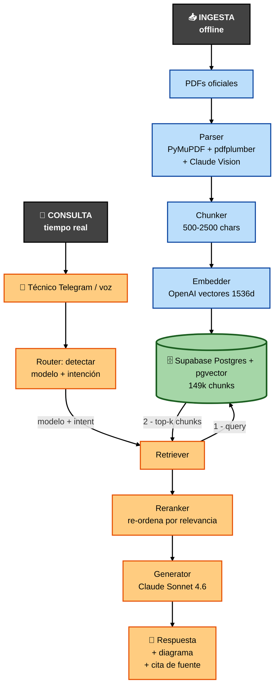
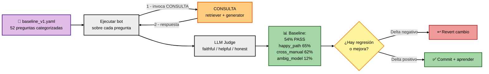
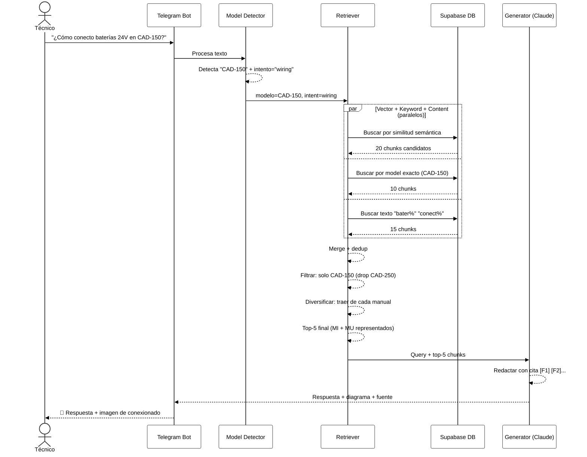
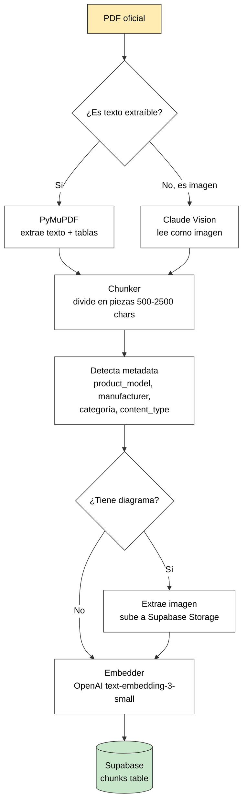
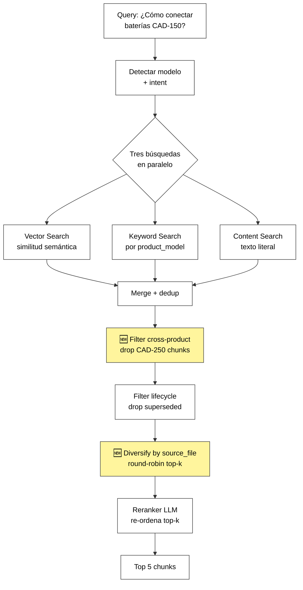
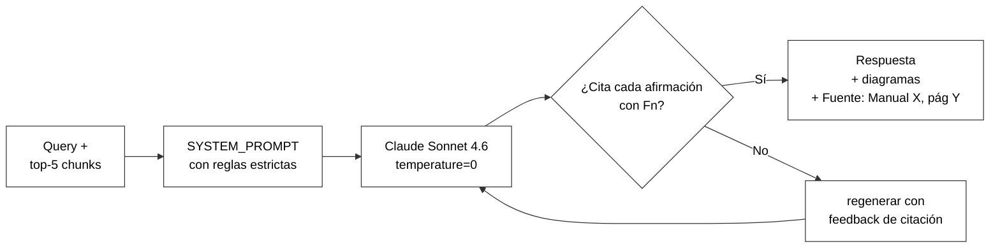
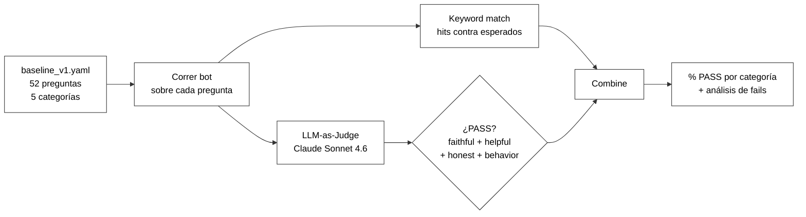
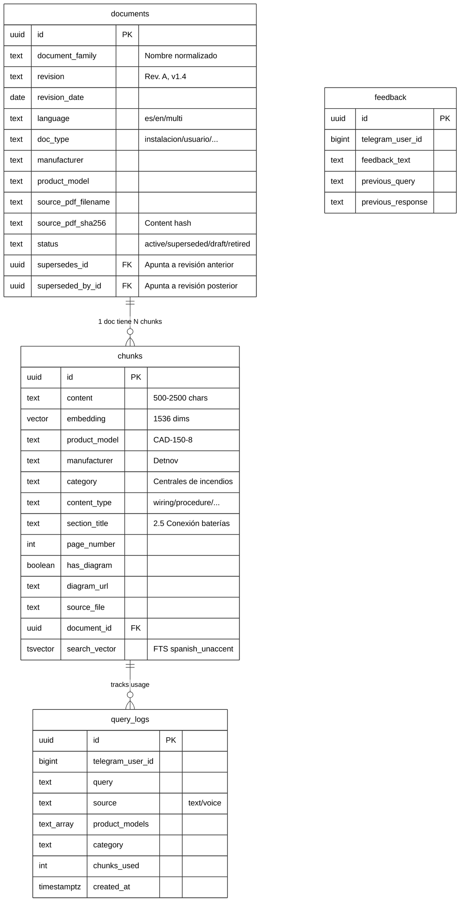

# Technical Bot — Arquitectura explicada

> **Propósito:** explicar cómo funciona el sistema de forma accesible (no hace falta ser ingeniero), por qué cada pieza es necesaria, y qué mejoras tenemos planificadas.
>
> **Audiencia:** Alberto (decisiones estratégicas), inversores (entender el valor técnico), y yo-futuro (onboarding rápido al volver de pausa).
>
> **Última actualización:** 2026-04-22 (sesión 12 — post Sprints 3+4).
>
> **Cómo mantener este doc:** cada vez que añadamos/cambiemos algo arquitectural, actualizamos la sección relevante + la fecha + el changelog al final. Reglas concretas en §7.

---

## 1. Visión general en 60 segundos

**Qué es:** un chatbot que responde preguntas técnicas de PCI (Protección Contra Incendios) usando **únicamente los manuales oficiales** de los fabricantes que tengamos ingestados. No inventa, cita fuente (*"Manual X, página Y"*), y si no tiene la información lo admite.

**En qué se diferencia de Google / ChatGPT:**

| | Google / ChatGPT | Technical Bot |
|---|---|---|
| Fuentes | Webs, foros, marketing | Solo manuales oficiales |
| Cita verificable | ❌ | ✅ (Manual X, pág. Y) |
| Mezcla fabricantes | ❌ mezcla libremente | ✅ respeta aislamiento |
| Revisión del manual | ❌ última indexada | ✅ gestiona supersede |
| Diagramas del manual | ❌ | ✅ adjunta schemas |
| Admite no saber | ❌ inventa | ✅ *"no tengo esta info"* |
| Voz / Telegram | ❌ | ✅ |

**Dominio:** PCI (Protección Contra Incendios). Fabricantes cubiertos hoy: Detnov, Notifier, Morley. Plan: 30+ fabricantes + expansión a rociadores / CCTV / control acceso.

**Contexto estratégico:** Fontiber Industrial Partners está en fase de due-diligence M&A. El chatbot es un multiplicador de valor del grupo: técnicos que antes tardaban 10 min buscando en manuales ahora preguntan y responden en 30 seg. Post-adquisición se despliega en las empresas del grupo.

---

## 2. Vista de pájaro — diagrama completo

### Diagrama 1 — Flujo principal (INGESTA + CONSULTA)

> 💡 **Si las flechas aún se ven tenues en el preview de VS Code:** abre `Ctrl+,` (Settings), busca `markdown-mermaid` y cambia `Markdown-mermaid: Light Mode Theme` y `Dark Mode Theme` a `default`. Eso fuerza fondo claro independiente del tema del editor.

**Cómo leer el diagrama:**

- **INGESTA** (azul, a la izquierda): camino offline que se ejecuta al añadir manuales. Termina metiendo chunks en la DB.
- **DB** (verde, centro): la base de conocimiento. Es el único punto que conecta los dos mundos.
- **CONSULTA** (naranja, a la derecha): camino en tiempo real cuando un técnico pregunta. Lee de la DB pero no la modifica.

**Tres actores:**
- **INGESTA** (arriba, azul) — offline. Cuando añades un manual nuevo, este flujo lo procesa y lo almacena en la DB. Se hace una vez por PDF.
- **DB (en medio, verde)** — la "base de conocimiento". Es el único punto de conexión entre ingesta y consulta. 149k chunks a día de hoy.
- **CONSULTA** (abajo, naranja) — tiempo real. Cada vez que un técnico pregunta, este flujo se activa. Consulta la DB pero no la modifica.

### Diagrama 2 — EVAL (proceso de verificación, separado)

EVAL no es independiente al 100%: **reusa la pipeline de CONSULTA** (ejecuta las 52 preguntas del eval contra el bot real). Pero conceptualmente es una capa de medición aparte — no modifica ni ingesta ni corpus, solo observa.

**Feedback loop:** los resultados del eval informan qué cambiar en INGESTA (si el problema es corpus) o en CONSULTA (si es retriever/generator). Por eso el desarrollo es "eval-driven": ningún cambio se commitea sin medir delta.

---

## 3. El viaje de una pregunta — paso a paso

Supongamos: el técnico pregunta *"¿Cómo se conectan las baterías de 24V en la Detnov CAD-150?"*

**Qué pasa a nivel humano:**

1. **Técnico pregunta** — texto o voz desde Telegram, en cualquier rincón de una obra.
2. **El bot entiende qué modelo** — regex + LLM detectan *"CAD-150"* y tipo de pregunta (conexionado).
3. **Busca en la base de datos** — tres búsquedas en paralelo:
   - *Vector* (entiende el significado): "baterías 24V" es semánticamente similar a "alimentación DC 24V"
   - *Keyword* (modelo exacto): CAD-150
   - *Content* (texto literal): "bater" / "conect"
4. **Filtra ruido** — drop chunks de OTROS productos (CAD-250) y otras marcas.
5. **Diversifica entre manuales** — si CAD-150 tiene 2 manuales (Usuario + Instalación), garantiza chunks de ambos.
6. **Claude redacta la respuesta** — con los 5 chunks + la pregunta, compone una respuesta citando cada afirmación.
7. **Adjunta diagrama** — si el chunk tenía un esquema de cableado, lo envía como imagen.

**Tiempos típicos:** 3-6 segundos end-to-end. La parte lenta es el LLM redactando (3-4s).

---

## 4. Los 4 procesos clave en detalle

### 4.1 INGESTA — "crear el cerebro"

**Qué hace esto y por qué es necesario:**

**(1) Parseo del PDF** — un PDF no es texto directo, es una estructura compleja con columnas, tablas y a veces imágenes de texto escaneado. PyMuPDF + pdfplumber capturan texto y tablas; Claude Vision lee las páginas cuando el texto está "pintado" (screenshots, diagramas).

> **Por qué importa:** el 30% de los PDFs Detnov tienen tablas de specs con estructura compleja. Sin pdfplumber, perdemos esas tablas. Sin Vision, perdemos los pantallazos de menús (que son el 90% de los nuevos manuales MC-380 / MS-416 que ingestamos hoy).

**(2) Chunking** — un manual de 100 páginas se parte en ~500 fragmentos. Cada fragmento tiene ~1500 palabras. La razón es doble: (a) los LLMs tienen límite de contexto, (b) queremos recuperar solo lo relevante, no el manual completo.

> **Por qué importa:** si chunkeamos mal (muy grande → no cabe en el prompt; muy pequeño → pierde contexto), la calidad cae dramáticamente. Hoy chunkeamos por secciones reconocidas (títulos 1.1, 2.3, etc.). Mejora futura: "semantic chunking" usando similitud de embeddings.

**(3) Metadata extraction** — para cada chunk detectamos: qué producto describe (CAD-150), qué marca (Detnov), qué categoría (Centrales de incendios), y qué tipo de contenido es (procedure / specification / wiring / troubleshooting / general).

> **Por qué importa:** sin metadata, el retriever no puede filtrar por "solo Detnov" o "solo wiring". El filtrado antes del LLM = mayor precisión.

**(4) Embedding** — convertimos cada chunk en un vector de 1536 números. Vectores que representan conceptos similares están "cerca" entre sí en un espacio multidimensional.

> **Por qué importa:** las búsquedas "¿consumo en reposo?" deben encontrar chunks con "current draw" aunque no compartan palabras. Embedding lo resuelve. **Coste:** ~$0.02 por cada 1M tokens = ~$3 por cada ingesta completa del corpus actual.

**(5) Storage en Supabase** — Postgres con extensión `pgvector` almacena los embeddings + permite búsqueda por similitud coseno. Las imágenes van a Supabase Storage (bucket `manual-images`).

> **Por qué importa:** Supabase nos da DB managed + storage + auth + vector search en un único servicio. Alternativa sería manejar Pinecone + S3 + Postgres por separado (3 servicios, 3 costes, 3 integraciones).

**Estado actual:**

| Componente | Estado |
|---|---|
| Parser PDF | ✅ Funciona |
| Vision fallback | ✅ Funciona (pero hoy no lo activamos por defecto por coste) |
| Chunker | ⚠️ Bugs conocidos: duplicación ×80 en 3 docs (TECH_DEBT #7); umbral mínimo descarta páginas útiles (#15) |
| Metadata | ✅ Product model detection cubre Detnov + Notifier + Morley |
| Embedder | ✅ OpenAI, batch adaptive |
| Storage | ✅ Supabase Pro + Micro |

**Corpus actual:** 866 documentos ≈ 149k chunks de 3 fabricantes. Hoy añadimos 3 manuales CAD-250 + SGD-151.

---

### 4.2 RETRIEVAL — "encontrar el fragmento correcto"

**🆕 = añadido hoy (sesión 12, Sprints 3+4).**

**Por qué retrieval es el paso más crítico:**

El LLM solo ve los fragmentos que le pasamos. Si el retrieval no trae el chunk correcto → el LLM no puede responder correctamente. **Garbage in, garbage out.**

Por eso hoy arreglamos 4 bugs del retriever:
- **Multi-doc retrieval** — antes: si CAD-250 tenía 4 manuales, solo traía chunks de uno. Después: trae de todos.
- **Cross-product** — antes: query CAD-150 traía chunks CAD-250 por similitud semántica. Después: filtrados.
- **Cross-brand** — antes: query ASD535 (Detnov) traía chunks MINILÁSER 25 (Notifier). Después: filtrados.
- **FTS Spanish unaccent** — antes: `fts.menú` no encontraba "menú" en el corpus. Después: sí.

**Estado actual:**

| Componente | Estado |
|---|---|
| Vector search | ✅ pgvector ivfflat, threshold 0.3 |
| Keyword search | ✅ imatch con word-boundary + digit-guard (TECH_DEBT #11 resuelto sesión 11) |
| Content search | ✅ PostgREST ilike |
| Reranker | ✅ Custom LLM-based |
| Filter cross-product | ✅ Añadido hoy (commit a6a45c3) |
| Diversify multi-doc | ✅ Añadido hoy (commit a6a45c3) |
| FTS spanish_unaccent | 🔄 Repoblando en background |

---

### 4.3 GENERATION — "responder con fuente"

**SYSTEM_PROMPT actual cubre:**

1. **Identidad:** experto PCI, fabricantes cubiertos, idioma del técnico.
2. **Regla de oro "CERO INVENCIÓN":** cada valor numérico, sección, norma, producto o referencia debe aparecer LITERALMENTE en un chunk. Fallback: *"el manual no especifica X"*.
3. **Citación inline obligatoria:** cada afirmación → `[F<n>]` marker.
4. **Política cross-brand:** si query mezcla fabricantes, admitir limitación y remitir al fabricante.
5. **Estructura:** encabezado, pasos numerados, sección de fuente, opcional seguimiento.

**Por qué `temperature=0`:** reproducibilidad. Con `temperature > 0`, la misma query daría respuestas ligeramente distintas cada vez → imposible validar con eval. `temperature=0` hace el sistema determinista (misma query → misma respuesta).

**Estado actual:**

| Componente | Estado |
|---|---|
| Modelo | ✅ Sonnet 4.6 |
| Temperature | ✅ 0 (reproducible) |
| Anti-alucinación prompt | ✅ Commit c0786b6 |
| Citación inline [F<n>] | ✅ Commit 6a256fc |
| Diagramas adjuntos | ✅ Commit 70035f8 |
| Validator cross-model | ❌ Probado e intencionalmente revertido (iteración H, sesión 11) |

---

### 4.4 EVAL — "medir si mejoramos"

**52 preguntas en 5 categorías:**

| Categoría | N | Qué testea |
|---|---|---|
| `happy_path` | 20 | Query con respuesta en corpus → bot debe responder con cita |
| `cross_manual` | 8 | Query mezcla fabricantes → bot debe admitir limitación |
| `missing_context` | 8 | Query ambigua → bot debe pedir clarificación |
| `ambiguous_model` | 8 | Query con modelo ambiguo → bot debe clarificar |
| `not_in_db` | 8 | Producto NO en corpus → bot debe admitir |

**Por qué LLM-as-judge:** keyword match es frágil (sinónimos, conjugaciones). Un LLM externo (Sonnet 4.6) lee el chunk + la respuesta y juzga si es faithful, helpful, honest. Es el patrón dominante en 2026 (RAGAS, DeepEval).

**Por qué calibrar el judge:** Alberto revisó 6 preguntas manualmente en sesión 11 y descubrió 2 bugs del judge (truncación 500 chars + no reconocía markers `[F<n>]`). Al arreglar esos bugs, el baseline saltó de 29% aparente → **54% real**. Sin calibración humana, perseguíamos un problema falso.

**Baselines registrados:**

| Fecha | Run | Keyword PASS | Judge PASS |
|---|---|---|---|
| 19 abril | Pre-fix retriever Notifier/Morley | 9/52 (17%) | — |
| 20 abril | Post-fix multi-manufacturer | 11/52 (21%) | 15/52 (29%) |
| 21 abril | **Post judge calibration** | 12/52 (23%) | **28/52 (54%)** ← último committed |
| 22 abril | **(pendiente)** Post Sprints 3+4 | TBD | TBD |

---

## 5. Modelo de datos (qué vive dónde)

**Notas:**
- `documents` existe desde sesión 7 (migration 001) para gestionar revisiones y supersede chains.
- `chunks.document_id` ya está vinculado en los 866 docs existentes (backfill sesión 7).
- `query_logs` y `feedback` son tablas preparadas pero aún no escritas — se usarán post-deploy para observability (TECH_DEBT #8).

---

## 6. Gap analysis — dónde estamos vs best practices 2026

| Best practice | Nuestro estado | ROI | Cuándo |
|---|---|---|---|
| Retrieval híbrido (vector + keyword + rerank) | ✅ | — | Ya hecho |
| LLM-as-judge con calibración humana | ✅ | — | Ya hecho |
| Source grounding + cita inline | ✅ | — | Ya hecho |
| Document lifecycle (revisiones, supersede) | ✅ Phase 1 | — | Phase 2-3 pendientes |
| **Query rewriting / multi-query** | ❌ | Alto (+15-25% recall) | Sesión 14-15 |
| **RAGAS metrics (5 dimensiones)** | ❌ (solo overall_pass) | Alto (atribución) | Sesión 14-15 |
| **Observability (query_logs activos)** | ⚠️ tablas creadas, no escritas | Bloqueante pre-deploy | TECH_DEBT #8 |
| Migrations versionadas | ⚠️ parcial | Medio (reproducibilidad) | Sesión 13 |
| CI con eval automático | ❌ | Medio (evita regresiones) | Post-deploy |
| Model routing (Haiku/Sonnet/Opus) | ❌ (solo Sonnet) | Medio (-50% coste) | Post-deploy |
| Semantic chunking | ❌ (regla fija) | Bajo-medio | Post-deploy |
| Structured output (JSON) | ❌ | Bajo | Opcional |
| Caching | ❌ | Bajo | Post-deploy |

---

## 7. Cómo mantener este documento

**Regla simple:** este archivo es la "single source of truth" de la arquitectura. Cada vez que cambias algo arquitectural, actualizas la sección relevante y el changelog.

### Protocolo de actualización

1. **Cuando modifiques código que cambia un diagrama:**
   - Abre este archivo.
   - Localiza la sección afectada (§4.1 ingesta, §4.2 retrieval, §4.3 generation, §4.4 eval).
   - Actualiza el diagrama Mermaid + texto.
   - Actualiza la tabla "Estado actual" de la sección.
   - Añade entrada al changelog al final.

2. **Cuando añadas un TECH_DEBT:**
   - Si es arquitectural, refleja en §6 "Gap analysis".

3. **Cuando cierres un ítem del gap analysis:**
   - Mueve a la tabla de "estado actual" de la sección relevante.
   - Actualiza §6 con estado ✅.

### Regla de Alberto para explicar a inversores

Si no sabrías explicar este documento en 10 minutos con powerpoint básico, algo falta. **Señales de alarma:**
- Una sección usa jerga sin definir → añadir definición.
- Un diagrama tiene >10 nodos → simplificar o partir en 2.
- El "Por qué importa" no es claro → reescribir hasta que lo sea.

### Herramientas

- **Mermaid:** renderiza automáticamente en GitHub, VS Code (extensión "Markdown Preview Mermaid Support"), Notion, y el plugin Claude Code preview.
- **Exportar a PDF para inversores:** Markdown → Pandoc → PDF, o simplemente Print-to-PDF desde VS Code preview.

---

## 8. Changelog

| Fecha | Cambio | Sesión |
|---|---|---|
| 2026-04-22 | Documento creado. Diagramas de 4 procesos (ingesta, retrieval, generation, eval) + ERD + gap analysis + protocolo de actualización. | 12 |

---

## Apéndice A — Glosario técnico ↔ lenguaje de negocio

| Término técnico | Qué significa en negocio |
|---|---|
| Chunk | Fragmento de manual, ~1.500 palabras |
| Embedding | Representación numérica de un texto (vector de 1.536 números) |
| Similitud coseno | Cómo de "cerca" están dos textos en significado (1 = idénticos, 0 = sin relación) |
| pgvector | Extensión de Postgres que permite búsqueda por similitud vectorial |
| FTS (Full-Text Search) | Búsqueda por palabra clave en el texto (como CTRL+F pero más inteligente) |
| Tsvector | Formato interno de Postgres para FTS (lista de palabras "stemmed") |
| Unaccent | Función que normaliza acentos ("menú" → "menu") para búsqueda |
| Retrieval | Proceso de encontrar los chunks relevantes para una query |
| Reranker | Segunda pasada que re-ordena los chunks según relevancia |
| LLM-as-judge | Usar otro LLM para validar si una respuesta es correcta |
| RAG | Retrieval-Augmented Generation (el patrón de todo esto) |
| Hallucination (alucinación) | Inventar datos que no están en el corpus |
| Faithfulness | Propiedad de que cada afirmación esté respaldada por un chunk |
| Superseded | Documento reemplazado por una revisión más nueva |
| Cross-brand / cross-product | Mezclar info de marcas o productos distintos (mala práctica) |

## Apéndice B — Decisiones arquitecturales clave (y por qué)

**¿Por qué Supabase y no Pinecone + AWS?**
Simplicidad. Un servicio resuelve DB + vector search + storage + auth. Para nuestra escala (<1M chunks) no hay diferencia de performance. Si escalamos 10x, migración a Pinecone + Postgres separado es opción abierta.

**¿Por qué OpenAI embeddings y no Cohere / Voyage AI?**
Calidad / precio está bien. text-embedding-3-small cuesta $0.02 por 1M tokens y tiene buen rendimiento en español. Voyage AI es mejor específicamente para código; no aplica.

**¿Por qué Claude Sonnet 4.6 y no GPT-4 / Gemini?**
Claude tiene mejor instrucción-following en castellano técnico y temperature=0 más estable. Además, Anthropic publica prompt caching (reducción de coste) y extended thinking (para queries complejas) — ambos disponibles cuando los necesitemos.

**¿Por qué Telegram y no WhatsApp / app propia?**
Telegram tiene bot API gratuita + voz nativa + no requiere número business pago (WhatsApp sí). Técnicos lo adoptan trivialmente. App propia = 6+ meses + $100k desarrollo.

**¿Por qué temperature=0?**
Reproducibilidad. Con cualquier valor > 0, la misma query produciría respuestas distintas cada vez, haciendo imposible el eval-driven development.
