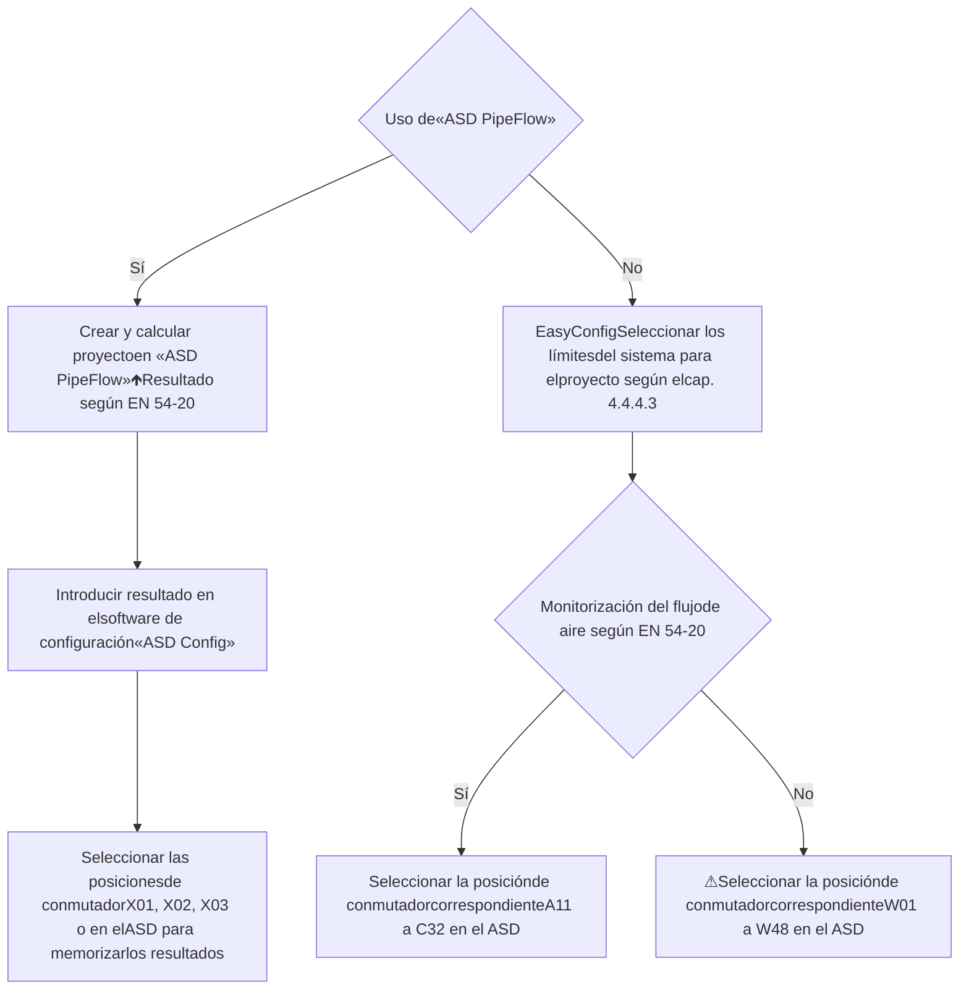
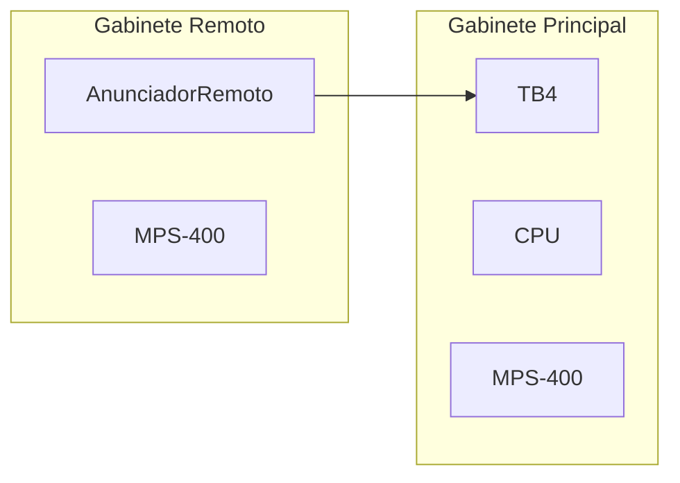
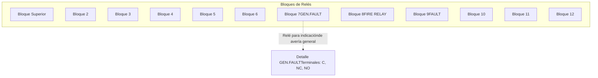

# Disagreements Sonnet ↔ Opus

**Agreement global:** 95.1% · **Cohen's κ:** 0.560 (moderada) · **Disagreements:** 86 / 1768

Para cada caso: revisa la cita y marca tu decisión (SI/NO/duda) en el slot.

## Criterios aplicados (sesión 26)

**Criterio: PROCEDURAL PURO.** SI cuando el bot citaría el chunk para construir alguna parte de la respuesta al técnico real. NO cuando el chunk es tangencial, de producto distinto al preguntado, o solo apuntador a otro manual sin contenido propio.

**Rigor de dominio DIFERIDO.** No se rechaza un chunk por contener valores aproximados o imprecisos. La corrección de hechos (p. ej. "el chunk dice 24V pero el rango operativo real es 22-38V") queda para la **Capa A del judge v2** (gold answers post-SWAP, validación con técnico PCI real). En este pase medimos retrieval recall, no answer quality.

**Casos pivote registrados (revisar bajo Capa A):**
- hp004 `bf78e1db-f87` — chunk DGD-600 dice "24v o 220v (según modelo)"; rango real 22-38V/180-240V. Procedural=SI, rigor de dominio=NO. Resuelto SI.

**Alcance del GATE inicial (sesión 26):** las 13 decisiones cross-manual `cm*` (cm002 × 5, cm003 × 2, cm004 × 5, cm005 × 1) **NO se incluyen** en esta pasada. Razón: política cross-brand DIFERIDA a post-SWAP (plan §B.2). 3 de las 4 son `admit_no_info` por construcción — decidir relevancia de chunks no aporta señal útil al GATE. La única `answer` (cm002, migración AFP-200 → ID3000) también es cross-brand. Se retomarán cuando construyamos la Capa A del judge v2 con técnico PCI real.

**Bugs de pipeline detectados durante la revisión humana (follow-ups Fase 1):**
- Renderizado del .md truncaba a 1500 chars mientras los jueces vieron 4000 (`cross_validate_relevance.py:311`). Parcheado en sesión 26.
- `page_number` off-by-2 sistemático en docs CAD-150 (Detnov). Bug del chunker B3.
- Chunks ES/EN equivalentes del mismo manual no marcados como `duplicate_of` (#1↔#6 hp003: CAD-150 Cautions 1.2). Gap de B6 (dedup semántico).
- Chunk con header de sección siguiente sin contenido (hp002 #4 `0adfba2d-3bc` — header "10.3 Detección y subsanació" sin más). Edge case del corte por tamaño.

---

## hp001 · chunk `12c25b7f-df1`

**Pregunta:** En la Detnov CAD-250, ¿cómo se entra al menú de programación avanzada?

**Chunk** (`Manual instalacion CAD-250 (MI_372_es_2024 e)` pag 6 · 1. Índice > 2.6. Documentación necesaria y diseño):

```
## 2.6. Documentación necesaria y diseño

Para la correcta y completa instalación, puesta en marcha, instalación y mantenimiento debe consultar la siguiente información y los anexos que se mencionen en ellos:

| Documento      | Descripción                                                |
| -------------- | ---------------------------------------------------------- |
| MC 380 es 20xx | Guía avanzada de configuración de la central CAD-250       |
| MU 376 es 20xx | Manual de Usuario de la central CAD-250                    |
| MS 416 es 20xx | Manual del programa de configuración para PC de la CAD-250 |
| SC 407 es 20xx | Sistema de cálculo de consumos para centrales CAD-250      |

Siempre que sea necesario, los procedimientos se desplegarán en uno o más diagramas, dependiendo de la complejidad de la tarea.

Verifique que la versión del manual se corresponde con el equipo que va a instalar.

Detnov pone especial atención en la compatibilidad e integridad de de los componentes del sistema a largo plazo, no obstante, revise cualquier nota de compatibilidad entre versiones para asegurar la mayor fiabilidad y mejor experiencia de uso.

Las características descritas, especificaciones e información relacionada con el producto en este manual se refieren al día de edición de este documento, ver apartado **Control de revisiones** y puede ser modificada debido a a cambios normativos y del diseño del sistema, instalación o configuración.

La información más actual y sus homologaciones están disponibles en nuestra página web www.DETNOV.com.

> Esta guía no describe las funciones avanzadas relacionadas con la configuración o funcionamiento de la central, ya que éstas se incluyen en los manuales correspondientes.

ESP
```

| Juez | Verdict | Razón |
|---|---|---|
| Sonnet | **NO** | NO El fragmento solo lista documentación de referencia y advierte que las funciones avanzadas se describen en otros manuales, sin explicar cómo acceder al menú de programación avanzada. |
| Opus   | **SÍ** | SÍ "Esta guía no describe las funciones avanzadas relacionadas con la configuración o funcionamiento de la central, ya que éstas se incluyen en los manuales correspondientes." Remite a la guía MC 380  |

**Tu decisión:** NO (SI / NO / mantengo Sonnet / mantengo Opus)
**Comentarios:** La realidad es que este chunk es útil para que el técnico mire otro documento, porque de hecho es el que yo he utilizado para identificar el menú avanzado (documento CAD-250-MC-380-es pdf, pag 22, en la que se puede ver claramente como acceder, logeado como administrador, a AJUSTES > AVANZADO, opción que de hecho no sale en el documento "Manual usuario CAD-250 (MU 376 es 2024 f)" P15) pero en realidad el bot debería generar su respuesta en base a chunks del otro documento (MC 380 es 20xx) y no a este chunk. Este chunk sería útil si no tuviéramos el documento mencionado o podría ayudar al retriever a buscar información en dicho documento si sí lo tenemos (como es el caso). por lo tanto, me inclino ligeramente a que NO, pero no es un "NO" claro. Para mi, el chunk que mejor responde a esta pregunta es el de la P31 del documento CAD-250-MC-380-es pdf

---

## hp001 · chunk `608288ff-27d`

**Pregunta:** En la Detnov CAD-250, ¿cómo se entra al menú de programación avanzada?

**Chunk** (`CAD-250-MC-380-es` pag 26 · 5. AJUSTES > 5.2. VERSIONES):

```
## 5.2. VERSIONES

En esta sección podrá revisar las versiones de firmware y de la central, así como actualizarlo desde el programa externo para PC o desde un Pendrive. Para acceder a estos ajustes pulse:

AJUSTES (Menú principal) > VERSIONES (Submenú)

[Menu Principal] [Vista Principal] [SubMenu]

[Left screenshot showing menu interface with following elements:

- detnov header with "Panel 1 20:44 - miércoles, 25 de marzo de 2020"
- Left sidebar menu with icons and labels:
  - LAZO
  - SECTORIZACIÓN
  - MANIOBRAS
  - LOGS
  - RED
  - AJUSTES (highlighted)
  - INSTALACIÓN
- Center panel showing "Versiones":
  - Versión de software: 0.19.12 (Nov 27 2019)
  - Versión de firmware: Lazo 1: 0.59.2
  - Lazo 2: 0.59.2
  - μC Aux 1: 0.2.8
- Right sidebar menu with icons and labels:
  - GENERAL
  - VERSIONES (highlighted)
  - USUARIOS
  - AVANZADO
  - CONECTIVIDAD
  - IMPRESORA
  - LOGS
  - TEST
- Bottom: "Comprobar actualizaciones" button and "INICIO" button
- Cursor pointer shown]

[Right screenshot showing update options interface:

- Header: "Opciones de actualización" with X button
- Tabs: "Tarjetas" and "Pen drive"
- Section: "Actualizaciones disponibles"
- Table with columns:
  - Tarjeta
  - Versión actual
  - Versión disponible
- Rows:
  - Lazo 1: 0.70.0 / 0.58.6
  - Lazo 2: 0.70.0 / 0.58.6
  - μC Aux 1: 0.4.3 / 0.2.4
- Bottom buttons: "Actualizar" and "TODO"
- Hand cursor pointer shown]

La pantalla le muestra todas las versiones de firmware que en el momento actual tiene la central.

* Versión del software de gestión de la central
* Versión de cada lazo
* Versión de la CPU

Al tocar el botón COMPROBAR ACTUALIZACIONES, inmediatamente se presenta una pantalla emergente mostrando 2 pestañas

* Firmware de tarjetas actual y disponible
* Pen drive

26

27
```

| Juez | Verdict | Razón |
|---|---|---|
| Sonnet | **NO** | NO El fragmento trata sobre la sección de versiones y actualizaciones de firmware, no sobre cómo acceder al menú de programación avanzada. |
| Opus   | **SÍ** | SÍ "Para acceder a estos ajustes pulse: AJUSTES (Menú principal) > VERSIONES (Submenú)" y en el submenú lateral se muestra la opción "AVANZADO", indicando la ruta hacia el menú de programación avanzad |

**Tu decisión:** SI (SI / NO / mantengo Sonnet / mantengo Opus)
**Comentarios:** Aquí es verdad que el chunk no responde explícitamente la pregunta, pero sin embargo, al contrario que en el chunk anterior, sí que es muy útil para localizar la parte de "avanzado" ya que dentro de las opciones que muestra (aunque sea para acceder a otro menú) sí que sale la opción de AVANZADO. por lo tanto, me inclino más por el "SI". En realidad, este es el chunk más importante de los que me muestras

---

## hp001 · chunk `09313100-7b8`

**Pregunta:** En la Detnov CAD-250, ¿cómo se entra al menú de programación avanzada?

**Chunk** (`Manual instalacion CAD-250 (MI_372_es_2024 e)` pag 30 · 6. Configuración rápida de la central > 6.2. Pantalla de administrador):

```
[Administrator interface screenshot showing a hospital management system dated "HOSPITAL UNIVERSITARIO 00:19 - miércoles, 9 de octubre de 2024". The interface displays a left sidebar menu with options including LAZO, SECTORIZACION, MANIOBRAS, LOGS, RED, AJUSTES, INSTALACION, and MAPAS. The central area shows "Lazos" with two entries "Lazo: 1" (marked as 001) and "Lazo: 2". The right side shows "DISPOSITIVOS" with various options including VALORANALOGICO, SALIDAS, AUTO-BUSQUEDA, AUTO-DIAGNOSTICO, CALIDAD COMUNICACION, AUTO-DIRECCIONAMIENTO, PROGRAMACION DE DIRECCION, and INICIO. The interface has 6 numbered callout markers (1-6) indicating different sections: 1-Menu principal (left), 2-Submenu (right), 3-Barra de navegación (top), 4-Vista principal (center), 5-Barra de estado (bottom center), and 6-Barra de mensajes (bottom).]
```

| Juez | Verdict | Razón |
|---|---|---|
| Sonnet | **NO** | NO El fragmento muestra la interfaz de administrador con sus elementos visuales, pero no explica cómo acceder al menú de programación avanzada. |
| Opus   | **SÍ** | SÍ "Menu principal (left)" con opciones incluyendo "INSTALACION" y "AJUSTES", mostrando la pantalla de administrador que da acceso a la configuración avanzada de la central CAD-250. |

**Tu decisión:** NO (SI / NO / mantengo Sonnet / mantengo Opus)
**Comentarios:** Aquí me inclino más por el NO. La realidad es que el chunk, sin más información, no generaría la respuesta a raiz de este chunk ya que en el pantallazo que describe es cierto que aparece la palabra AJUSTES, pero no AVANZADO. No se si la realidad es si estos ajustes ya son ajustes de programación avanzados. Un tema importante: ¿estás seguro de que la P30 del pdf contiene el chunk que dices? Creo que es la P32. La realidad es que la P33 (6.3 Configuración) sí contiene un screenshot donde aparece la opción de AVANZADO, pero como hablas de la P30 mi respuesta es un NO.

---

## hp001 · chunk `edeb58a7-58c`

**Pregunta:** En la Detnov CAD-250, ¿cómo se entra al menú de programación avanzada?

**Chunk** (`Manual usuario CAD-250 (MU 376 es 2024 f)` pag 10 · 4. Nivel usuario):

```
# 4. Nivel usuario

## 4.1. Primer arranque

Si ha seguido los pasos iniciales de esta guía una LUZ VERDE se encenderá en la parte izquierda de la puerta (PANEL PRINCIPAL) y la pantalla mostrará:

**Primero:** Una barra de estado que indica que la central está iniciando, espere.

[Screenshot showing initialization screen with time 13:26 and a progress bar displaying "Initializing: 63%"]

**Segundo:** Aparecerá la PANTALLA DE REPOSO que muestra información básica de la central.

[Screenshot showing rest screen with:

- Header: "detnov" and "Showroom 11:54 - martes, 27 de julio de 2021"
- Large time display: "11:54"
- Date: "martes, 27 de julio de 2021"
- detnov logo with red dot
- Lock icon
- Text: "SISTEMA EN REPOSO"
- Bottom buttons: "ALTA OCUPACION", "BAJA OCUPACION", "Test zona"
- Settings icon in bottom right]

## 4.2. Pantalla de reposo

Hasta que no se produzca un evento en la instalación el sistema se dice que está EN REPOSO.

Esta pantalla muestra la fecha y la hora en la BARRA SUPERIOR, el NOMBRE DE LA CENTRAL y un candado. Si toca el candado (🔒) accederá a la PANTALLA DE ACCESO que le solicitará un código de seguridad.

## 4.3. Acceso de usuario

Asegúrese de tener la autorización y los conocimientos necesarios para operar esta central, si no fuera así no use este nivel sin la supervisión de una persona autorizada.

> 📄 Dependiendo de la clave introducida ciertos parámetros de configuración no estarán disponibles para prevenir el uso indebido del sistema.

> ⚠️ El uso indebido o negligente del nivel de acceso de USUARIO puede provocar un mal funcionamiento de la instalación que puede ocasionar la pérdida de vidas humanas.

Si no se ha producido ningún evento en la instalación el sistema se encontrará en la PANTALLA DE REPOSO.

Pulsando sobre el candado que aparece en el centro de la PANTALLA DE REPOSO accederá a la PANTALLA DE ACCESO.

[Screenshot showing access screen with:

- Header: "detnov" and "HOSPITAL UNIVERSITARIO 00:11 - miércoles, 9 de octubre de 202"
- Text: "Contraseña"
- Numeric keypad with numbers 1-9, 0
- X and ✓ buttons
- Four dots at top for password entry]

La clave de usuario por defecto es 1111.

ESP

## 4.4. Pantalla de usuario

La pantalla de administrador está dividida en 6 secciones:

[Screenshot of the delnov software interface showing a hospital management system. The interface displays "HOSPITAL UNIVERSITARIO 00:19 - miércoles, 9 de octubre de 2024" at the top. The left side shows a menu with options including LAZO, SECTORIZACIÓN, MANIOBRAS, LOGS, RED, AJUSTES, INSTALACIÓN, and MAPAS. The center shows a table with "Lazos" information displaying "Lazo: 1" with value "001" and "Lazo: 2" with value "41". The right side shows "DISPOSITIVOS" menu with options including VALOR ANALÓGICO, SALIDAS, AUTO-BÚSQUEDA, AUTO-DIAGNÓSTICO, CALIDAD COMUNICACIÓN, AUTO-DIRECCIONAMIENTO, PROGRAMACIÓN DE DIRECCIÓN, and INICIO. The interface has 6 numbered markers (1-6) indicating different sections of the screen.]
```

| Juez | Verdict | Razón |
|---|---|---|
| Sonnet | **NO** | NO El fragmento describe el acceso de nivel usuario (clave 1111 y candado), no el acceso al menú de programación avanzada. |
| Opus   | **SÍ** | SÍ "Pulsando sobre el candado que aparece en el centro de la PANTALLA DE REPOSO accederá a la PANTALLA DE ACCESO." y "La clave de usuario por defecto es 1111." Describe el acceso al menú de programaci |

**Tu decisión:** SI (SI / NO / mantengo Sonnet / mantengo Opus)
**Comentarios:** Aquí no se si el chunk está truncado, pero lo que yo veo del chunk no veo lo de "la clave del usuario por defecto es 1111". Además, viendo otro chunk, parece que la contraseña por defecto para administrador es 2222, no 1111, y de hecho si entras con la contraseña 1111 no tienes acceso a la opción de "AVANZADO" dentro de AJUSTES que sí tienes cuando entras con 2222 (clave de administrador por defecto). No obstante, sí que me parece relevante los avisos de "Asegúrese de tener la autorización...", por lo que creo que sí lo utilizaría para generar la respuesta.

---

## hp001 · chunk `c3397a68-571`

**Pregunta:** En la Detnov CAD-250, ¿cómo se entra al menú de programación avanzada?

**Chunk** (`CAD-250-MS-416-es` pag 27 · 4.14. GENERAL > 4.14.3. Configuración de Usuarios y permisos):

```
| Screenshot 3: User List with Multiple Users                                                                                                                                                                                                                                                                     |
| --------------------------------------------------------------------------------------------------------------------------------------------------------------------------------------------------------------------------------------------------------------------------------------------------------------- |
| **CANCELAR \| AÑADIR**<br/><br/>**Configuración panel 1**<br/>**Configuración de usuarios**<br/><br/>User List:<br/>USUARIO \| 1111 \| Usuario 1<br/>USUARIO \| 1112 \| Usuario 2<br/>USUARIO \| 1113 \| Usuario 3<br/>INSTALADOR \| 22 \| Instalador<br/><br/>Bottom buttons: ⊙ Añadir \| ⊙ Borrar \| ⊙ Editar |

**Acceso nivel 3:** o de instalador y configuración le permitirá realizar todas las acciones de configuración del sistema o acciones de diagnóstico.

**Acceso nivel 4:** queda definido por las acciones de ajuste que requieren la apertura de la central como la configuración con PC o PENDRIVE o la configuración del TOTEM,

Para más información sobre los NIVELES DE ACCESO vea también los MANUALES DE INSTALACION y del SOFTWARE DE CONFIGURACION para PC.

27

ESP
```

| Juez | Verdict | Razón |
|---|---|---|
| Sonnet | **NO** | NO El fragmento describe niveles de acceso y configuración de usuarios, pero no explica cómo entrar al menú de programación avanzada. |
| Opus   | **SÍ** | SÍ "Acceso nivel 3: o de instalador y configuración le permitirá realizar todas las acciones de configuración del sistema o acciones de diagnóstico." — indica que el nivel de instalador da acceso a la |

**Tu decisión:** NO (SI / NO / mantengo Sonnet / mantengo Opus)
**Comentarios:** Aquí la realidad es que el screenshot de la pag 27 sí que muestra que hay un menú avanzado (aunque en el chunk que veo en este archivo no veo la parte de "avanzado" que si veo en el screenshot de dicha página en el documento). Mi respuesta de NO es en base a la información que veo en este documento, pero sería un SI en base a la información que aparece en la P27.

---

## hp002 · chunk `5bc6a825-4e4`

**Pregunta:** El detector ASD535 de Detnov está dando una alarma intermitente de flujo bajo. ¿Cuál es la causa más probable y cómo se diagnostica?

**Chunk** (`ASD535_TD_T131192es_h` pag 117 · 8 Manejo > 8.5.5.1 Grabación de datos en el MCM 35):

```
## 8.5.5.1 Grabación de datos en el MCM 35

<ins>Valores de humo y flujo de aire</ins>: En la SD memory card se graba cada segundo la sensibilidad de la alarma, el nivel de humo, el grado de suciedad y el valor de flujo de aire de cada sensor de humo. Estos se almacenan en Log-Files(archivo .xls). Al llegar a las 28 800 entradas (equivalentes a 8 h en intervalos de MCM de 1 s) se creará automáticamente un nuevo Log-File. En total, se pueden crear 251 Log-Files (L000.xls hasta L250.xls) para la grabación de larga duración. Después del último Log-File, se sobrescribirá el más antiguo (L000.xls). Los 251 Log-Files son suficientes para grabar datos durante 83 días (a intervalos de MCM de 1 s). Los Log-Files pueden abrirse en Excel y mostrarse como gráfico (editable) con el asistente para diagramas.

<ins>Eventos</ins>: Todos los eventos del ASD 535 se guardarán en Event-Files (archivo .aev). Al cabo de 64 000 eventos se creará automáticamente un nuevo Event-File. En total, se pueden crear 251 Event-Files (E000.aev hasta E250.aev) para la grabación de larga duración. Después del último Event-File, se sobrescribirá el más antiguo (E000.aev). Los 251 Event-Files son suficientes para grabar más de 16 millones de eventos. Los Event-Files pueden abrirse con un editor de texto. Los eventos se interpretan de forma análoga a lo descrito en el cap. 8.5.3. También existe la posibilidad de leer los Event-Files con el software de configuración «ASD Config», donde pueden mostrarse como texto auténtico del evento.
```

| Juez | Verdict | Razón |
|---|---|---|
| Sonnet | **NO** | NO El fragmento trata sobre el almacenamiento de datos en tarjeta SD (Log-Files y Event-Files), no sobre causas ni diagnóstico de alarmas de flujo bajo. |
| Opus   | **SÍ** | SÍ "En la SD memory card se graba cada segundo... el valor de flujo de aire de cada sensor de humo. Estos se almacenan en Log-Files(archivo .xls)." — útil para diagnosticar la alarma de flujo bajo rev |

**Tu decisión:** NO (SI / NO / mantengo Sonnet / mantengo Opus)

---

## hp002 · chunk `3e276678-c2f`

**Pregunta:** El detector ASD535 de Detnov está dando una alarma intermitente de flujo bajo. ¿Cuál es la causa más probable y cómo se diagnostica?

**Chunk** (`ASD535_TD_T131192es_h` pag 90 · Puesta en funcionamiento):

```
# Puesta en funcionamiento

## 7.2 Programación

El ASD 535 dispone de varias posiciones de conmutador con parámetros predefinidos:

* Límites normativos del sistema según EN 54-20 (clases A a C), posiciones de conmutador **A11** a **C32**.
* Límites no normativos del sistema, posiciones de conmutador **W01** a **W48**.
* Posiciones de conmutador parametrizables para memorizar los ajustes tras el uso de «ASD PipeFlow» o modificación de la configuración del dispositivo con el software de configuración «ASD Config» o la CDI SecuriPro, SecuriFire o Integral (XLM 35 o SLM 35), **X01** a **X03**.

El cap. 8.3 incluye una explicación detallada de todas las posiciones de conmutador.

En caso de que el ASD 535 esté operativo con el procedimiento **EasyConfig**, es decir, dentro de los límites del sistema establecidos según las tablas de los cap. 4.4.4.3 y 4.4.4.4, únicamente deberá seleccionarse la posición de conmutador correspondiente **A11** a **C32** y **W01** a **W48**. Aquí no es necesario utilizar el software de configuración «ASD Config».

En aquellos sistemas en los que el conducto de aspiración se proyectó con el software de cálculo «ASD PipeFlow», las sensibilidades de respuesta de los sensores de humo calculadas por «ASD PipeFlow» deben programarse en el ASD 535 con «ASD Config». La memorización en el ASD 535 se lleva a cabo en una de las posiciones de conmutador de libre parametrización **X01** a **X03**. El ASD 535 funcionará posteriormente en las posiciones de conmutador correspondientes **X01** a **X03**.

En el momento de la entrega del dispositivo, las posiciones de conmutador **X01** a **X03** también tienen asignados valores por defecto. Correspondencias:

* La posición **X01** corresponde a la **A11** (en el ASD 535-2 -4 = **A12**);
* La posición **X02** corresponde a la **b11** (en el ASD 535-2 -4 = **b12**);
* La posición **X03** corresponde a la **C11** (en el ASD 535-2 -4 = **C12**).

Los siguientes parámetros pueden modificarse con el software de configuración «ASD Config» (véase también el cap. 7.2.1):

* Umbrales de alarma de los sensores de humo;
* Umbrales de disparo de polvo y suciedad (individuales)
* Umbrales de disparo para preseñales 1, 2 y 3 (individuales, por cada sensor de humo)
* Tiempos de retardo para polvo o suciedad, preseñal, alarma y fallo (individuales)
* Sensibilidad y tiempo de retardo de la monitorización del flujo de aire
* Desactivación autorretención para polvo o suciedad, preseñal, alarma y fallo (individuales)
* Desactivación de criterios (preseñales, polvo/suciedad, fallos)
* Revoluciones del ventilador
* Fecha/hora
* Autolearning (On/Off, duración)
* Funcionamiento día/noche;
* Asignación de relés (relé 3 del AMB 35, RIM 35);
* Salida 3 del Open collector (siempre como el relé 3 del AMB 35).
```

| Juez | Verdict | Razón |
|---|---|---|
| Sonnet | **NO** | NO El fragmento trata sobre programación y posiciones de conmutador del ASD535, no sobre causas ni diagnóstico de alarmas de flujo bajo. |
| Opus   | **SÍ** | SÍ "Sensibilidad y tiempo de retardo de la monitorización del flujo de aire" — indica que estos parámetros son configurables mediante «ASD Config», lo cual es relevante para diagnosticar alarmas de fl |

**Tu decisión:** NO (SI / NO / mantengo Sonnet / mantengo Opus).

---

## hp002 · chunk `c23d9afc-347`

**Pregunta:** El detector ASD535 de Detnov está dando una alarma intermitente de flujo bajo. ¿Cuál es la causa más probable y cómo se diagnostica?

**Chunk** (`ASD535_TD_T131192es_h` pag 58 · Proyectos > 4.9 Ajustes):

```
## 4.9 Ajustes

Dependiendo del procedimiento utilizado en el proyecto (con o sin el software de cálculo «ASD PipeFlow»), será necesario llevar a cabo la siguiente operación de ajuste:



**Fig. 16 Proceso de la programación y configuración del proyecto en cuestión**

| ⚠ | **Advertencia**<br/>Las posiciones de conmutador **W01** a **W48** únicamente deben utilizarse previa consulta con el fabricante. Los valores definidos en ellas en relación con la monitorización del flujo de aire **no** están homologados según EN. |
| - | ------------------------------------------------------------------------------------------------------------------------------------------------------------------------------------------------------------------------------------------------------- |

La explicación de las posiciones predefinidas y de la estructura de manejo se detalla en los cap. 4.4.4.3, 4.4.4.4, 7.2.1 y 8.3.

En función del uso del ASD 535, puede ser necesario realizar adaptaciones en la monitorización del flujo de aire con el software de configuración «ASD Config». Estas adaptaciones se refieren únicamente al tamaño de la ventana de monitorización (rotura de tubo/obstrucción) y al tiempo de retardo del aviso de fallo (tiempo transcurrido hasta que se comunica el fallo al superarse la ventana de monitorización). Se deben tener en cuenta y respetar las siguientes indicaciones:


**Fig. 16 Proceso de la programación y configuración del proyecto en cuestión**

| ⚠ | **Advertencia**<br/>Las posiciones de conmutador **W01** a **W48** únicamente deben utilizarse previa consulta con el fabricante. Los valores definidos en ellas en relación con la monitorización del flujo de aire **no** están homologados según EN. |
| - | ------------------------------------------------------------------------------------------------------------------------------------------------------------------------------------------------------------------------------------------------------- |

La explicación de las posiciones predefinidas y de la estru
```

| Juez | Verdict | Razón |
|---|---|---|
| Sonnet | **NO** | NO El fragmento trata sobre ajustes de configuración y programación del proyecto, no sobre causas o diagnóstico de alarmas de flujo bajo. |
| Opus   | **SÍ** | SÍ "adaptaciones en la monitorización del flujo de aire... se refieren únicamente al tamaño de la ventana de monitorización (rotura de tubo/obstrucción) y al tiempo de retardo del aviso de fallo" |

**Tu decisión:** NO (SI / NO / mantengo Sonnet / mantengo Opus)

---

## hp002 · chunk `0adfba2d-3bc`

**Pregunta:** El detector ASD535 de Detnov está dando una alarma intermitente de flujo bajo. ¿Cuál es la causa más probable y cómo se diagnostica?

**Chunk** (`ASD535_TD_T131192es_h` pag 126 · 10 Fallos):

```
# 10 Fallos

## 10.1 Aspectos generales

No está permitida la manipulación in situ de las placas de circuito impreso para subsanar un fallo. Esto se aplica especialmente a la sustitución de componentes soldados. Las placas de circuito impreso defectuosas deberán sustituirse en su totalidad y enviarse al fabricante para su reparación utilizando el cupón de reparación e indicando la causa del fallo.

> **Advertencia**
>
> La sustitución de las placas de circuito impreso montadas solo podrá llevarla a cabo personal técnico formado. La manipulación siempre deberá hacerse teniendo en cuenta y cumpliendo las medidas de protección frente a descargas electroestáticas.

## 10.2 Derechos de garantía

Si no se observan las normas de procedimiento antes mencionadas, no se tendrá derecho a reclamar al fabricante del ASD 535 ninguna responsabilidad o garantía.

> **Peligro**
>
> * Las reparaciones del dispositivo o de sus componentes solo podrá llevarlas a cabo el personal técnico formado por el fabricante. El incumplimiento de esta norma tendrá como consecuencia la cancelación de los derechos de garantía y responsabilidad que pudieran ejercerse ante el fabricante del ASD 535.
> * Deberán documentarse todas las reparaciones y subsanaciones de fallos que se lleven a cabo.
> * Después de realizar una reparación o de subsanar un fallo, el ASD 535 deberá someterse a una inspección de funcionamiento.

126 / 134 ASD 535, Descripción técnica, T 131 192 h es

Fallos

## 10.3 Detección y subsanación de errores

### 10.3.1 Estado de los fallos

Con ayuda de la memoria de eventos y de la correspondiente indicación del código de evento (consultable a través del visualizador de segmentos del AMB 35 [posición de conmutador E]) es posible delimitar el patrón de error cuando se produce un fallo. La siguiente tabla muestra los códigos de evento de los posibles estados de fallo junto con las indicaciones para su subsanación. Dado que los sensores de humo I y II utilizan los mismos códigos que las LS-Ü I y II, ambos se presentan conjuntamente. En consecuencia, para su interpretación debe prestarse atención al grupo de eventos correspondiente (p. ej. G10 o G20). El cap. 8.5.3.3 incluye una lista de todos los códigos de evento.

| **Indicación**<br/>**Código múltiple**: En caso de que existan varios eventos en cada grupo de eventos, las indicaciones se suman.<br/>Ejemplo: Indicación *012* = Código de eventos *004* y *008*. |   |
| --------------------------------------------------------------------------------------------------------------------------------------------------------------------------------------------------- | - |
```

| Juez | Verdict | Razón |
|---|---|---|
| Sonnet | **NO** | NO El fragmento trata sobre procedimientos generales de reparación, garantía y estructura de códigos de evento, pero no contiene información específica sobre alarmas de flujo bajo ni su diagnóstico. |
| Opus   | **SÍ** | SÍ "Con ayuda de la memoria de eventos y de la correspondiente indicación del código de evento... es posible delimitar el patrón de error cuando se produce un fallo." |

**Tu decisión:** NO (SI / NO / mantengo Sonnet / mantengo Opus)
** Comentarios:** Veo que el chunker ha incluido una sección nueva sin contenido al final del chunk y no se si es un error, pero lo parece. La realidad es que el contenido del chunk no versa sobre la P127, solo el título "10.3 Detección y subsanació", al que por cierto le falta una "n" al final.

---

## hp002 · chunk `75d7028a-4ba`

**Pregunta:** El detector ASD535 de Detnov está dando una alarma intermitente de flujo bajo. ¿Cuál es la causa más probable y cómo se diagnostica?

**Chunk** (`ASD535_TD_T131192es_h` pag 46 · Proyectos > 4.4.2 Principios básicos de la vigilancia de recintos > 4.4.4 Límites del sistema para la vigilancia de recintos sin el cálculo con «ASD PipeFlow»):

```
### 4.4.4 Límites del sistema para la vigilancia de recintos sin el cálculo con «ASD PipeFlow»

Los límites del sistema definidos en este capítulo son válidos para realizar proyectos ~~sin~~ el uso del software de cálculo «ASD PipeFlow». Los límites del sistema incluyen posiciones de conmutador con valores predefinidos. En este sentido, existen dos rangos con el siguiente significado:

* Límites normativos del sistema según EN 54-20 (clases A a C), posiciones de conmutador **A11** a **C32**.
* Límites no normativos del sistema, posiciones de conmutador **W01** a **W48**.

La siguiente **Fig. 9** muestra las tuberías de aspiración posibles con las definiciones de los datos de longitudes de tubería. Las longitudes máximas de tubería y el número máximo de orificios de aspiración, así como el tipo de sensor de humo necesario, se detallan en las tablas del cap. 4.4.4.3 según su clase de respuesta.

**Forma de I**

[Diagram showing a rectangular box connected to point A, then to point B, followed by a series of circles connected by lines extending to the right]

**Forma de U/T**

[Diagram showing a rectangular box connected to point A, which splits into two parallel branches at point B, each branch containing a series of circles connected by lines]

**Forma de H**

[Diagram showing a rectangular box connected to point A, then to point B, with two parallel horizontal lines containing circles, connected by vertical segments]

**Forma de E**

[Diagram showing a rectangular box connected to point A, which branches into three parallel lines at point B, each containing circles connected by lines]

**Fig. 9 Definiciones del conducto de aspiración**

#### 4.4.4.1 Límites normativos del sistema para la vigilancia de recintos sin cálculo con «ASD PipeFlow»

Las posiciones de conmutador **A11** a **C32** contienen los valores necesarios para el cumplimiento de la norma EN 54-20 (clases A a C) en relación con la sensibilidad de respuesta de la alarma y la monitorización del flujo de aire. La designación de la posición de conmutador tiene el siguiente significado:

* Primera cifra Clase de respuesta **A**, **b**, **C** (A = sensibilidad muy alta, b = sensibilidad alta, C = sensibilidad normal)
* Segunda cifra límites del sistema **1**, **2**, **3** (longitud de la tubería, número de orificios de aspiración)
* Tercera cifra tuberías **1**, **2**, (número de tuberías de aspiración en el ASD 535).

Ejemplo: **b22** Clase de respuesta **b** / Límite del sistema **2** / **2** Tubería de aspiración.

#### 4.4.4.2 Límites no normativos del sistema para la vigilancia de recintos sin cálculo con «ASD PipeFlow»
```

| Juez | Verdict | Razón |
|---|---|---|
| Sonnet | **NO** | NO El fragmento trata sobre límites del sistema y configuración de tuberías para proyectos sin software ASD PipeFlow, no sobre diagnóstico de alarmas de flujo bajo. |
| Opus   | **SÍ** | SÍ "la monitorización del flujo de aire" y las "posiciones de conmutador A11 a C32 contienen los valores necesarios para el cumplimiento de la norma EN 54-20... en relación con la sensibilidad de resp |

**Tu decisión:** NO (SI / NO / mantengo Sonnet / mantengo Opus)

---

## hp002 · chunk `b19b6a78-f17`

**Pregunta:** El detector ASD535 de Detnov está dando una alarma intermitente de flujo bajo. ¿Cuál es la causa más probable y cómo se diagnostica?

**Chunk** (`ASD535_TD_T131192es_h` pag 98 · Puesta en funcionamiento > 7.4 Reprogramación > 7.4.3 Reprogramación desde SecuriPro / SecuriFire / Integral con el SLM 35):

```
> **Indicación**
>
> Es posible reprogramar el ASD con posterioridad.
>
> ➀ Los niveles de sensibilidad de la interfaz de usuario de la CDI comprenden un valor por defecto y un rango predefinido para la configuración del ASD.
>
> Ejemplo: Tras la puesta en funcionamiento del ASD 535, la sensibilidad de la monitorización del flujo de aire se fija automáticamente en el ±20 % (valor por defecto según EN 54-20). En caso de que se realice posteriormente una reprogramación al nivel «baja» desde la CDI, el ASD modificará su configuración al ±50 %. Si posteriormente, y en un paso adicional, se lleva a cabo una reprogramación en el ASD mediante el software de configuración «ASD Config» (p. ej. al ±30 %), el nivel se mantendrá en «baja» cuando se consulte el estado desde la central de detección de incendios (±30 % está en el mismo rango para la CDI que el ±50 %). Por el contrario, una modificación en el ASD del ±10 % provocará que la CDI muestre una sensibilidad «alta».

> **Advertencia**
>
> ➁ La reprogramación desde la CDI SecuriPro, SecuriFire o Integral puede, dado el caso, tener como consecuencia el incumplimiento de la norma EN 54-20. Las adaptaciones o modificaciones en el ASD 535 realizadas desde la CDI SecuriPro, SecuriFire o Integral en el nivel «bajo» solo deberá llevarlas a cabo el fabricante o el personal técnico formado por el fabricante.
```

| Juez | Verdict | Razón |
|---|---|---|
| Sonnet | **NO** | NO El fragmento trata sobre reprogramación de niveles de sensibilidad desde la CDI, no sobre diagnóstico de alarmas intermitentes de flujo bajo. |
| Opus   | **SÍ** | SÍ "la sensibilidad de la monitorización del flujo de aire se fija automáticamente en el ±20 % (valor por defecto según EN 54-20). En caso de que se realice posteriormente una reprogramación al nivel  |

**Tu decisión:** NO (SI / NO / mantengo Sonnet / mantengo Opus)

---

## hp002 · chunk `082579b5-b18`

**Pregunta:** El detector ASD535 de Detnov está dando una alarma intermitente de flujo bajo. ¿Cuál es la causa más probable y cómo se diagnostica?

**Chunk** (`ASD535_TD_T131192es_h` pag 25 · 2 Funcionamiento > 2.2.4 Programación y manejo):

```
## 2.2.4 Programación y manejo

El manejo del detector de humos por aspiración ASD 535 en servicio normal (tras la puesta en funcionamiento) se limita al encendido y apagado o al restablecimiento de un evento generado (alarma/fallo). La operación se lleva a cabo normalmente desde la CDI a través de las opciones «Grupo On/Off» y «Reset» (en la entrada «Reset externo» del ASD 535).

Mediante el botón «Reset» de la unidad de control, o accionando brevemente la entrada «Reset externo», pueden reinicializarse *in situ* los eventos generados en el ASD 535. El restablecimiento se producirá únicamente cuando el evento que produjo el disparo o el aviso ya no esté presente (p. ej., el sensor de humo ya no contiene humo). Asimismo, una señal permanente en la entrada «Reset externo» provocará la desactivación (desconexión) del ASD 535 (véanse para ello también los cap. 2.2.8 y 6.6.2).

> ### Indicación
>
> El restablecimiento in situ ~~no~~ provocará la reinicialización de la CDI de orden superior. Existe la posibilidad de que la línea de orden superior de la CDI dispare un aviso de fallo a raíz del procedimiento de reset del ASD 535.

Para la puesta en funcionamiento del ASD 535, el Main Board AMB 35 del interior del dispositivo incluye una indicación alfanumérica y dos visualizadores de 7 segmentos, así como dos pulsadores («UP» / «OK»). Estos elementos posibilitan una función similar a la de un interruptor giratorio, es decir, pueden mostrar visualizaciones y posiciones comprendidas entre los rangos A00 a Z99.

Con estos elementos puede llevarse a cabo la puesta en funcionamiento del ASD 535. No obstante, también pueden cargarse configuraciones de dispositivo para límites del sistema predefinidos (*EasyConfig*). Estas posiciones predefinidas contienen, por una parte, valores normativos sobre la sensibilidad de respuesta, la monitorización del flujo de aire (LS-Ü) y la configuración de la tubería. Por otra parte, también incluyen posiciones que permiten desviaciones respecto a los límites normativos de la monitorización del flujo de aire. Con el procedimiento *EasyConfig* es posible poner en funcionamiento el dispositivo sin necesidad del software de configuración «ASD Config». En caso de que sea necesario llevar a cabo una programación específica del sistema (p. ej., tras realizar un cálculo con «ASD PipeFlow» o para programar el RIM 35), deberá utilizarse el software de configuración «ASD Config».

La siguiente **Fig. 3** muestra el esquema de proceso para fijar o programar las funciones del dispositivo que dependen del proyecto.
```

| Juez | Verdict | Razón |
|---|---|---|
| Sonnet | **NO** | NO El fragmento trata sobre programación, manejo y puesta en funcionamiento del ASD535, pero no aborda causas ni diagnóstico de alarmas de flujo bajo. |
| Opus   | **SÍ** | SÍ "la monitorización del flujo de aire (LS-Ü) y la configuración de la tubería... posiciones que permiten desviaciones respecto a los límites normativos de la monitorización del flujo de aire" |

**Tu decisión:** NO (SI / NO / mantengo Sonnet / mantengo Opus)

---

## hp002 · chunk `d6b0ebbf-00e`

**Pregunta:** El detector ASD535 de Detnov está dando una alarma intermitente de flujo bajo. ¿Cuál es la causa más probable y cómo se diagnostica?

**Chunk** (`ASD535_TD_T131192es_h` pag 92 · Puesta en funcionamiento):

```
**Tabla C**: Configuraciones independientes. Pueden modificarse en el ASD 535 con independencia de la posición de conmutador.

| Sector• Parámetros                                              | Configuración por defecto            | Selección                                                      |
| --------------------------------------------------------------- | ------------------------------------ | -------------------------------------------------------------- |
| **Reloj**                                                       |                                      |                                                                |
| • Año, mes, día, hora, minuto                                   | ---                                  | Minutos – Año                                                  |
| **Relé / Salida OC / Botón de reset / Diversos**                |                                      |                                                                |
| • Relé 3 y salida OC 3, AMB 35                                  | Alarma II                            | según el cap. 7.2.2                                            |
| • Relé 1, 1.er RIM 35                                           | Preseñal 1 sensor de humo I          | según el cap. 7.2.2                                            |
| • Relé 2, 1.er RIM 35                                           | Preseñal 2 sensor de humo I          | según el cap. 7.2.2                                            |
| • Relé 3, 1.er RIM 35                                           | Preseñal 3 sensor de humo I          | según el cap. 7.2.2                                            |
| • Relé 4, 1.er RIM 35                                           | Suciedad en sensor de humo I         | según el cap. 7.2.2                                            |
| • Relé 5, 1.er RIM 35                                           | Obstrucción en tubo de aspiración I  | según el cap. 7.2.2                                            |
| • Relé 1, 2.º RIM 35                                            | Preseñal 1 sensor de humo II         | según el cap. 7.2.2                                            |
| • Relé 2, 2.º RIM 35                                            | Preseñal 2 sensor de humo II         | según el cap. 7.2.2                                            |
| • Relé 3, 2.º RIM 35                                            | Preseñal 3 sensor de humo II         | según el cap. 7.2.2                                            |
| • Relé 4, 2.º RIM 35                                            | Suciedad en sensor de humo II        | según el cap. 7.2.2                                            |
| • Relé 5, 2.º RIM 35                                            | Obstrucción en tubo de aspiración II | según el cap. 7.2.2                                            |
| • Botón de reset On / Off                                       | On                                   | On / Off                                                       |
| • Mando de la calefacción, tiempo de descongelación             | 2 min                                | 1 – 60 min                                                     |
| • Ajuste del MCM, intervalo de grabación                        | 1 s                                  | 1 – 120 s                                                      |
| • Memoria valores pico de humo MCM                              | Off                                  | Off / On                                                       |
| • Ejecutar reset inicial                                        | ---                                  | On / Off                                                       |
| • Modo de funcionamiento sensor de humo (sensor de humo I / II) | SSD/DMB                              | SSD/DMB o entradas OEM (individuales o en combinación) Apagado |
| • Aislar sensor de humo (sensor de humo I / II)                 | Servicio normal      
```

| Juez | Verdict | Razón |
|---|---|---|
| Sonnet | **NO** | NO El fragmento trata sobre configuraciones de relés, salidas y parámetros generales del ASD535, sin mencionar alarmas de flujo bajo ni su diagnóstico. |
| Opus   | **SÍ** | SÍ "Relé 5, 1.er RIM 35 — Obstrucción en tubo de aspiración I" — indica que la obstrucción en el tubo de aspiración es una condición monitorizada que puede causar alarmas de flujo bajo. |

**Tu decisión:** NO (SI / NO / mantengo Sonnet / mantengo Opus)
** Comentarios:**: Opus ha ido demasiado lejos, ya que como tal en la tabla no aparece nada (sin inferir) de flujo bajo ni su diagnóstico.

---

## hp002 · chunk `fef670d3-a95`

**Pregunta:** El detector ASD535 de Detnov está dando una alarma intermitente de flujo bajo. ¿Cuál es la causa más probable y cómo se diagnostica?

**Chunk** (`ASD535_TD_T131192es_h` pag 46 · Proyectos > 4.4.2 Principios básicos de la vigilancia de recintos > 4.4.4 Límites del sistema para la vigilancia de recintos sin el cálculo con «ASD PipeFlow» > 4.4.4.2 Límites no normativos del sistema para la vigilancia de recintos sin cálculo con «ASD PipeFlow»):

```
Las posiciones de conmutador **W01** a **W48** incluyen límites del sistema que ~~únicamente~~ cumplen la sensibilidad de respuesta de la alarma según EN 54-20, clases A a C, ~~pero no~~ los límites normativos en relación con la monitorización del flujo de aire. Dado que estos son idénticos en cuanto a topología de tubo (longitud de la tubería, número de orificios de aspiración) a los límites del sistema **A11** a **C32**, las posiciones de conmutador **W01** a **W48** también están incluidas en las tablas siguientes del cap. 4.4.4.3. El cap. 4.4.4.4 contiene más información sobre las posiciones de conmutador **W01** a **W48** en relación con el número de tuberías y la monitorización del flujo de aire.

| **Advertencia**                                |                                                                                                                                                                                                                                         |
| ---------------------------------------------- | --------------------------------------------------------------------------------------------------------------------------------------------------------------------------------------------------------------------------------------- |
| \[Warning triangle icon with exclamation mark] | Las posiciones de conmutador **W01** a **W48** únicamente deben utilizarse previa consulta con el fabricante. Los valores definidos en ellas en relación con la monitorización del flujo de aire ~~no~~ están homologados según EN. |

46 / 134 ASD 535, Descripción técnica, T 131 192 h es **SECURITON**

Proyectos
```

| Juez | Verdict | Razón |
|---|---|---|
| Sonnet | **NO** | NO El fragmento trata sobre límites del sistema para vigilancia de recintos y posiciones de conmutador, no sobre causas ni diagnóstico de alarmas de flujo bajo. |
| Opus   | **SÍ** | SÍ "Las posiciones de conmutador W01 a W48 incluyen límites del sistema que únicamente cumplen la sensibilidad de respuesta de la alarma según EN 54-20... pero no los límites normativos en relación co |

**Tu decisión:** NO (SI / NO / mantengo Sonnet / mantengo Opus)

---

## hp002 · chunk `11f6d1c1-7cd`

**Pregunta:** El detector ASD535 de Detnov está dando una alarma intermitente de flujo bajo. ¿Cuál es la causa más probable y cómo se diagnostica?

**Chunk** (`ASD535_TD_T131192es_h` pag 65 · 5 Montaje > 5.4 Montaje de la caja del detector):

```
En entornos con fuertes oscilaciones térmicas (tanto en el conducto de aspiración como en la caja del detector) de más de 20 °C, en determinados casos deberán realizarse ajustes especiales (ventana de flujo de aire más grande, mayor tiempo de retardo, etc.). Esto también se aplicará a las diferencias de temperatura de más de 20 °C que se produzcan entre el conducto de aspiración y la caja del detector.

Para el montaje se elegirá una ubicación accesible que permita manipular la caja sin medios adicionales (escalera, andamios). La altura de montaje ideal de la caja del detector es aprox. a 1,6 m del suelo (hasta el borde superior de la caja).

Para la fijación desplazada de la cubierta de la caja (puesta en funcionamiento/mantenimiento), en el lado de entrada de los conductos de aspiración debe respetarse una separación mínima de 20 cm respecto a los elementos constructivos (véase también la Fig. 17). En el lado de entrada del cable de conexión es suficiente una separación de 10 cm.

A la hora de elegir la ubicación de la caja del detector, deberá tenerse en cuenta que los ruidos generados por el ventilador en ocasiones pueden resultar molestos. En caso de que no exista una ubicación adecuada para la caja, puede que sea necesario instalarla en un armario con aislamiento acústico (p. ej., una carcasa insonorizada para el ASD). Si se necesita un retorno de aire a la misma zona climática de los conductos de aspiración, podrá utilizarse un segmento de tubo que salga del armario con aislamiento acústico. El tramo del segmento de tubo que sale del armario con aislamiento acústico (transición) deberá sellarse correctamente. Para instalar la carcasa insonorizada del ASD, la transición se efectuará mediante un racor atornillado para cables M32. Deberán consultarse con el fabricante las indicaciones adicionales relacionadas con la caja insonorizada del ASD.

ASD 535, Descripción técnica, T 131 192 h es    65 / 134

66 / 134    ASD 535, Descripción técnica, T 131 192 h es    **SECURITON**
```

| Juez | Verdict | Razón |
|---|---|---|
| Sonnet | **NO** | NO El fragmento trata sobre requisitos de montaje físico de la caja del detector, no sobre causas ni diagnóstico de alarmas de flujo bajo. |
| Opus   | **SÍ** | SÍ "En entornos con fuertes oscilaciones térmicas... de más de 20 °C, en determinados casos deberán realizarse ajustes especiales (ventana de flujo de aire más grande, mayor tiempo de retardo, etc.)." |

**Tu decisión:** SI (SI / NO / mantengo Sonnet / mantengo Opus)
**Comentarios:** Cambio a SI tras revisión conjunta — el chunk identifica causa concreta de alarma intermitente de flujo (diferencias térmicas >20°C entre conducto y caja) y acción correctiva (ventana de flujo más grande, mayor tiempo de retardo). Material accionable para diagnóstico.

---

## hp002 · chunk `6cfdf979-164`

**Pregunta:** El detector ASD535 de Detnov está dando una alarma intermitente de flujo bajo. ¿Cuál es la causa más probable y cómo se diagnostica?

**Chunk** (`ASD535_TD_T131192es_h` pag 111 · 8 Manejo > 8.5.2 Visualizaciones en el Main Board AMB 35):

```
## 8.5.2 Visualizaciones en el Main Board AMB 35

Además del visualizador de segmentos, el Main Board AMB 35 incluye diversos LED auxiliares con el siguiente significado (véase también la Fig. 48):

* Punto parpadeante en el visualizador de segmentos situado a la izquierda = Indicación Watchdog (procesador activado)
* Punto y **AL** parpadeando en el visualizador de segmentos = Autolearning activado
* Punto y **Fr** parpadeando en el visualizador de segmentos = Sustitución del filtro iniciada;
* En el visualizador de segmentos, punto parpadeante a la izquierda, punto encendido a la derecha = Control día/noche activado (solo en **X01** – **X03**)
* LED 2 = Indicación Watchdog (procesador se para 🡺 ASD ha disparado aviso de fallo);
* LED 5 = Comunicación interfaz USB, señal RX, parpadeo;
* LED 6 = Comunicación interfaz USB, señal TX, parpadeo.

Otros datos e indicaciones posibles del visualizador de segmentos son:

* En la posición de conmutador **d > RE** = Vida útil del filtro, véase cap. 7.8;
* En la posición de conmutador **E** = Memoria de eventos, véase cap. 8.5.3
* En la posición de conmutador **F** = Versión de firmware, véase cap. 7.3.6;
* Pulsar botón «UP» = Configuración establecida (**A11** a **C32**, **W01** a **W48**, **X01** a **X03**); véase el cap. 7.6.1;
* en la posición de conmutador **V** = Valores de flujo de aire (flujo volumétrico), véase el cap. 7.6.1
* **000** parpadea = Entrada no válida
```

| Juez | Verdict | Razón |
|---|---|---|
| Sonnet | **NO** | NO El fragmento describe indicadores LED y visualizaciones del Main Board, pero no menciona alarmas de flujo bajo ni su diagnóstico. |
| Opus   | **SÍ** | SÍ "en la posición de conmutador **V** = Valores de flujo de aire (flujo volumétrico), véase el cap. 7.6.1" — indica cómo visualizar los valores de flujo para diagnosticar problemas de flujo bajo. |

**Tu decisión:** NO (SI / NO / mantengo Sonnet / mantengo Opus)
**Comentarios:** La realidad es que tiene el mismo patrón que el chunk de hp001 que redirigía al manual de configuración de la CAD-250 (MC 250 380 o algo así)

---

## hp003 · chunk `34856c37-377`

**Pregunta:** ¿Cómo se conectan las baterías de 24V en la Detnov CAD-150?

**Chunk** (`55315008-Manual-Centrales-Analogicas-CAD-150-8-Usuario-ES-FR-GB-IT` pag 7 · 1- Introducción):

```
# 1- Introducción

## 1.1- Descripción General de la Serie

Este manual recoge las instrucciones de puesta en marcha y mantenimiento de las centrales analógicas, así como sus datos técnicos.

La gama de centrales de detección de incendios analógica está compuesta por 5 modelos:

* De 1 lazo no ampliable con capacidad para baterías de 7A/h
* De 2 lazos no ampliables con capacidad para baterías de 7A/h
* De 4 lazos no ampliables con capacidad para baterías de 7A/h
* De 4 lazos ampliable a 8 lazos con capacidad para batería de 18A/h
* De 4 lazos ampliable a 8 lazos con capacidad para batería de 24A/h

La gama de centrales analógica ha sido concebida para dar servicio a medianas y grandes instalaciones que requieren de un sistema de detección de incendio, tales como, centros de negocios, Industrias, campus universitarios, hospitales, escuelas, pequeña y mediana empresa, etc.

Las centrales analógicas han sido diseñadas de acuerdo a los requisitos para centrales de detección de incendios recogidos en las normas EN54 Parte 2 y 4.

Estas centrales deben ser instaladas por personal cualificado según la norma EN54 parte 14.

## 1.2- Precauciones y advertencias de seguridad

Es importante respetar el orden de conexionado del equipo a la alimentación

* En primer lugar, conectar el equipo a la red principal (230VAC)
* En segundo lugar, conectar las baterías

Si no respetamos este orden, el equipo podría sufrir daños.

5

ES
```

| Juez | Verdict | Razón |
|---|---|---|
| Sonnet | **SÍ** | SÍ "En primer lugar, conectar el equipo a la red principal (230VAC). En segundo lugar, conectar las baterías. Si no respetamos este orden, el equipo podría sufrir daños." |
| Opus   | **NO** | NO El fragmento describe los modelos de la gama y precauciones generales de conexionado (red antes que baterías), pero no explica cómo se conectan las baterías de 24V (cableado, serie, paralelo, borne |

**Tu decisión:** SI (SI / NO / mantengo Sonnet / mantengo Opus)
**Comentarios:** No es un SI claro, ya que no está respondiendo al cómo pero da información relevante sobre el orden de los pasos y en cierta forma al "cómo" (aunque igual algo tangencial), por lo que creo (sin tener una opinión muy fuerte) que sí se utilizaría para generar la respuesta. No obstante, las seciones 1.1 y 1.2 que mencionas aparecen en el pdf en la página 5 (tal y como aparece el final del chunk), no en la 7.

---

## hp003 · chunk `b0856e1f-d10`

**Pregunta:** ¿Cómo se conectan las baterías de 24V en la Detnov CAD-150?

**Chunk** (`55315013 Manual Centrales Analogicas CAD-150-8 Instalacion ES FR GB IT` pag 10 · 3- Guía de puesta en marcha del Sistema):

```
# 3- Guía de puesta en marcha del Sistema

Este capítulo define paso a paso como se debe realizar una correcta puesta en marcha de las centrales analógicas.

**ES**

## 3.1- Verificación del sistema

Antes de suministrar la alimentación de red al equipo verificar los puntos que se detallan a continuación con detenimiento:

* Comprobar que el equipo se ha instalado correctamente.
* Con la ayuda de un voltímetro verificar que en los lazos no existen ni cortocircuitos ni circuitos abiertos. Use el tester para comprobar la continuidad de la línea.
* Verificar que las líneas de zona conectadas a módulos de zona tienen las resistencias de final de línea (4K7)
* Verificar que las líneas de sirenas, conectadas a módulos de sirenas están conectadas respetando la polaridad, y que tienen las resistencias (4k7) de final de línea.
* Verificar las conexiones de salida de la placa base. Compruebe que están correctamente instaladas.
* Ajustar el retardo deseado de las sirenas.
* Verificar que la tensión de red es de 230VAC mediante el uso de un voltímetro y compruebe que las baterías tienen una tensión superior a 24V.

## 3.2- Alimentación del sistema

Una vez revisados todos los puntos descritos anteriormente, el orden correcto para realizar la conexión es el siguiente:

* Conectar la alimentación de red activando el magneto térmico bipolar
* Conectar las baterías.

En caso de necesidad, se puede encender el equipo solo con las baterías conectadas, pero es imprescindible pulsar sobre el pulsador BAT para arrancar el equipo.

Una vez realizada esta maniobra todos los indicadores de la central deberían estar apagados excepto el led verde de servicio. Si se hubiese programado algún retardo de sirena, también debería encenderse el led de modo retardado.

En caso detectar alguna indicación diferente a las descritas anteriormente, investigar el origen del problema en la instalación y reparar la anomalía antes de continuar (ver problemas comunes).

9

## 3.3 Configuración rápida de una Instalación

La configuración básica de la central se puede realizar en su totalidad desde el teclado de la propia central, pero se recomienda utilizar el software de configuración dado que el proceso será más sencillo y rápido.

A continuación se detallan los pasos para la puesta en marcha.

* **Selección de Idioma** con el cual trabajará el equipo. Por defecto desde fábrica los equipos salen para trabajar en Español. Accediendo al *menú GENERAL* podrá variar el Idioma.

* **Configuración Fecha y Hora.** Para configurar la fecha y la hora del equipo acceda al *menú FECHA Y HORA*.

* **Nombrar la Instalación.** Para dar nombre a la instalación y editar los números de teléfono del mantenedor de la instalación acceda al *menú GENERAL*.
```

| Juez | Verdict | Razón |
|---|---|---|
| Sonnet | **SÍ** | SÍ "Conectar las baterías" tras activar el magnetotérmico bipolar, y se puede encender solo con baterías pulsando el pulsador BAT. |
| Opus   | **NO** | NO El fragmento menciona que las baterías deben tener tensión superior a 24V y el orden de conexión (después de la red), pero no explica cómo se conectan físicamente (cableado, bornes, serie/paralelo) |

**Tu decisión:** SI (SI / NO / mantengo Sonnet / mantengo Opus)
**Comentarios:** Cambio a SI tras revisión conjunta — el chunk es el procedimiento completo de puesta en marcha de la CAD-150 (verificación 230VAC, baterías >24V, EOL 4K7, polaridad sirenas + orden de alimentación + BAT para arranque solo con baterías). Por coherencia con #1/#6 (mismo manual, sección 1.2, menos info → SI) y siendo más informativo, debe ser SI. Nota original: yo no veía "BAT" porque el .md truncaba a 1500 chars — bug del renderizado, no del chunk en producción.
**Bug detectado por mí:** page_number 10 vs real 8 (off-by-2 en CAD-150 docs).

---

## hp003 · chunk `0716d0ef-5ad`

**Pregunta:** ¿Cómo se conectan las baterías de 24V en la Detnov CAD-150?

**Chunk** (`55315501 CAD150R Instalacion ES GB 191018` pag 14 · 2- Installation Guide):

```
# 2- Installation Guide

## 2.1 - Language Selection

The controls of the repeater are designed so the language can be easily customized. In the attached language sheet you will find the entries for various languages. Select the required language insertable and put it into the slot located at the bottom of the keyboard. The locations are marked with the letters A, B and C.

## 2.2 - Electrical wiring

**GB**

It is recommended to power up the equipment and test it before connecting any devices. The repeater must be connected via an external two-pole circuit breaker using a 1.5 mm² cable section. The voltage should be 230VAC.

To avoid short circuits the mains cable must be separated from the communication bus lines.

If the facility has electrical interferences that could affect the proper function of the system, we recommend to use ferrites. Install them as close as possible to the connector blocks.

It is essential to use the holes marked on the box to pass the cable lines of the mains, communications and sounders. Use a drill bit to open the holes and insert the cable glands (use PG13 cable glands). For the mains cable is more adequate to use the rear entry near the main connector.

Always use a shielded cable. Connect the cable shield to the corresponding terminals (insulating the shield to prevent short circuits) and ensure that the facility has an approved mains ground.

## 2.3 - Power up the repeater

Do not install the repeater with the mains power connected. Always disconnect the bi-polar breaker before working in the repeater.

The connection sequence, for your safety, must be connecting first the main power and then the batteries. Don not connect the repeater until the installation has finished.

## 2.4 - Mains connection

Insert the wire into the plastic guide tabs to prevent the wire coming loose and keep the ground cable longer than the other cables. In case of an abrupt removal, the ground cable will be the last to disconnect.

Never use the fuse as a switch to connect and disconnect the mains power, use the external circuit breaker.

4

GB

## 2.5 - Battery connection

The repeater requires two 12V batteries (2Ah or 7Ah) wich must be connected in series for its proper function. The cable bridge supplied with the unit must be connected to the + terminal of one battery and the - terminal of the other.

The batteries are placed in the space provided in the bottom of the box. Connect the supplied cable from the connector in the main circuit to the unused poles the batteries.

## 2.6 - Communications network connection

The communications network installation is a closed loop, that is to say, the cable goes out and returns to the same repeater. This cable must be a shielded twisted pair to avoid interferences.
```

| Juez | Verdict | Razón |
|---|---|---|
| Sonnet | **SÍ** | SÍ "The repeater requires two 12V batteries which must be connected in series. The cable bridge supplied must be connected to the + terminal of one battery and the - terminal of the other." |
| Opus   | **NO** | NO El fragmento describe la conexión de baterías del repetidor CAD-150**R**, no de la central CAD-150. Aunque el procedimiento de baterías en serie es similar, el documento no corresponde a la central |

**Tu decisión:** NO (SI / NO / mantengo Sonnet / mantengo Opus)
**Comentarios:** Estoy deacuerdo con Opus - la diferencia entre la central y el repetiro es sutil, aunque lo puedes extraer de la portada del pdf donde dice "repetidores analógicos". no obstante, ¿este chunk en la versión en castellano lo estamos procesando? porque me parece raro que solo haya discrepancias en la versión inglesa y no en la versión en español.

---

## hp003 · chunk `af6ab292-dbf`

**Pregunta:** ¿Cómo se conectan las baterías de 24V en la Detnov CAD-150?

**Chunk** (`55315013 Manual Centrales Analogicas CAD-150-8 Instalacion ES FR GB IT` pag 22 · 3- Start-up Guide System):

```
# 3- Start-up Guide System

This chapter defines step by step how you should correctly install the analogue panel.

## 3.1- System Check

Before connecting the mains supply check the points listed below carefully:

* Check that the equipment has been installed correctly.
* With the help of a voltmeter to verify that there are no short or open circuits.
* Use the tester to verify continuity of the line. Verify that the circuits connected to zone modules have 4k7 end of line resistors.
* Verify that the sounder circuits are connected with the correct polarity, and have 4K7 EOL resistors.
* Check output connections on the motherboard. Make sure they are properly installed.
* Set the desired delay for the sounders.
* Check that the mains voltage is 230VAC by using a voltmeter and check the batteries have a voltage greater than 24V.

## 3.2- System supply

After reviewing all the points described above, the correct order to connect the power is:

* Connect the mains power supply.
* Connect the batteries.

If necessary, you can turn the panel on with only the battery connected, but it is essential to press TAB to start the panel.

Once both power supplies are connected all the panel indicators should be turned off except the green power LED. If you have programmed a sounder delay, you should also see the sounder delay LED on.

If you notice any indication other than those described above, the origin of the problem in the installation should be detected and the fault repaired before proceeding (see problems).

8

GB

## 3.3 A Basic Configuration Installation

The basic configuration of the panel can be made entirely from the keypad of the panel itself, but we recommend using the configuration software provided so that the process will be simpler and faster.

Here are the steps for a basic installation.

* **Select the Language.** See section

* **Date and Time Settings.** To set the date and time on the panel see section

* **Name the installation.** To enter the name of the installation, and the maintenance company & phone

* **Set a loop.** Use loop autosearch so the system will scan and show all the items it finds. This search should match the items found with the plans for the installation. To access the AUTOSEARCH LOOP menu.

* **Configure zones.** The installation can be divided into zones, this allows the installation to be structured according to installation requirements.

* **Configure the points.** A point can be assigned a name that identifies its location and zone. The points can be disabled if necessary.

* **Set actions.** An action is the "cause and effect" rule which applies when a fire event occurs. To set up a move, you first define an input generated by the event and then define the output that is required. The outputs may be associated with a time delay in seconds, to avoid false alarms in case of immediate actions.

Once all the steps outlined above have been carried out, the system is configured to protect the installation.

9

10

## 3.4- System Test

A quick test of the system can be performed as follows:

* Create a fault, such as a loop open circuit or a power failure, and check that the fault relay operates and the fault is indicated on the LEDs and LCD.
* Cause an alarm to occur and check that the alarm relay outputs are activated and the correct sounders operate (after the correct delay, if programmed).

Note: A power failure may take several minutes to be indicated.

GB
```

| Juez | Verdict | Razón |
|---|---|---|
| Sonnet | **SÍ** | SÍ "Connect the mains power supply. Connect the batteries."  (El fragmento indica el orden de conexión, pero no detalla cómo conectar físicamente las baterías de 24V.) |
| Opus   | **NO** | NO El fragmento menciona verificar que las baterías tengan voltaje mayor a 24V y el orden de conexión (primero red, luego baterías), pero no explica cómo se conectan físicamente las baterías. |

**Tu decisión:** SI (SI / NO / mantengo Sonnet / mantengo Opus)
**Comentarios:** Cambio a SI tras revisión conjunta — versión EN del mismo procedimiento de puesta en marcha que `b0856e1f-d10` (CAD-150 Instalación, sección 3.1-3.2). Por coherencia con #1/#6 (Cautions 1.2 → SI) y siendo más informativo, debe ser SI.

---

## hp003 · chunk `e20df949-c62`

**Pregunta:** ¿Cómo se conectan las baterías de 24V en la Detnov CAD-150?

**Chunk** (`55315501 CAD150R Instalacion ES GB 191018` pag 17 · 3 - Start-up Guide System):

```
# 3 - Start-up Guide System

This chapter defines ,step by step, how you should correctly install the repeater.

## 3.1 - System Check

Before connecting the mains supply check the points listed below carefully:

* Check that the equipment has been installed correctly.
* With the help of a multimeter verify that there are no short or open circuits.
* Use the multimeter to verify continuity of the line.
* Verify that the sounder circuits are connected with the correct polarity, and have 4K7 Ohms EOL resistors.
* Check the output connections on the main board. Make sure they are properly installed.
* Check that the mains voltage is 230VAC by using a voltmeter and check tha the batteries is voltage greater than 24V.

## 3.2 - System supply

After reviewing all the points described above, the correct order to connect the power is:

* Connect the mains power supply.
* Connect the batteries.

If necessary you can turn the repeater on with only the batteries connected. Press the BAT switch on the main board to start the repeater.

Once both power supplies are connected all the panel indicators should be turned off except the green power indicator.

If you notice any indication other than those described above, the origin of the problem in the installation should be detected and the fault repaired before proceeding (see problems).

7

8

## 3.3 - A Basic Configuration Installation

The basic configuration of the repeater can be made entirely from the keypad of the repeater but it is recommended to use the configuration software provided as the process will be simpler and faster. To gain access to the configuration menu you should unlock the system by introducing the key **2222**. Follow the next step for a quick start.

<table>
<tr>
<td colspan="2">CLAVE</td>
</tr>
<tr>
<td colspan="2">[

9
```

| Juez | Verdict | Razón |
|---|---|---|
| Sonnet | **SÍ** | SÍ "Connect the mains power supply. Connect the batteries."  (El fragmento indica el orden de conexión de las baterías, aunque no detalla el cableado físico específico de las baterías de 24V.) |
| Opus   | **NO** | NO El fragmento trata sobre la repeater CAD-150R, no la central CAD-150, y solo menciona conectar las baterías como paso del encendido sin explicar cómo se conectan físicamente las baterías de 24V. |

**Tu decisión:** NO (SI / NO / mantengo Sonnet / mantengo Opus)
**Comentarios:** Estoy de acuerdo con Opus, y es clave la diferenciación entre repetidor y central que Sonnet no captura, similar a la discrepancia en el chunk `0716d0ef-5ad`.

---

## hp003 · chunk `83d25b86-a9b`

**Pregunta:** ¿Cómo se conectan las baterías de 24V en la Detnov CAD-150?

**Chunk** (`55315008-Manual-Centrales-Analogicas-CAD-150-8-Usuario-ES-FR-GB-IT` pag 43 · 1- Introduction):

```
# 1- Introduction

## 1.1- General description

This manual contains instructions for setting up and maintenance of the analogue Control Panels, and technical data.

The range of analogue fire detection panels consists of 2 models:

* One loop
* Two loop

This analogue range is designed to serve medium and large facilities that require a fire detection system, such as businesses, schools, small and medium enterprises, etc.

The analogue fire detection panels are designed in accordance with the requirements listed in the standards EN54 Part 2 and 4.

These panels should be installed by qualified EN54 Part 4 personnel.

## 1.2- Cautions and warnings

It is important to connect the power supplies in the following order:

* First, connect the panel to the mains (230VAC)
* Secondly, connect the batteries

The equipment may be damaged if it is not connected in this order.

GB
```

| Juez | Verdict | Razón |
|---|---|---|
| Sonnet | **SÍ** | SÍ "First, connect the panel to the mains (230VAC). Secondly, connect the batteries." |
| Opus   | **NO** | NO El fragmento solo indica el orden de conexión (primero red, luego baterías) pero no explica cómo se conectan las baterías de 24V (cableado, configuración serie/paralelo, terminales, etc.). |

**Tu decisión:** SI (SI / NO / mantengo Sonnet / mantengo Opus)
**Comentarios:** Siendo purista, estoy de acuerdo con Opus, pero es verdad que no estoy 100% seguro. es un caso similar (solo que esta vez en inglés) al chunk `34856c37-377`, y de hecho te diría que es el mismo chunk solo que en inglés.

---

## hp004 · chunk `bf78e1db-f87`

**Pregunta:** ¿Cuál es la tensión de funcionamiento y el consumo en reposo del detector DGD-600 de Detnov?

**Chunk** (`55360004 Manual Detector Gas DGD-600 ES EN IT FR` pag 1 · DETECTORES DE GAS AUTÓNOMO):

```
# DETECTORES DE GAS AUTÓNOMO

## Detectores de gas autónomo

*Leer detenidamente este manual antes de poner en servicio el dispositivo.*

*Este dispositivo debe ser instalado por personal cualificado.*

*Algunos productos de limpieza como lejía, amoniaco… disolventes o pinturas y sus gases puede afectar en el proceso de detección.*

*No manipular el dispositivo sin desconectar previamente los cables de alimentación*

*Limpiar únicamente con un paño húmedo.*

*Es posible oler a gas antes de detectar la fuga*

*En caso de alarma: No operar ningún interruptor eléctrico, no fumar ni crear ninguna llama. Abrir puertas y ventanas para ventilar el área, verificar que los aparatos que funcionan con gas están apagados y si es posible cerrar la llave de paso del gas.*

## ~~Colocación de los detectores~~

Teniendo en cuenta las diferentes densidades de los gases, el detector para gases LP debe instalarse 30 cm sobre el suelo y el detector para gasas más ligeros que el aire 30 cm bajo el techo. Tal como muestra la siguiente figura:

| 30 cm | DGD-600 |
| ----- | ------- |
| 30 cm | DGD-620 |

## ~~Montaje del detector~~

Para desmontar un detector previamente montado es necesario presionar con un destornillador sobre la pestaña

Las bases pueden atornillarse directamente en la pared o montarse sobre un carril DIN de 35mm.

La carcasa se fija sobre la base como muestra la imagen:

## 1- Introducción

La gama de detectores de gas autónomos ha sido desarrollada para detectar cualquier fuga de gases inflamables de uso cotidiano. Está compuesta de los siguientes modelos:

- Gases más ligeros que el aire: Metano, gas ciudad, gas natural. DGD-600
- Gases licuados del petróleo (LP): Butano y Propano. DGD-620

Ambos incluyen 1 relé de alarma y otro apara avería además de 3 LEDS para indicar el estado del detector en todo momento: Verde-servicio, amarillo-avería, rojo-alarma.

## 2- Instalación

El DGD-600 debe conectarse a 24v o 220v (según modelo) a través de los conectores destinados para ello, tal y como muestran las siguientes imágenes:

**220V:**

```
L -------- 230VAC
N
           + LOOP IN
           + LOOP OUT ---- ADDRESSABLE
                      ---- CONVENTIONAL
```

**24V:**

```
           + -------- 24VCC
           -
           + LOOP IN
           + LOOP OUT ---- ADDRESSABLE
                      ---- CONVENTIONAL
```

Opcionalmente los detectores pueden conectarse al lazo de comunicaciones de cualquier sistema analógico DETNOV.

```
L -------- 230VAC
N
LOOP IN
LOOP OUT
           + LOOP IN
           + LOOP OUT ---- ADDRESSABLE
                      ---- CONVENTIONAL
```

Para conectarlo es necesario asignarle una dirección correcta mediante el programador de direcciones PGD-200 y colocar todos los 3 jumpers en los terminales "addresable". En caso contrario, colocar sobre "stand alone".

Los relés se pueden utilizar para actuar sobre cualquier tipo de circuito eléctrico. Verifique en el apartado de Características Técnicas el valor de corriente y tensión máxima de los contactos.

## 3- Test y mantenimiento
```

| Juez | Verdict | Razón |
|---|---|---|
| Sonnet | **NO** | NO El fragmento menciona que el DGD-600 puede conectarse a 24V o 220V, pero no especifica la tensión de funcionamiento exacta ni el consumo en reposo del dispositivo. |
| Opus   | **SÍ** | SÍ "El DGD-600 debe conectarse a 24v o 220v (según modelo)" — indica la tensión de funcionamiento, aunque no se menciona el consumo en reposo en este fragmento. |

**Tu decisión:** SI (SI / NO / mantengo Sonnet / mantengo Opus)
**Comentarios:** Cambio a SI bajo criterio PROCEDURAL PURO acordado en sesión 26 — el chunk responde parcialmente al primer eje de la pregunta (tensión: 24V/220V según modelo) y el bot lo citaría como respuesta aproximada. NO responde al segundo eje (consumo en reposo).
**Nota técnica (rigor de dominio, DIFERIDO a Capa A):** los valores reales son rango 22-38V (DC) y 180-240V (AC), no exactamente 24V/220V. El chunk es impreciso pero el bot lo usaría. La corrección la haremos cuando construyamos las gold answers con un técnico PCI real.

---

## hp006 · chunk `82a887a1-54a`

**Pregunta:** La Notifier AFP-400 muestra el aviso 'Tierra' (Earth Fault). ¿Qué significa y cómo se localiza?

**Chunk** (`50253SP` pag 91 · Alambrando un Circuito de Señalización de Línea (SLC)):

```
**Tabla 2-18 Ejecución del SLC**

AFP-300/AFP-400 Installation PN 50253:D 09/22/98    2-55

2. Instalación                                Alambrando un Circuito de Señalización de Línea (SLC)

## Terminación del Blindado del SLC

### Sobre vista

Todo el alambrado que sale del panel de control tiene que estar blindado. La , Figura 2-68, y la Figura 2-69 muestran tres métodos de terminación del blindado, dependiendo del tipo de conducto utilizado: a) no-conducto, b) conducto completo, y c) conducto parcial.

### No-Conducto

No permite que el cable de drenaje del blindado entre en el gabinete del sistema. Conecte el alambre de drenaje utilizando un enchufe de cable como es mostrado en la :

**Nota:** Raspe la pintura del gabinete para hacer buenas conexiones eléctricas.

[Diagram showing: A shield drain wire (Alambre de Drenaje del Blindado) connected toward the SLC, with a cable connector. The wire connects to a cabinet (Gabinete) with SLC- and SLC+ terminals marked with circles]

**Figura 2-67 Terminación del Blindado – No Conducto**

### Conducto Completo

Terminación del Blindado – No Conducto para el alambrado en el campo en Estilo 6 o Estilo 7 del SLC, conecte cada extremo del blindado al lado negativo del canal respectivo como es mostrado en la Figura 2-68:

**Nota:** El alambre de drenaje del blindado tiene que estar conectado al lado negativo (-) del SLC. No deje que el alambre de drenaje o que el blindado toque el gabinete del sistema.

[Diagram showing: A cabinet (Gabinete) with shield drain wire (Alambre de Drenaje del Blindado) running through conduit. Note indicates "El blindado no deberá estar conectado a tierra en ningún punto." The wire connects to SLC- and SLC+ terminals]

**Figura 2-68 Terminación del Blindado – Conducto Completo**

### Conducto Parcial

No permita al alambre de drenaje del blindado entrar en el conducto o en el gabinete del sistema. Conecte el alambre de drenaje al punto de terminación de la corrida del conducto.

**Nota:** Si la longitud de un conducto del gabinete del panel de control excede 20 pies, termine el blindado como es mostrado. Si esta utilizando un cajón metal, tiene que utilizar un conducto de metal.

[Diagram showing: A metal conduit box with Shield Drain Wire connected inside. The conduit connects to a Cabinet with SLC- and SLC+ terminals at the bottom]

**Figura 2-69 Terminación del Blindado – Conducto Parcial**

2-56                                          AFP-300/AFP-400 Installation PN 50253:D 09/22/98

Alambrando un Circuito de Señalización de Línea (SLC)                                                        2. Instalación
```

| Juez | Verdict | Razón |
|---|---|---|
| Sonnet | **NO** | NO El fragmento trata sobre terminación del blindado del SLC, no sobre el aviso de fallo de tierra (Earth Fault), su significado ni cómo localizarlo. |
| Opus   | **SÍ** | SÍ "El blindado no deberá estar conectado a tierra en ningún punto." / "No deje que el alambre de drenaje o que el blindado toque el gabinete del sistema." — Instrucciones de terminación del blindado  |

**Tu decisión:** SI (SI / NO / mantengo Sonnet / mantengo Opus)
**Comentarios:** misma lógica que en chunk `11f6d1c1-7cd` ¿no?

---

## hp006 · chunk `aed8e120-870`

**Pregunta:** La Notifier AFP-400 muestra el aviso 'Tierra' (Earth Fault). ¿Qué significa y cómo se localiza?

**Chunk** (`50253SP` pag 160 · Transformador de Acoplamiento de Audio ACT-1):

```
# Transformador de Acoplamiento de Audio ACT-1

## Introducción del ACT-1

El Transformado de Acoplamiento de Audio ACT-1 acopla el nivel bajo de audio a los amplificadores de audio o otra entrada de audio, como el ATG-2. Un ACT-1 puede ser utilizado para acoplar una señal de nivel bajo de audio a hasta ocho dispositivos en el mismo gabinete. Este proporciona el aislamiento eléctrico entre el levantador de audio de nivel bajo y el equipo al cual la señal está siendo alimentada (amplificadores o el ATG-2). También, el ACT-1 proporciona el rechazo de ruido de modo común(CMNR), reduciendo grandemente el cruce de comunicación desde los SLCs.

Se puede instalar el ACT-1 en cualquier aplicación que utilice los amplificadores de audio AA-30, AA-100, o AA-120, estos están sujetos a las siguientes restricciones:

* El amplificador tiene que instalarse remotamente desde la fuente de los dispositivos de audio de nivel bajo, como un AMG-1 o ATG-2.

* Las fuentes de alimentación en el gabinete del panel de control principal y en los gabinetes remotos no comparten el mismo común.

* La falla de tierra está habilitada en cada fuente de alimentación.

Fuentes de alimentación aisladas, cada una con su circuito de detección de falla de tierra habilitado, son utilizadas frecuentemente para ayudar en la localización rápida de las fallas de tierra en los sistemas grandes. Esta tarea es más dificil si todo el sistema (principal y todos los dispositivos remotos) comparten el mismo común y la fuente de alimentación en el gabinete del panel de control proporciona la detección de la falla de tierra.

En los sistemas grandes, la capacitancia se convierte en un factor critico en la creación esporádica y dificil de encontrar las fallas de tierra a través de la conexión singular del común. En estos sistemas—tanto como en los sistemas que se expanden—utilice un si es posible un ACT-1.

## Aislando a las Fuentes de Alimentación

Por ejemplo, tome un sistema consistiendo de un anunciador remoto alimentado desde una fuente local dentro del mismo gabinete—pero conectando a través de un circuito EIA-485—al panel de control principal (Figura 4-52). Una conexión común ocurre (sin embargo es muy pobre) a través de la interface del EIA-485. Así que, las fuentes de alimentación en el sistema no son aisladas adecuadamente y problemas ocurrirán. En este caso, la detección de la falla de tierra de la fuente de alimentación remota tiene que ser Inhabilitada y una conexión buena al común tiene que ser hecha entre los dos sistemas. Un ACT-1 no es requerido para los amplificadores instalados en este gabinete remoto pero la instalación de un ACT-1 puede reducir CMN desde el SLC. La Figura 4-52 muestra un diagrama de un anunciador remoto alimentando desde una fuente de alimentación local:


```

| Juez | Verdict | Razón |
|---|---|---|
| Sonnet | **NO** | NO El fragmento trata sobre el transformador ACT-1 y el aislamiento de fuentes de alimentación, no explica qué significa la alarma 'Tierra' ni cómo localizarla en la AFP-400. |
| Opus   | **SÍ** | SÍ "Fuentes de alimentación aisladas, cada una con su circuito de detección de falla de tierra habilitado, son utilizadas frecuentemente para ayudar en la localización rápida de las fallas de tierra e |

**Tu decisión:** SI (SI / NO / mantengo Sonnet / mantengo Opus)
**Comentarios:** Para mi la fase clave está en "En los sistemas grandes, la capacitancia se convierte en un factor critico en la creación esporádica y dificil de encontrar las fallas de tierra a través de la conexión singular del común", que creo que sí puede utilizar el bot para generar la respuesta.

---

## hp010 · chunk `838abbeb-3be`

**Pregunta:** En la Morley DXc, ¿cómo se añade un nuevo detector al lazo tras la puesta en marcha inicial?

**Chunk** (`DXc_Manual de configuracion` pag 35 · 5 Programación):

```
## PASO 3 AJUSTE DEL PROTOCOLO DEL LAZO

* Este paso no es necesario en algunas versiones según el país. En caso de que aparezca esta opción en pantalla, seleccione el protocolo de lazo adecuado.

* Para los países en los que es necesario seleccionar el protocolo, debe consultar el Manual de variaciones de la versión del país.

## PASO 4 CONFIGURACIÓN DE LOS EQUIPOS DE LAZO

* Tras ajustar el protocolo de lazo (si existía la opción), se pueden configurar los equipos del lazo mediante la autoconfiguración, de lazo en lazo. Si la central dispone de más de un lazo, el total de equipos configurados para cada lazo aparece antes de que el proceso de autoconfiguración configure el lazo siguiente, así, el usuario puede regresar al paso anterior si desea realizar cualquier modificación.

* Si selecciona la opción '1: Reconocer lazos.' aparece en pantalla una lista de todos los equipos encontrados tras la función de autobúsqueda.

```
[Rearme Sist.]                    12/04/11 18:18:45

        Configuracion rapida completa!

Acceda a menu de programacion o use PC
para configurar el sistema
```

* Cuando finaliza la edición , pulse la tecla ⬅ para salir a la pantalla anterior y repetir el proceso.

* Pulse la tecla ➡ para realizar la autoconfiguración de los equipos del lazo siguiente.

* Cuando haya configurado todos los lazos, pulse la tecla ✓ para finalizar el proceso de configuración mediante la función de programación guiada. Mediante los menús de usuario podrá realizar más funciones de edición.

* Si selecciona la opción de 'Salir Autobúsqueda', no se configurará ningún lazo y en pantalla se mostrará que no existe ningún equipo. Sin embargo, estos equipos se pueden configurar más adelante o bien configurarse manualmente en un PC con el programa de configuración Connexion Tool y enviando los datos a la central.
```
[Rearme Sist.]                    12/04/11 18:18:45

        Configuracion rapida completa!

Acceda a menu de programacion o use PC
para configurar el sistema
```

* Cuando finaliza la edición , pulse la tecla ⬅ para salir a la pantalla anterior y repetir el proceso.

* Pulse la tecla ➡ para realizar la autoconfiguración de los equipos del lazo siguiente.

* Cuando haya configurado todos los lazos, pulse la tecla ✓ para finalizar el proceso de configuración mediante la función de programación guiada. Mediante los menús de usuario podrá realizar más funcio
```

| Juez | Verdict | Razón |
|---|---|---|
| Sonnet | **NO** | NO El fragmento describe la configuración inicial mediante autoconfiguración durante la puesta en marcha, no cómo añadir un nuevo detector al lazo tras dicha puesta en marcha inicial. |
| Opus   | **SÍ** | SÍ "estos equipos se pueden configurar más adelante o bien configurarse manualmente en un PC con el programa de configuración Connexion Tool y enviando los datos a la central." |

**Tu decisión:** SI (SI / NO / mantengo Sonnet / mantengo Opus)
**Comentarios:** Hay un tema con la tecla. en el chunk aparece "➡", pero la tecla en la realidad es OK. No se si hay una forma de capturar esto tipo de casuísticas, ya que los botones de los diferentes sistemas serán muy particulares y si el icono no es el mismo o muy parecido tendremos problemas. ¿cómo lo ves?
Aquí me da la sensación de que sigue truncando algo, ya que el chunk que yo veo acaba en "ediante los menús de usuario podrá realizar más funcio", mientras que los LLMs parecen ver más por lo que dice Opus, y ahí es donde está la clave, en "Sin embargo, estos equipos se pueden configurar más adelante o bien configurarse manualmente en un PC con el programa de configuración Connexion Tool y enviando los datos a la central.", por lo que me inclino más hacia el SI.

---

## hp011 · chunk `ec6fd913-18c`

**Pregunta:** En la Morley RP1r, después de descargar la extinción el sistema no vuelve a estado normal tras resetear. ¿Qué comprobar?

**Chunk** (`HLSI-MN-103_RP1r-Supra_lr` pag 66 · RP1r-Supra                                                                                                                                    Configuración > 5.6 Funciones de monitorización):

```
## 5.6 Funciones de monitorización

### 5.6.1 Introducción

La técnica de supervisión utilizando un diodo o un condensador como elemento de final de línea (EOL), en contraposición al tradicional método de supervisión mediante EOL resistivo, permite monitorizar el cableado determinando si éste dispone de las condiciones resistivas mínimas para garantizar su función.

Esto es, si una de las líneas de cableado (ej. circuito de extinción) presentase una resistencia excesiva por la longitud o calidad del cable (ej. 4 Ω), y por ese circuito circulase 1 A de corriente, esto implicaría una caída de tensión de 4 V, que podría provocar que la electro-válvula asociada a dicho circuito no llegase a activarse.

El criterio de supervisión clásico mediante elemento EOL resistivo permite tan sólo determinar el estado de una línea en cuanto a cortocircuito o circuito abierto, así, el caso anterior no se hubiese detectado, mientras que con la técnica utilizada en la central RP1r-Supra, mediante diodos y condensadores como elementos de final de línea, es posible determinar la resistencia de la línea, permitiendo así avanzar hipotéticas averías en el cableado.

La central dispone de funciones que permiten monitorizar y visualizar los valores que se desprenden de la supervisión de los diferentes circuitos.

Estas funciones de monitorización son sólo accesibles desde el **nivel de acceso 3** (consultar la sección **4.3. Niveles de acceso**, para más información).

### 5.6.2 Acceso a las funciones de monitorización

Para acceder a las funciones de monitorización de la central, deberá seguir el siguiente procedimiento:

* Sitúe la central en el **nivel 3** de acceso, cerrando el jumper "PROG" (consultar la sección **4.3. Niveles de acceso**, para más información).

* Pulse sobre la tecla "Evacuación" para acceder al modo de monitorización.

* El led correspondiente a la tecla "Evacuación" parpadea, y las teclas habilitadas para la navegación se iluminan para facilitar su localización.

* Los diferentes parámetros monitorizados, así como el correspondiente valor asociado, se muestran a través del display de 7 segmentos del panel frontal, de forma alternada.

* Navegue por los diferentes parámetros monitorizados mediante las teclas "Teclado" y "Silenciar sirenas".

* Para abandonar el modo de monitorización, pulse de nuevo sobre la tecla "Evacuación".

[Control Panel Diagram showing:]
```

| Juez | Verdict | Razón |
|---|---|---|
| Sonnet | **NO** | NO El fragmento trata sobre funciones de monitorización del cableado, no sobre el procedimiento a seguir cuando el sistema no vuelve al estado normal tras resetear después de una descarga. |
| Opus   | **SÍ** | SÍ "monitorizar y visualizar los valores que se desprenden de la supervisión de los diferentes circuitos" — permite comprobar si el circuito de extinción presenta resistencia excesiva o condición anóm |

**Tu decisión:** SI (SI / NO / mantengo Sonnet / mantengo Opus)
**Comentarios:** En mi opinión, sí que ayuda el acceso a las funciones de monitorización para detectar posibles problemas y por lo tanto comprobar lo que pueda estar pasando. Para mi la clave es el diagrama del panel de control. ¿cómo lo ves?

---

## hp011 · chunk `4e1466f3-150`

**Pregunta:** En la Morley RP1r, después de descargar la extinción el sistema no vuelve a estado normal tras resetear. ¿Qué comprobar?

**Chunk** (`HLSI-MA-103_GuiaRapida_RP1r-Supra_ES_lr` pag 2 · Guía rápida - Opciones de configuración):

```
# Guía rápida - Opciones de configuración

Nota: Opciones de configuración avanzadas solo accesibles desde 2
el menú de configuración del instalador. Consulte el manual
de instrucciones de puesta, operación y mantenimiento.

## SA - Modo activación sirenas

Determina cuando deben activarse las sirenas.

| 00 | Sirenas activan en estado preactivado (por defecto)<br/>Sirenas se activan en alarma o activado |
| -- | ----------------------------------------------------------------------------------------------- |

## SP - Modo salida Sirenas 2

Por defecto, el circuito de sirenas 2 forma equivalente a Sirenas 1 (sonido intermitente), y su frecuencia
depende del estado de la central.

| 00 | Sirenas 2 inicialmente igual que Sirenas 1 (por defecto) |
| -- | -------------------------------------------------------- |
| 01 | Sirenas 2 siempre fija                                   |

## St - Indicación sirenas activadas

Determina el estado del led "Sirenas activadas" durante el retardo de sirenas.

De acuerdo con la norma UNE-EN 12094-1:2004, apartado 4.1.7, el retardo de sirenas deberá indicarse como una información,
no como una alarma.

| 00 | Sumando durante retardo de sirenas (por defecto) |
| -- | ------------------------------------------------ |
| 01 | Apagado durante retardo de sirenas               |

## AL - Modo en cortocircuito

⚠️ No compatible con norma UNE-EN 12094-1:2004

Determina el tipo de indicación en caso de detección de cortocircuito en alguna zona.

| 00 | Cortocircuito indica avería ⚠️ |
| -- | ------------------------------ |
| 01 | Cortocircuito indica alarma ⚠️ |

## EL - Modo de supervisión entradas

Permite seleccionar el tipo de elemento de final de línea (EOL) utilizado para la supervisión de las entradas.

| 00 | EOL resistivo                |
| -- | ---------------------------- |
| 01 | EOL capacitivo (por defecto) |

## HL - Modo entrada señales de espera (Hold) y paro (Abort)

Permite seleccionar el modo de funcionamiento del contacto de señal conectado a las entradas de espera (Hold) y
paro (Abort).

| 00 | Normalmente abierto -NA- (por defecto) |
| -- | -------------------------------------- |
| 01 | Normalmente cerrado -NC-               |

## PL - Modo entrada baja presión (Low Press)

Permite seleccionar el modo de funcionamiento del contacto de señal conectado a la entrada de baja presión (Low
Press).

| 00 | Normalmente abierto -NA- (por defecto) |
| -- | -------------------------------------- |
| 01 | Normalmente cerrado -NC-               |

## FL - Modo entrada señal de flujo (Flow Press)

Permite seleccionar el modo de funcionamiento del contacto de señal conectado a la entrada de presencia de flujo
(Flow Press).

| 00 | Normalmente abierto -NA- (por defecto) |
| -- | -------------------------------------- |
| 01 | Normalmente cerrado -NC-               |

## dL - Modo entrada señal de puerta abierta (Open Door)

Permite seleccionar el modo de funcionamiento del contacto de señal conectado a la entrada de detección de
puerta abierta (Open Door).
```

| Juez | Verdict | Razón |
|---|---|---|
| Sonnet | **NO** | NO El fragmento trata sobre opciones de configuración (sirenas, entradas, modos de supervisión), sin abordar el procedimiento de reset tras descarga de extinción. |
| Opus   | **SÍ** | SÍ "Modo entrada señal de flujo (Flow Press)" y "Modo entrada baja presión (Low Press)" — las entradas PL y FL configuran los contactos de presión y flujo que, si quedan activados tras la descarga, pu |

**Tu decisión:** NO (SI / NO / mantengo Sonnet / mantengo Opus)
**comentarios:** Aquí coincido con Sonnet

---

## hp011 · chunk `ecdb7204-cc5`

**Pregunta:** En la Morley RP1r, después de descargar la extinción el sistema no vuelve a estado normal tras resetear. ¿Qué comprobar?

**Chunk** (`HLSI-MA-103-I_GuiaRapida_RP1r-Supra_EN_lr` pag 2 · Quick Guide - Set up options > All operating Options):

```
### di - Operating mode for digital input

Associates a function to DIGITAL IN input.

| 00 | Remote reset (default value) |
| -- | ---------------------------- |
| 01 | Evacuate                     |
| 02 | Delay ON/OFF                 |
| 03 | Delay ON/OFF                 |
| 04 | Mute buzzer                  |

----

### SA - Sounders activation mode

Defines when sounders are activated.

| 00 | Sounders are activated when PREACTIVE status (default value) |
| -- | ------------------------------------------------------------ |
| 01 | Sounders are activated when ACTIVE status                    |
```

| Juez | Verdict | Razón |
|---|---|---|
| Sonnet | **NO** | NO El fragmento describe opciones de configuración de entradas digitales y activación de sirenas, sin información sobre procedimientos de reset tras descarga de extinción. |
| Opus   | **SÍ** | SÍ "di - Operating mode for digital input: 00 Remote reset (default value)" — La entrada digital configurada como remote reset es relevante para diagnosticar por qué el sistema no vuelve a estado norm |

**Tu decisión:** NO (SI / NO / mantengo Sonnet / mantengo Opus)
**Comentarios:** 

---

## hp011 · chunk `440dbbb6-603`

**Pregunta:** En la Morley RP1r, después de descargar la extinción el sistema no vuelve a estado normal tras resetear. ¿Qué comprobar?

**Chunk** (`HLSI-MN-103I_RP1r-Supra_lr` pag 68 · Appendix A General Wiring Diagram):

```
# Appendix A General Wiring Diagram

**Legend:**

1. Battery connection
2. Power supply connector
3. Inhibition monitoring earth jumper
4. USB port
5. Lithium battery location
6. Access level 3 jumper
7. RS-232 communication port
8. I²C auxiliary communication port

**Diagram Description:**

The wiring diagram shows the RP1r-Supra control panel with the following main sections:

**Top Terminal Connections (left to right):**

- **Extraction circuits:** EOL connections with two circuit terminals
- **Aux. power supply:** EOL connections with two 24V terminals
- **Sounders:** EOL connections for SND1 and SND2
- **External call points:** EOL connections for terminals labeled A (MIN.IX REL.), B (HON.IM REL.2), C (MIN.EL), D (ABORT SWITCH)
- **Zones:** EOL connections for terminals E through F, and zone indicators Z1, Z2, Z3

**Main Control Panel Display Area:**

- Large "GAS" indicator (red)
- Digital display showing "88"
- Cylinder status indicator (red)
- Mode selector switch with positions: Released, System Disabled, Automatic, Manual Only
- Key switch for access control

**Status Indicators (left column):**

- Pre-Activated
- Activated
- Release Active
- Pressure Flow
- Pressure Low
- Monitored Cct. Abort
- Monitored Cct. Hold
- Monitored Cct. Open door
- Release Fault
- Release Circuit Fault
- Manual Release Only

**Alarm/Fault Indicators (right column):**

- Alarm
- Disablement
- Test
- Power
- General Fault
- Earth Fault
- Sounder Fault Disabled
- Power Supply Fault
- Auxiliary Power Supply Fault
- System Fault

**Control Buttons:**

- Keypad Access / Lamp test (3 sec.)
- Evacuate (3 sec.)
- Delay On/Off
- Mute Buzzer
- Reset

**Zone Outputs (right side):**

- Z1, Z2, Z3 (with circular indicators)
- Multiple relay outputs connected to:
  - EOL terminals for External signals
  - Digital input
  - Fault relay
  - State relays (Preactive, Active, Released)
  - Mode relays (Disabled, Manual, Automatic)

**Bottom Terminal Connections:**

- BAT+ BATTERY FUSE (with numbered indicators 1, 2)
- EARTH (with numbered indicator 3)
- PROG (with numbered indicators 4, 5, 6)
- RS-232 (with numbered indicator 7)
- RS-232 AUX-MOD (with numbered indicator 8)

HLSI-MN-103-I v.06                                                                 User Manual
http://www.honeywelllifesafety.es                                                  68

RP1r-Supra                                                                                                                         Appendix
```

| Juez | Verdict | Razón |
|---|---|---|
| Sonnet | **NO** | NO El fragmento es un diagrama de cableado general con descripción de terminales e indicadores, sin instrucciones sobre qué comprobar tras resetear después de una descarga de extinción. |
| Opus   | **SÍ** | SÍ "Mode selector switch with positions: Released, System Disabled, Automatic, Manual Only" y "Pressure Flow, Pressure Low, Release Fault, Release Circuit Fault" — indicadores y relés de estado (Preac |

**Tu decisión:** SI (SI / NO / mantengo Sonnet / mantengo Opus)
**Comentarios:** Para mi, el diagrama sí que sirve de ayuda para identificar fallos persistentes.

---

## hp011 · chunk `f3cb2463-385`

**Pregunta:** En la Morley RP1r, después de descargar la extinción el sistema no vuelve a estado normal tras resetear. ¿Qué comprobar?

**Chunk** (`HLSI-MN-103I_RP1r-Supra_lr` pag 33 · 4 Use and operation > 4.2.1.2 Front panel: Release process):

```
## 4.2.1.2 Front panel: Release process

The group of leds located on the left side of the front panel are the indicators and keys used for the control panel release process.

1. Released led (release has started)
2. Countdown timer for release activation / display for control panel configuration
3. Released led (Release is finished)
4. Operating Mode leds
5. Reserved leds for future use
6. Pre-activated / Activated led (Release status indicator)
7. Manual Release led
8. Pressure Flow led (Extinguishing agent flow indicator)
9. Pressure Low led (Indicator of low pressure due to loss of extinguishing agent)
10. Monitored Circuit Abort and Hold leds
11. Monitored Circuit - Open Door led
12. Release Fault led
13. Release Circuit Fault led
14. Manual Release Only led

| ① | GAS              |                     | Pre-Activated<br/>Activated      | ○<br/>○                       | ⑥       |   |
| - | ---------------- | ------------------- | -------------------------------- | ----------------------------- | ------- | - |
|   | ②                | 88                  |                                  | Manual<br/>Release<br/>Active | ⚠<br/>○ | ⑦ |
| ③ |                  | ○                   | Released                         | Pressure<br/>Flow             | ⚠<br/>○ | ⑧ |
| ④ | ○                | System<br/>Disabled | Pressure<br/>Low                 | ⚠<br/>○                       | ⑨       |   |
|   | ○                | Automatic           | Monitored<br/>Cct.<br/>Abort     | ⚠<br/>○                       | ⑩       |   |
|   | ○                | Manual<br/>Only     | Monitored<br/>Cct.<br/>Hold      | ⚠<br/>○                       | ⑪       |   |
| ⑤ | OFF<br/>⟲<br/>ON |                     | Monitored<br/>Cct.<br/>Open door | ⚠<br/>○                       | ⑫       |   |
|   |                  |                     | Release<br/>Fault                | ⚠<br/>○                       | ⑬       |   |
|   |                  |                     | Release<br/>Circuit<br/>Fault    | ⚠<br/>○                       | ⑭       |   |
|   |                  |                     | Manual<br/>Release<br/>Only      | 🔥<br/>○                      |         |   |

HLSI-MN-103-I v.06                                                                                                                                User Manual
http://www.honeywelllifesafety.es                                                                                                                 33

RP1r-Supra                                                                                                                                Operation
```

| Juez | Verdict | Razón |
|---|---|---|
| Sonnet | **NO** | NO El fragmento describe los indicadores del panel frontal durante el proceso de descarga, pero no contiene instrucciones sobre qué comprobar si el sistema no vuelve al estado normal tras resetear. |
| Opus   | **SÍ** | SÍ "Released led (Release is finished)", "Pressure Low led (Indicator of low pressure due to loss of extinguishing agent)", "Release Fault led", "Release Circuit Fault led" — indicadores a comprobar t |

**Tu decisión:** SI (SI / NO / mantengo Sonnet / mantengo Opus)
**Comentario:** Este chunk es parte del diagrama del chunk anterior (`440dbbb6-603`), y creo que sí ayuda a saber dónde están los fallos. ¿cómo lo ves? si no ves los diagramas, puedo pasártelos.

---

## hp011 · chunk `95334549-e62`

**Pregunta:** En la Morley RP1r, después de descargar la extinción el sistema no vuelve a estado normal tras resetear. ¿Qué comprobar?

**Chunk** (`HLSI-MN-103_RP1r-Supra_lr` pag 65 · RP1r-Supra                                                                                                                                    Configuración > 5.5 Restauración de los valores por defecto):

```
## 5.5 Restauración de los valores por defecto

Para restaurar el valor por defecto de los diferentes parámetros de configuración, deberá seguir el siguiente procedimiento:

• Sitúe la central en el **nivel 3 de** acceso cerrando el jumper "PROG" (consultar la sección **4.3. Niveles de acceso**, para más información).

• Presione, y mantenga pulsada, la tecla "Teclado" [keyboard icon].

• Sin dejar de presionar la tecla "Teclado" [keyboard icon], introduzca la siguiente secuencia, pulsando sobre las teclas de zonas, y siguiendo el orden indicado en la figura: Z1 - Z2 - Z2 - Z1.

[Diagram showing a control panel with three black circular buttons labeled Z1, Z2, and Z3 arranged vertically on a dark green background. Four orange hands numbered 1, 2, 3, and 4 are shown indicating the sequence of button presses. Two indicator symbols (flame and triangle) appear at the top of the panel. White dots appear next to each zone button.]

*Secuencia para restauración de los valores de configuración por defecto*

----

[Warning triangle icon with exclamation mark]

**Esta opción sólo está disponible desde el nivel 3 de acceso.**

----

[Information icon with letter "i"]

**Esta acción sólo restaura los valores por defecto correspondientes a las opciones configurables. Las funciones especiales accesibles desde el nivel 3 (ver sección 5.4** *Funciones especiales***) no recuperan la selección definida desde fábrica y, en caso necesario, deberán ser restauradas de forma manual mediante el procedimiento correspondiente.**

HLSI-1-M-103v.07                                                                                                                Manual de usuario
http://www.honeywelllifesafety.es                                                                                                            65

RP1r-Supra | Configuración
```

| Juez | Verdict | Razón |
|---|---|---|
| Sonnet | **NO** | NO El fragmento trata sobre la restauración de valores por defecto de configuración, no sobre el procedimiento a seguir cuando el sistema no vuelve al estado normal tras una descarga de extinción. |
| Opus   | **SÍ** | SÍ "Esta acción sólo restaura los valores por defecto correspondientes a las opciones configurables. Las funciones especiales accesibles desde el nivel 3... no recuperan la selección definida desde fá |

**Tu decisión:** NO (SI / NO / mantengo Sonnet / mantengo Opus)
**comentarios:** Aquí la verdad que implícitamente se puede pensar que reseteando los valores por defecto de las opciones configurables solucionarías el volver a la normalidad, pero no se si es ir demasiado lejos.

---

## hp011 · chunk `7b9ee0c1-0b4`

**Pregunta:** En la Morley RP1r, después de descargar la extinción el sistema no vuelve a estado normal tras resetear. ¿Qué comprobar?

**Chunk** (`HLSI-MN-103_RP1r-Supra_lr` pag 28 · RP1r-Supra > 3.5.4.3 Contactos de modo de funcionamiento - Bloques 11 a 13):

```
## 3.5.4.3 Contactos de modo de funcionamiento - Bloques 11 a 13

De la misma manera, la central dispone de un segundo conjunto de 3 contactos de salida que permiten indicar el modo de funcionamiento en el que se encuentra la misma:

* Modo anulado (bloque 11 - DISABLED)
* Modo manual (bloque 12 - MANUAL)
* Modo automático (bloque 13 - AUTO)

En estado de reposo (no activado), los 3 relés presentan un circuito abierto entre sus terminales de salida (C y NO), tal y como se muestra en la ilustración.

Para indicar el modo de funcionamiento de la central, se activa el relé correspondiente. En esa situación, el relé afectado presentará continuidad entre los terminales C y NO.

[The page contains two technical diagrams:

1. A vertical green circuit board showing blocks 8-13 with relay terminals labeled "C NO" for each block. Blocks 8, 9, and 10 are highlighted in a box with an arrow pointing to text "Relés para indicación de fase del proceso de extinción"

2. A smaller diagram in the upper right showing a simplified view of the DISABLED/MANUAL section with "C NO C NO" terminals and labels for "Común" and "NA"

The diagrams illustrate the relay contact configurations described in the text, showing how blocks 8-10 indicate extinction process states and blocks 11-13 indicate operating modes. An arrow points to blocks 11, 12, and 13 with text "Relés para indicación del modo de funcionamiento de la central"]

HLSI-MN-103 v.04
http://www.honeywelllifesafety.es
Manual de usuario
28

RP1r-Supra | Instalación
```

| Juez | Verdict | Razón |
|---|---|---|
| Sonnet | **NO** | NO El fragmento describe los contactos de indicación de modo de funcionamiento (anulado, manual, automático), pero no aborda el problema de no retorno al estado normal tras resetear después de una des |
| Opus   | **SÍ** | SÍ "la central dispone de un segundo conjunto de 3 contactos de salida que permiten indicar el modo de funcionamiento en el que se encuentra la misma: Modo anulado (bloque 11 - DISABLED), Modo manual  |

**Tu decisión:** SI (SI / NO / mantengo Sonnet / mantengo Opus)
**Comentarios:** no es un Strong SI, pero me inclino más hacia el sí porque esto puede ayudar a identificar posibles fallos en caso de que el modo de funcionamiento no sea el correcto, pero no se si estos modos de funcionamiento cambian en función de si ha habido una descarga o no. ¿cómo lo ves?

---

## hp011 · chunk `6a0912fa-45e`

**Pregunta:** En la Morley RP1r, después de descargar la extinción el sistema no vuelve a estado normal tras resetear. ¿Qué comprobar?

**Chunk** (`HLSI-MN-103_RP1r-Supra_lr` pag 28 · 3.5 Conexión circuitos de salida > 3.5.4.2 Contactos de estado - Bloques 8 a 10):

```
## 3.5.4.2 Contactos de estado - Bloques 8 a 10

La central dispone de un conjunto de 3 relés de salida que permiten indicar, en forma de contacto de control, el estado o fase en el que se encuentra el proceso de extinción:

* Extinción activada (bloque 8 - ACTIV.)
* Extinción preactivada (bloque 9 - PREACT.)
* E xtinción en curso (bloque 10 - RELEASED)

E n estado de reposo (no activado), los 3 relés presentan un circuito abierto entre sus terminales de salida (C y NO), tal y como se muestra en la ilustración.

Para indicar el estado o fase de la central, se activa el relé correspondiente. E n esa situación, el relé o relés afectados presentarán continuidad entre los terminales C y NO.
```

| Juez | Verdict | Razón |
|---|---|---|
| Sonnet | **NO** | NO El fragmento describe el funcionamiento de los relés de estado de extinción, pero no aborda el problema de que el sistema no vuelva a estado normal tras resetear. |
| Opus   | **SÍ** | SÍ "En estado de reposo (no activado), los 3 relés presentan un circuito abierto entre sus terminales de salida (C y NO)" — verificar que los relés de estado (bloques 8-10) vuelven a reposo tras reset |

**Tu decisión:** SI (SI / NO / mantengo Sonnet / mantengo Opus)
**Comentarios:** Chunk muy similar al anterior solo que correspondiente a la sección 3.5.4.2

---

## hp011 · chunk `bb2e613e-dca`

**Pregunta:** En la Morley RP1r, después de descargar la extinción el sistema no vuelve a estado normal tras resetear. ¿Qué comprobar?

**Chunk** (`HLSI-MN-103_RP1r-Supra_lr` pag 41 · RP1r-Supra                                                                                                                                                          Funcionamiento > 4.5.5 Estado fin extinción):

```
## 4.5.5 Estado fin extinción

Una vez transcurrido el tiempo de activación de la extinción indicado en el parámetro t-H de la configuración, se darán los siguientes cambios en el estado de la central:

|                                                                                              |                                                                                                                           |
| -------------------------------------------------------------------------------------------- | ------------------------------------------------------------------------------------------------------------------------- |
| \[Red rectangular display showing "00"]                                                      | E l temporizador para el disparo de extinción mantiene el valor de 00 seg. de forma **fija**                              |
| \[Display showing three fire extinguisher icons with red dot and text "Extinción Realizada"] | L ed "E xtinción realizada" iluminado de forma **fija**                                                                   |
| \[Green circuit board icon]                                                                  | C ircuitos de extinción: los relés de salida para activación de los solenoides del equipo de extinción, se **desactivan** |

HLSI-fvN-1Q3v.O7 | Manual de usuario

http://www.honeywelllifesafety.es | 41

RP1r-Supra | Funcionamiento
```

| Juez | Verdict | Razón |
|---|---|---|
| Sonnet | **NO** | NO El fragmento describe el estado normal tras la extinción (indicadores y relés), pero no indica qué comprobar si el sistema no vuelve al estado normal tras resetear. |
| Opus   | **SÍ** | SÍ "los relés de salida para activación de los solenoides del equipo de extinción, se **desactivan**" — describe el estado fin extinción, relevante para diagnosticar por qué el sistema no vuelve a est |

**Tu decisión:** SI (SI / NO / mantengo Sonnet / mantengo Opus)
**Comentarios:** en línea con lo anterior, es verdad que no indica un proceso por pasos, pero puede ayudar a identificar fallos.

---

## hp011 · chunk `ecf04c43-d3e`

**Pregunta:** En la Morley RP1r, después de descargar la extinción el sistema no vuelve a estado normal tras resetear. ¿Qué comprobar?

**Chunk** (`HLSI-MN-103I_RP1r-Supra_lr` pag 52 · RP1r-Supra                                                                                     Operation > 4.9 Faults > 4.9.2 Monitored circuits faults):

```
| Monitored circuit                  | Term. Block | Description   | Indicator led                                                                       | Notes                                      |
| ---------------------------------- | ----------- | ------------- | ----------------------------------------------------------------------------------- | ------------------------------------------ |
| Release circuit 1                  | 1           | CCT EXT 1     | "Release circuit fault" led: **flashing**                                           | Automatic reset option(\*)                 |
| Release circuit 2                  | 2           | CCT EXT 2     |                                                                                     |                                            |
| Sounders 1                         | 5           | SND 1         | "Sounders fault/disabled" led: **flashing**                                         | Automatic reset option(\*)                 |
| Sounders 2                         | 6           | SND 2         |                                                                                     |                                            |
| Manual release                     | A           | AUX. MAN.REL. | "Manual release" fault led: **steady**                                              | Automatic reset option(\*)                 |
| Manual release 2                   | B           | MANUAL REL.2  | "Manual release" fault led: **flashing**                                            | Automatic reset option(\*)                 |
| Hold device                        | C           | HOLD MAN.REL. | "Monitored Cct" led (fault in hold mode): **flashing**<br/>"Hold" led: **steady**   | Automatic reset option(\*)                 |
| Extinguishing abort<br/>call point | D           | ABORT SWITCH  | "Monitored Cct" led (fault in abort mode): **flashing**<br/>"Abort" led: **steady** | Aborts release.<br/>Manual reset required. |
| Zone 1                             | E           | Z1            | Zone 1 fault led: **flashing**                                                      | Automatic reset option(\*)                 |
| Zone 2                             | F           | Z2            | Zone 2 fault led: **flashing**                                                      | Automatic reset option(\*)                 |
| Zone 3                             | G           | Z3            | Zone 3 fault led: **flashing**                                                      | Automatic reset option(\*)                 |

HLSI-MN-103-I v.06
http://www.honeywelllifesafety.es
User Manual
52

RP1r-Supra | Operation

| Low Pressure | H | LOW PRESS<br>SWITCH | Pressure ⚠<br>**Low** | "Low pressure fault" led: **flashing** | Automatic reset<br>option(*) |

| Flow Signal | I | FLOW PRESS<br>SWITCH | Pressure ⚠<br>**Flow** | "Flow pressure fault" led: **flashing** | Automatic reset<br>option(*) |
```

| Juez | Verdict | Razón |
|---|---|---|
| Sonnet | **NO** | NO El fragmento describe fallos en circuitos monitorizados y sus indicadores LED, pero no aborda el procedimiento tras descarga de extinción ni por qué el sistema no vuelve a estado normal al resetear |
| Opus   | **SÍ** | SÍ "Low Pressure | H | LOW PRESS SWITCH", "Flow Signal | I | FLOW PRESS SWITCH", "Release circuit 1 | 1 | CCT EXT 1" — circuitos monitorizados cuya falta impide el retorno a estado normal tras reset. |

**Tu decisión:** SI (SI / NO / mantengo Sonnet / mantengo Opus)
**comentarios:** Creo que puede ayudarte a identificar qué puede estar fallando.

---

## hp011 · chunk `cc45b0e4-4a2`

**Pregunta:** En la Morley RP1r, después de descargar la extinción el sistema no vuelve a estado normal tras resetear. ¿Qué comprobar?

**Chunk** (`HLSI-MA-103_GuiaRapida_RP1r-Supra_ES_lr` pag 2 · Guía rápida - Conexionado > Guía rápida - Opciones de configuración > Opciones zonas):

```
### Opciones zonas

#### Co - Condición coincidencia zonas

Determina qué combinación de alarmas por zona debe darse para que la central entre en estado de ACTIVADO, e inicie la secuencia de extinción.

| 00 | Alarma en Z1 y Z2, o en Z3 (por defecto)                                                                 |
| -- | -------------------------------------------------------------------------------------------------------- |
| 01 | Alarma en cualquier zona (Z1 o Z2 o Z3), con extinción a una zona                                        |
| 02 | Cualquiera de las siguientes combinaciones, con extinción a dos zonas: (Z1 y Z2) o (Z1 y Z3) o (Z2 y Z3) |
| 03 | Necesario todas las zonas en alarma (Z1 y Z2 y Z3)                                                       |

#### LZ - Modo de Zona 3

Determina el modo de funcionamiento de la zona 3:

| 00 | Z3 como pulsador (por defecto) |
| -- | ------------------------------ |
| 01 | Z3 como detector               |

#### Au - Verificación zonas

El sistema permite esperar confirmación de la alarma de una zona, con el objeto de verificar si ésta es real. Activando este parámetro, de producirse una alarma en cualquiera de las 3 zonas, la central rearma la zona de manera automática esperando, durante 10 minutos, a que la alarma se confirme. De repetirse la alarma en la misma zona, ésta se indicará de forma inmediata. De lo contrario, una vez transcurridos los 10 minutos, la central reinicia el temporizador de verificación.

| 00 | Sin verificación de la alarma (por defecto) |
| -- | ------------------------------------------- |
| 01 | Con verificación de la alarma               |

#### br - Entrada de paro (ABORT) rearmable automáticamente

⚠ (*)No cumple UNE-EN 12094-1:2004

De acuerdo con la norma UNE-EN 12094-1:2004, apartado 4.27, la activación del pulsador de paro de emergencia (ABORT) debe inhibir totalmente el proceso de extinción y se requiere un rearme manual de la central para iniciar de nuevo el proceso de extinción.

| 00 | Entrada ABORT enclavada (por defecto) |
| -- | ------------------------------------- |
| 01 | Entrada ABORT auto-rearmable(\*)      |

#### Od - Criterio para puerta abierta

Determina cómo se comportará la central frente a una activación de la señal de puerta abierta (Door Open).

| 00 | Sólo indicación de la situación "Puerta abierta" (por defecto)                |
| -- | ----------------------------------------------------------------------------- |
| 01 | Bloquea momentáneamente el proceso de extinción hasta que la puerta se cierre |

#### iL - Función de entrada externa digital

Determina la función asignada a la entrada digital (Digital In):

| 00 | Reset o rearme remoto (por defecto) |
| -- | ----------------------------------- |
| 01 | Evacuación                          |
| 02 | Silenciar sirenas                   |
| 03 | Activar/anular retardos             |
| 04 | Silenciar zumbador                  |

----
```

| Juez | Verdict | Razón |
|---|---|---|
| Sonnet | **NO** | NO El fragmento trata sobre opciones de configuración de zonas, verificación y entradas, pero no aborda el problema de que el sistema no vuelva al estado normal tras resetear después de una descarga. |
| Opus   | **SÍ** | SÍ "Entrada ABORT enclavada (por defecto)" — si el pulsador ABORT fue activado y está enclavado (br=00), la central no volverá a estado normal hasta rearme manual; comprobar también la entrada de puer |

**Tu decisión:** NO (SI / NO / mantengo Sonnet / mantengo Opus)
**Comentarios:** un tema que he visto, y es que en el chunk del pdf dice "L3", no "LZ", que puede inducir a error a los técnicos.

---

## hp011 · chunk `eee3bdc3-a69`

**Pregunta:** En la Morley RP1r, después de descargar la extinción el sistema no vuelve a estado normal tras resetear. ¿Qué comprobar?

**Chunk** (`HLSI-MN-103_RP1r-Supra_lr` pag 24 · 3.5 Conexión circuitos de salida):

```
# 3.5 Conexión circuitos de salida

E n esta sección se describen los criterios y requerimientos a seguir para la conexión de los diferentes circuitos y dispositivos externos controlados por la central.

## *3.5.1 Circuitos de extinción - Bloques 1 y 2*

Las salidas supervisadas correspondientes a los bloques 1 y 2, se encargarán de generar la señal que permitirá la activación de los solenoides de los equipos de extinción.

La corriente máxima proporcionada por cada circuito de extinción es de 1 A (siempre y cuando la suma total de intensidades suministradas por el conjunto de salidas de la central no supere el límite de 2,4 A de la fuente de alimentación).

La forma de conectar los solenoides dependerá del tipo de solenoide y método de supervisión utilizados (ver figuras).

Para garantizar la función de supervisión, es necesario utilizar un **diodo** como elemento de final de línea (EOL) o, de forma alternativa, una resistencia de final de línea (RFL) de **6K8**. Consulte la sección **3.5.5 Supervisión de las salidas** para información más detallada.

> Para evitar daños irreparables en la central, utilice siempre el esquema de diodos indicado, en cualquier conexión que implique el uso de bobinas (retenedores, relés, válvulas, etc...).

[Diagram showing circuit board with terminals labeled: CCT EXT 1, CCT EXT 2, 24V RES, 24V, SND1, SND2, AUX MANUAL REL., HOLD REL. 2, ABORT MAN.REL, SWITCH, Z1, Z2, Z3. Above the board is a label "Circuitos de extinción" with an arrow pointing to the terminals.]

[Diagram showing three different wiring configurations:

1. Top left: Two circuits (Cto. extinción 1 and Cto. extinción 2) each showing a Solenoide connected to a "Diodo final de línea (1N4007)" connected to CCT EXT terminals on a circuit board.

2. Top right: Single circuit showing a Solenoide connected to a Diodo, with a "Resistencia final de línea 6K8" in parallel, labeled "Conexión en caso de supervisión por RFL (EOL resistivo)"

3. Bottom: Two circuits - Cto. extinción 1 showing a Solenoide connected to "Diodo final de línea (1N4007)", and Cto. extinción 2 labeled as "Circuito 2 - no utilizado" with just a "Diodo final de línea" symbol. Both connected to CCT EXT 2 terminals on a circuit board.]

HLSI-IVN-1O3v.O7
http://www.honeywelllifesafety.es
Manual de usuario
24

RP1r-Supra | Instalación

## 3.5.2 *Salidas de tensión auxiliar - Bloques 3 y 4*

La central dispone de dos salidas de 24 Vdc, suministradas desde la fuente de alimentación principal, que pueden ser utilizadas para proporcionar alimentación a equipos auxiliares.

La corriente máxima que cada una de estas salidas puede proporcionar es de 250 mA. Ambas salidas están protegidas contra sobrecarga por un fusible electrónico.

La salida de tensión auxiliar **24V**, correspondiente al bloque 4, permite el suministro de una tensión **fija y continuada** de 24 Vdc con una corriente máxima de I<sub>max</sub> = 250 mA, para la alimentación de equipos auxiliares.
```

| Juez | Verdict | Razón |
|---|---|---|
| Sonnet | **NO** | NO El fragmento trata sobre la conexión física de los circuitos de extinción, no sobre procedimientos de diagnóstico o reset tras una descarga de extinción. |
| Opus   | **SÍ** | SÍ "Para garantizar la función de supervisión, es necesario utilizar un diodo como elemento de final de línea (EOL) o, de forma alternativa, una resistencia de final de línea (RFL) de 6K8." |

**Tu decisión:** NO (SI / NO / mantengo Sonnet / mantengo Opus)

---

## hp011 · chunk `01691bfd-8f4`

**Pregunta:** En la Morley RP1r, después de descargar la extinción el sistema no vuelve a estado normal tras resetear. ¿Qué comprobar?

**Chunk** (`HLSI-MN-103_RP1r-Supra_lr` pag 42 · RP1r-Supra                                                                                                                                                          Funcionamiento > 4.6 Pulsadores auxiliares > *4.6.2 Pulsador de espera (HOLD)*):

```
Siguiendo las instrucciones indicadas en la sección **3.4.2. Pulsador de espera (HOLD)**, y de acuerdo con lo indicado en la opción con requerimientos correspondiente a la sección 4.20b de la normativa UNE-EN 12094-1:2004 (*Dispositivo de retención de urgencia*), la central admite la conexión (opcional) de un pulsador de retención o espera (HOLD) que permitirá detener, de forma manual, la secuencia automática de extinción.

Si el pulsador de espera (HOLD) se activa una vez la central ha iniciado la cuenta atrás (estado *Activado*), los circuitos de sirenas pasan de frecuencia rápida a frecuencia lenta, se detiene la cuenta atrás para la extinción y se activa el contacto de salida correspondiente al modo *"Anulado"* (DISABLED).

En caso que la activación haya sido iniciada mediante un pulsador de disparo manual, sólo será posible detener la cuenta atrás si la opción de retardo en caso de disparo manual se encuentra activada. Esta opción, por defecto inhabilitada, puede ser activada mediante la modificación del parámetro *P<sub>d</sub>* accediendo al modo de configuración de la central (consultar la sección **5. Configuración de la central**, para información más detallada al respecto).

La secuencia de acciones que se ejecutan en la central una vez accionado el pulsador de retención o espera (HOLD) es la siguiente:

HLSI-fvN-1O3v.O7 | Manual de usuario

http://www.honeywelllifesafety.es | 42

RP1r-Supra | Funcionamiento

|  | Mientras que la entrada correspondiente al pulsador se mantenga en estado activo, el temporizador de cuenta atrás para la extinción permanece **detenido y en espera** |
| ---------------------------- | ---------------------------------------------------------------------------------------------------------------------------------------------------------------------- |
|       | Contacto DISABLED: **ON**                                                                                                                                              |
|              | Salidas sirenas 1 y 2 (SND1 y SND2) **activadas** con frecuencia lenta (1 Hz)                                                                                          |

La entrada HOLD es auto-rearmable. Al liberar el pulsador, la entrada abandona el estado activo y la cuenta atrás se reinicia.

De acuerdo con lo indicado en la sección 4.20.4 de la norma UNE-EN 12094-1:2004, si se llegase a dar una avería en el circuito de supervisión del pulsador de retención o espera, **la central deberá indicar la situación de avería y evitar la activación del circuito de extinción.**

Es posible determinar si la entrada correspondiente al pulsador de disparo manual (pulsador auxiliar o de Zona 3) tiene prioridad sobre la entrada del pulsador de espera, o viceversa, mediante la modificación del parámetro , accediendo al modo de configuración de la central (consultar la sección **5. Configuración de la central**, para información más detallada al respecto).
```

| Juez | Verdict | Razón |
|---|---|---|
| Sonnet | **NO** | NO El fragmento trata sobre el funcionamiento del pulsador de espera (HOLD) durante la cuenta atrás, no sobre qué comprobar cuando el sistema no vuelve al estado normal tras resetear después de una de |
| Opus   | **SÍ** | SÍ "si se llegase a dar una avería en el circuito de supervisión del pulsador de retención o espera, la central deberá indicar la situación de avería y evitar la activación del circuito de extinción." |

**Tu decisión:** NO (SI / NO / mantengo Sonnet / mantengo Opus)
**Comentarios:** Aquí igual el problema es que el chunk habla de pre-extinción, no post, por lo que este chunk no ayudaría al bot a generar una respuesta.

---

## hp011 · chunk `c673cad4-323`

**Pregunta:** En la Morley RP1r, después de descargar la extinción el sistema no vuelve a estado normal tras resetear. ¿Qué comprobar?

**Chunk** (`HLSI-MN-103I_RP1r-Supra_lr` pag 44 · RP1r-Supra                                                                                                                                  Operation > 4.7 External signals):

```
## 4.7 External signals

Following the description of Section **3.4.5. Technical alarm inputs**, the control panel provides a number of monitored input circuits for external signals to detect and signal events from external devices.

### 4.7.1 *LOW PRESSURE signal*

The LOW PRESSURE input (LOW PRESS) allows the control panel to signal the status of loss of extinguishing agent in the bottles sent by the sensors installed in the extinguishing agent bottles.

Refer to Section 3.4.5.1 Low Pressure Signal to see the connection of this external signal.

When the control panel receives a low pressure signal, this is considered as a fault. This input is self-resettable.

| \[Icon showing a buzzer with sound waves and a yellow indicator light]                                     | The internal buzzer operates (**pulsing** tone)                                     |
| ---------------------------------------------------------------------------------------------------------- | ----------------------------------------------------------------------------------- |
| \[Icon showing a circuit board with green components and a red indicator light]                            | GENERAL FAULT relay (GEN.FAULT) non-energized ≡ fault (continuity between C and NC) |
| \[Icon showing a panel with "General Fault" label and warning triangle symbol]                             | The ALARM led (red) lights in **flashing** mode.                                    |
| \[Icon showing a panel with "Pressure" label, warning triangle, and "Low" indicator with two white lights] | "Low Pressure" led lights in **steady** mode                                        |

HLSI-MN-103-I v.06 | User Manual

http://www.honeywelllifesafety.es | 44

RP1r-Supra                                                                                                                                                                                    Operation
```

| Juez | Verdict | Razón |
|---|---|---|
| Sonnet | **NO** | NO El fragmento trata sobre la señal de baja presión (LOW PRESSURE) como fallo, no sobre el procedimiento de reset tras descarga de extinción. |
| Opus   | **SÍ** | SÍ "When the control panel receives a low pressure signal, this is considered as a fault. This input is self-resettable." — Tras la descarga, la señal de baja presión genera una falta que podría imped |

**Tu decisión:** SI (SI / NO / mantengo Sonnet / mantengo Opus)

---

## hp011 · chunk `a9a55135-1b4`

**Pregunta:** En la Morley RP1r, después de descargar la extinción el sistema no vuelve a estado normal tras resetear. ¿Qué comprobar?

**Chunk** (`HLSI-MN-103_RP1r-Supra_lr` pag 26 · RP1r-Supra):

```
HLSI-MN-103 v.04                                                                                                                                                    Manual de usuario
http://www.honeywelllifesafety.es                                                                                                                                                   26

RP1r-Supra | Instalación

## 3.5.4 *Relés de estado - Bloques 7, 8, 9, 10, 11, 12 y 13*

La central dispone de diferentes relés de salida que permiten indicar, de forma remota y en forma de contactos de control, el estado y modo de funcionamiento de la misma.

En estado "no activado", todos los relés de estado presentan a la salida un circuito abierto entre sus terminales (C y NO), a excepción del relé de avería (bloque 7) que dispone de 3 terminales (C, NO, NC) y permite disponer de dos estados (circuito abierto: C-NO / circuito cerrado: C-NC).

### 3.5.4.1 Contacto de avería general (GEN.FAULT) - Bloque 7

El relé de avería general permite indicar, mediante un contacto, la existencia de una anomalía de funcionamiento en la central.

Por defecto, el relé se encuentra activado en estado de reposo, y se desactiva ante cualquier incidencia del equipo o frente a un fallo en la alimentación eléctrica del mismo.

Dependiendo de la configuración de la central, las indicaciones de avería pueden ser rearmables o enclavadas (consultar la sección **5. Configuración de la central**, para información más detallada acerca de las opciones de configuración disponibles).

Por defecto, las indicaciones de avería son enclavadas y requieren ejecutar una maniobra de rearme en la central para forzar a que el relé vuelva a su estado de reposo.

Si las indicaciones de avería se han configurado como rearmables, el relé volverá automáticamente a su estado de reposo una vez la incidencia que ha provocado la avería haya desaparecido.

*Nota: La ilustración muestra el contacto de avería en el estado "no activado" del relé. Es decir, en el estado de avería. Con la central en estado normal o de reposo, el relé está "activado".*

* *Normal o reposo:* Continuidad entre C y NO
* *Avería o sin alimentación:* Continuidad entre C y NC



| Común                 | NC | NA |
| --------------------- | -- | -- |
| GEN.FAULT<br/>C NC NO |    |    |

HLSI-MN-103 v.04
http://www.honeywelllifesafety.es

Manual de usuario
27

RP1r-Supra | Instalación
```

| Juez | Verdict | Razón |
|---|---|---|
| Sonnet | **NO** | NO El fragmento trata sobre los relés de estado y el contacto de avería general, no sobre el procedimiento a seguir cuando el sistema no vuelve al estado normal tras resetear después de una descarga d |
| Opus   | **SÍ** | SÍ "las indicaciones de avería pueden ser rearmables o enclavadas... Por defecto, las indicaciones de avería son enclavadas y requieren ejecutar una maniobra de rearme en la central para forzar a que  |

**Tu decisión:** SI (SI / NO / mantengo Sonnet / mantengo Opus)

---

## hp011 · chunk `4bde0d8f-2b6`

**Pregunta:** En la Morley RP1r, después de descargar la extinción el sistema no vuelve a estado normal tras resetear. ¿Qué comprobar?

**Chunk** (`HLSI-MN-103I_RP1r-Supra_lr` pag 21 · RP1r-Supra                                                                                                                 Installation > 3.4.6 *Digital input - Terminal block: K*):

```
## 3.4.6 *Digital input - Terminal block: K*

The extinguishing control panel has a programmable digital input to connect an external contact in order to control the extinguishing control panel from a higher level and external system.

Depending on the control panel configuration, the external contact can be NO (Normally Open) or NC (Normally Closed). Both are voltage free contacts.

There are different functions which can be associated with the activation of this contact, depending on the control panel configuration (see Section **5. Control panel configuration**, for more information):

* Reset
* Evacuate
* Mute sounders and buzzer
* Delay on / off

[Image: A green terminal block board showing multiple terminal connections. The terminal block labeled "K" with "IN 1 2+" is highlighted and labeled as "Digital input" with an arrow pointing to it. The board shows various other terminal blocks arranged vertically.]

|  | **To avoid irreparable damage to the control panel, do not use contacts or cables with voltage in the digital input.** |
| --------------------- | ---------------------------------------------------------------------------------------------------------------------- |

[Image: A wiring diagram showing a connection from a "Digital input" terminal to a "NO dry contact" box, which then connects to a terminal block labeled "DIGITAL IN" with + and - terminals.]

HLSI-MN-103-I v.06                                                                                                                                        User Manual
http://www.honeywelllifesafety.es                                                                                                                                 21

RP1r-Supra | Installation

### 3.4.7 *Input Monitoring*

By default, all monitored inputs are **NO** (Normally Open) contacts and they become activated when the circuit is closed with a serial 2K2 resistor.

Monitored outputs may also be used with NC (Normally Closed) contacts which will be activated when the circuit is open. In normal status (standby), the **NC** contact must be connected **in series with a 2K2 resistor**.

The control panel provides two different ways to implement the monitoring circuit by means of an EOL element: with a capacitor (default) or with a resistor.

Refer to Section **5. Control panel configuration**, for more information).

#### 3.4.7.1 Monitoring with an EOL capacitor

In order to increase the robustness and stability of the monitoring procedure and in compliance with UNE-EN54-13, the control panel uses, by default, an End Of Line capacitor to monitor the input circuits.

To do so, it is necessary to install at the end of each line, a **47μF (≥ 35V)** capacitor.

Moreover, this monitoring procedure reduces the system power consumption and, consequently, the batteries useful life is extended without increasing the battery capacity.

[Circuit Diagram 1: Monitoring topology for NO circuit (capacitive monitoring mode)
```

| Juez | Verdict | Razón |
|---|---|---|
| Sonnet | **NO** | NO El fragmento trata sobre la entrada digital programable y el monitoreo de entradas, no sobre procedimientos de reset tras descarga de extinción. |
| Opus   | **SÍ** | SÍ "all monitored inputs are NO (Normally Open) contacts and they become activated when the circuit is closed with a serial 2K2 resistor" — tras descarga, verificar que los contactos monitorizados (pr |

**Tu decisión:** NO (SI / NO / mantengo Sonnet / mantengo Opus)

---

## hp011 · chunk `b0e6bee6-d49`

**Pregunta:** En la Morley RP1r, después de descargar la extinción el sistema no vuelve a estado normal tras resetear. ¿Qué comprobar?

**Chunk** (`HLSI-MN-103_RP1r-Supra_lr` pag 25 · RP1r-Supra > 3.5.2 *Salidas de tensión auxiliar - Bloques 3 y 4*):

```
## 3.5.2 *Salidas de tensión auxiliar - Bloques 3 y 4*

La central dispone de dos salidas de 24 Vdc, suministradas desde la fuente de alimentación principal, que pueden ser utilizadas para proporcionar alimentación a equipos auxiliares.

La corriente máxima que cada una de estas salidas puede proporcionar es de 250 mA. Ambas salidas están protegidas contra sobrecarga por un fusible electrónico.

La salida de tensión auxiliar **24V**, correspondiente al bloque 4, permite el suministro de una tensión **fija y continuada** de 24 Vdc con una corriente máxima de I<sub>max</sub> = 250 mA, para la alimentación de equipos auxiliares.

Por el contrario, la tensión proporcionada por la salida **24V RES**, correspondiente al bloque 3, es también de 24 Vdc y I<sub>max</sub> = 250 mA, pero **rearmable**. Es decir, cada vez que se lleva a cabo una maniobra de rearme en la central, la tensión en bornes de esta salida baja temporalmente de 24 Vdc a 0 Vdc durante un periodo aproximado de 5 segundos. Este tipo de salida se utiliza para la alimentación de equipos externos auxiliares que precisen de la supresión momentánea del suministro eléctrico para su rearme.

Antes de conectar cualquier equipo auxiliar a las salidas de tensión de la central, deberá tener en cuenta las siguientes recomendaciones:

* Verifique que el equipo o circuito externo a conectar no presenta ningún cortocircuito.
* Observe la correcta polaridad de los equipos a conectar a la central.
* Antes de conectar cualquier equipo externo a la central, revise cuidadosamente el consumo máximo de los mismos. Tenga en cuenta que las baterías, en cumplimiento de la normativa correspondiente, deben ser capaces de mantener el sistema en modo de reposo y alarma durante los periodos de tiempo establecidos. Asegure, por tanto, que la fuente de alimentación de la central y las baterías disponen de capacidad suficiente. En caso contrario, no alimente los equipos auxiliares desde la central y utilice fuentes de alimentación externas adecuadas para su consumo.

| **i** | **Los módulos auxiliares con conexión opcional a la central, tales como UCIP, VSN-232, VSN-4REL, etc..., obtienen su alimentación de la salida auxiliar no rearmable (bloque 4), en consecuencia, la disponibilidad de corriente Imax en esta salida se verá reducida proporcionalmente en función del nº y consumo específico de los equipos conectados.** |
| ----- | ----------------------------------------------------------------------------------------------------------------------------------------------------------------------------------------------------------------------------------------------------------------------------------------------------------------------------------------------------------- |
```

| Juez | Verdict | Razón |
|---|---|---|
| Sonnet | **NO** | NO El fragmento trata sobre salidas de tensión auxiliar y sus características, no sobre procedimientos de rearme tras descarga de extinción. |
| Opus   | **SÍ** | SÍ "la tensión proporcionada por la salida 24V RES... es rearmable. Es decir, cada vez que se lleva a cabo una maniobra de rearme en la central, la tensión en bornes de esta salida baja temporalmente  |

**Tu decisión:** NO (SI / NO / mantengo Sonnet / mantengo Opus)

---

## hp011 · chunk `788fbe2d-e79`

**Pregunta:** En la Morley RP1r, después de descargar la extinción el sistema no vuelve a estado normal tras resetear. ¿Qué comprobar?

**Chunk** (`HLSI-MN-103I_RP1r-Supra_lr` pag 34 · 4 Use and operation > 4.2.2 Function keys):

```
## 4.2.2 Function keys

Panel operation, at access Levels 1 and 2, is controlled by the various function keys located on the front fascia.

Function control keys are single-function activation keys and, apart from the MUTE BUZZER, require the panel to be at user access Level 2 before they can be selected.

1. Z1 key to disable/test Zone 1 (access level 2)
2. Z2 key to disable/test Zone 2 (access level 2)
3. Z3 key to disable/test Zone 3 (access level 2)
4. Introduction of programming sequences and led test (access level 2)*
5. Disable/Activate sounders (access level 2)
6. Manual Activation of Evacuate signal (access level 2)
7. Activate/Disable the delay before sounders activation (access level 2)
8. Mute Buzzer (access level 1 - always available)
9. Control panel Reset (access level 2)
10. Operating Mode selection (access level 2)**
11. Key to disable / enable access to keypad (access level 2)

> **(\*)** The "Led Test" function of the key (4) is also accessible from level 1.
>
> **\*\*** The button for selecting the mode of operation (10) is only enabled from level 2 if the access to this level is gained through the user key (11).
>
> For security reasons, it is not possible to modify the operating mode if the alternative method for level 2 access (without key, as described in section 4.3.) was used.

### Control Panel Layout
```

| Juez | Verdict | Razón |
|---|---|---|
| Sonnet | **NO** | NO El fragmento describe las teclas de función del panel (zonas, reset, silenciar), pero no aborda el problema de que el sistema no vuelva al estado normal tras resetear después de una descarga de ext |
| Opus   | **SÍ** | SÍ "Control panel Reset (access level 2)" — indica que el reset requiere nivel de acceso 2, lo cual es un punto a comprobar si el sistema no vuelve a estado normal tras resetear. |

**Tu decisión:** NO (SI / NO / mantengo Sonnet / mantengo Opus)

---

## hp011 · chunk `f5ea54c2-9ea`

**Pregunta:** En la Morley RP1r, después de descargar la extinción el sistema no vuelve a estado normal tras resetear. ¿Qué comprobar?

**Chunk** (`HLSI-MN-103I_RP1r-Supra_lr` pag 17 · RP1r-Supra                                                                                                                 Installation):

```
# RP1r-Supra                                                                                                                 Installation

### 3.4.3 *Emergency abort device - Terminal block: D*

The extinguishing control panel has an *Abort* input to comply with the requirements of UNE-EN 12094-1:2004, section 4.27 (Devices for emergency abort).

The optional connection of an Abort device to Terminal block "D" allows you to manually stop the automatic extinguishing sequence. The Abort input is latched, so, once activated, it will require a manual reset of the control panel to enable again the extinguishing process.

To ensure the monitoring, it is necessary to install a serial 2K2 resistor with the call point and a **47μF (≥ 35V)** capacitor as an End Of Line element (EOL).

Alternatively, and for compatibility reasons with previous installations, it is possible to replace the capacitor by an **EOL** resistor **(6K8)**. (See Section **5. Control Panel Configuration** for more details).

Refer to Section **3.4.7 Input monitoring** for more information.

[The page contains two technical wiring diagrams:

**Left diagram:** Shows a terminal block layout with multiple connection points labeled from left to right: CCT, EXT, 24U RES, 24U, SND1, SND2, AUX MANUAL REL., HOLD 2 MAN. REL., ABORT SWITCH (marked as D), Z1, Z2, Z3. Above the terminal block is a detail showing the "ABORT SWITCH" connection with a NO switch, 2K2 Resistor, and EOL capacitor 47μF connected between + and - Abort switch terminals. An "Emergency abort" label points to the connection.

**Right diagram:** Shows two configurations of the ABORT SWITCH terminal:

- Top configuration: Shows EOL capacitor 47μF with NO switch and 2K2 Resistor connected to + and - Abort switch terminals
- Bottom configuration: Shows EOL capacitor 47μF with "Abort switch - not used" label, connected to the ABORT SWITCH terminal block]

HLSI-MN-103-I v.06                                                                                                          User Manual
http://www.honeywelllifesafety.es                                                                                                    17

RP1r-Supra | Installation

### 3.4.4 Zone connection - Terminal blocks: E, F and G

The connection terminals for detection zones provide 24Vdc nominal voltage, which is used to supply power to conventional detectors and call points.

When using Notifier series 800 or Morley ECO1000 detectors, up to 32 detectors per zone can be installed.

Detection zone circuits must be wired as a single circuit with no spurs or T junctions to enable the monitoring circuit to work correctly. Moreover, a **47μF (≥ 35V)** capacitor is required as an End Of Line element.

Alternatively, and for compatibility reasons with previous installations, it is possible to replace the capacitor by an **EOL** resistor **(6K8)**. (See Section **5. Control Panel Configuration** for more details).

Refer to Section **3.4.7 Input monitoring** for more information.
```

| Juez | Verdict | Razón |
|---|---|---|
| Sonnet | **NO** | NO El fragmento trata sobre la conexión del dispositivo de aborto de emergencia y zonas de detección, no sobre qué comprobar cuando el sistema no vuelve al estado normal tras resetear después de una d |
| Opus   | **SÍ** | SÍ "The Abort input is latched, so, once activated, it will require a manual reset of the control panel to enable again the extinguishing process." |

**Tu decisión:** NO (SI / NO / mantengo Sonnet / mantengo Opus)

---

## hp011 · chunk `bcb13945-b91`

**Pregunta:** En la Morley RP1r, después de descargar la extinción el sistema no vuelve a estado normal tras resetear. ¿Qué comprobar?

**Chunk** (`HLSI-MN-103_RP1r-Supra_lr` pag 25 · RP1r-Supra > 3.5.2 *Salidas de tensión auxiliar - Bloques 3 y 4*):

```
[Diagram showing terminal blocks with labels: "Salidas tensión auxiliar" at top, showing a circuit board with multiple terminal connections labeled "CCT EXT 1 2", "24U RES", "24U", "SND1", "SND2", "AUX MANUAL HOLD ABORT MAN.REL REL.2 MAN.PEL SWITCH", "Z1", "Z2", "Z3". Block numbers 3 and 4 are indicated.]

[Diagram on right showing simplified terminal block labeled "Tensión Auxiliar rearmable" and "Tensión Auxiliar fija" with connections showing:

+ 24 Vdc
- (I<sub>max</sub>: 250 mA)
+ 24 Vdc
- (I<sub>max</sub>: 250 mA)

With "24U RES" and "24U" terminal labels]

HLSI-MN-103 v.04 | Manual de usuario

http://www.honeywelllifesafety.es | 25

RP1r-Supra                                                                                                                                                                    Instalación
```

| Juez | Verdict | Razón |
|---|---|---|
| Sonnet | **NO** | NO El fragmento describe las salidas de tensión auxiliar (bloques 3 y 4) y sus conexiones, sin abordar el procedimiento de reset tras descarga de extinción. |
| Opus   | **SÍ** | SÍ "Tensión Auxiliar rearmable" y "24U RES" — la salida 24U RES es una tensión auxiliar rearmable que debe verificarse, ya que tras resetear podría no restablecer dispositivos conectados a ella si hay |

**Tu decisión:** NO (SI / NO / mantengo Sonnet / mantengo Opus)

---

## hp011 · chunk `76973cd5-af3`

**Pregunta:** En la Morley RP1r, después de descargar la extinción el sistema no vuelve a estado normal tras resetear. ¿Qué comprobar?

**Chunk** (`HLSI-MN-103I_RP1r-Supra_lr` pag 25 · RP1r-Supra                                                                                                                 Installation > 3.5.2 *Auxiliary 24Vdc Output Circuit - Terminal blocks 3 and 4*):

```
## 3.5.2 *Auxiliary 24Vdc Output Circuit - Terminal blocks 3 and 4*

The Base PCB provides two 24Vdc outputs, supplied by the control panel power supply, which can be used to drive ancillary equipment indicators.

Maximum current supplied by each output is 250mA. Both outputs have an over-current protection fuse.

Aux **24V** output (terminal block 4) provides **constant** 24Vdc with I<sub>max</sub> = 250 mA (max. current) to supply ancillary devices.

On the contrary, **24V RES** output (terminal block 3), which is also 24 Vdc and I<sub>max</sub> = 250 mA, provides **resettable** supply. Thus, when the control panel is reset, the output voltage goes down to 0V for 5 seconds approximately. This type of output is used to drive external ancillary devices which require a momentarily power cut-off in order to be reset.

Before connecting auxiliary devices to the control panel, please consider the following:

* Ensure that the external wiring is not short circuited.

* Observe correct polarity.

* Before connecting any external circuit to the control panel, check their maximum consumption. To comply with the standards, batteries must be able to keep the system in standby and alarm status for the required periods of time. Ensure that the control panel power supply and batteries provide sufficient capacity. Otherwise, auxiliary devices must not be supplied by the control panel but by suitable external power supplies.

> [Information icon] **Auxiliary modules with optional connection to the control panel, such as UCIP, VSN-232, VSN-4REL, etc., get their power from non-resettable auxiliary output (block 4), therefore the availability of current I<sub>max</sub> in this output will be reduced proportionally according to the number and specific consumption of the connected devices.**

[Diagram showing a green PCB terminal block strip with multiple screw terminals. The terminals are labeled from left to right: CCT 1, EXT 2, 24V RES (marked as 3), 24V (marked as 4), SND1, SND2, AUX MAN, HAN REL, REL 2, HLD REL, TRN REL, SIM TCH, eBDRT, Z1, Z2, Z3. An arrow points to terminals 3 and 4 with the label "Auxiliary 24Vdc outputs"]

[Diagram showing a smaller terminal block detail with two outputs labeled:

- *resettable* output: 24 Vdc (I<sub>max</sub>: 250 mA)
- *steady* output: 24 Vdc (I<sub>max</sub>: 250 mA)

The terminals are labeled "+ 24Vdc supply output -" and "+ 24Vdc supply output -" with terminal blocks labeled "24V RES" and "24V"]

HLSI-MN-103-I v.06                                                                                                                     User Manual
http://www.honeywelllifesafety.es                                                                                                                25

RP1r-Supra | Installation

### 3.5.3 *Sounder circuits - Terminal blocks: 5 and 6*
```

| Juez | Verdict | Razón |
|---|---|---|
| Sonnet | **NO** | NO El fragmento describe las salidas auxiliares de 24V (constante y resettable), sin relación con el problema de no retorno al estado normal tras descarga de extinción. |
| Opus   | **SÍ** | SÍ "when the control panel is reset, the output voltage goes down to 0V for 5 seconds approximately. This type of output is used to drive external ancillary devices which require a momentarily power c |

**Tu decisión:** NO (SI / NO / mantengo Sonnet / mantengo Opus)

---

## hp011 · chunk `51cc43c7-a56`

**Pregunta:** En la Morley RP1r, después de descargar la extinción el sistema no vuelve a estado normal tras resetear. ¿Qué comprobar?

**Chunk** (`MN-DT-959_OPC-RP1r` pag 13 · 5. Items OPC > 5.1.2 Items OPC. Pcc.E):

```
MN-DT-959

Pasarela OPC-RP1r. Manual de usuario

| EEx2 | P01.E.EEx2<br/>Estado de la entrada Extinción 2<br/>0-Cortocircuito<br/>1-Circuito Cerrado con Final de Línea<br/>2-Circuito Cerrado sin Final de Línea<br/>3-Circuito Abierto con Final de Línea<br/>4-Circuito Abierto sin Final de Línea   |
| ---- | --------------------------------------------------------------------------------------------------------------------------------------------------------------------------------------------------------------------------------------------- |
| Din  | P01.E.Din<br/>Estado de la entrada externa<br/>0 - Off, 1 - On                                                                                                                                                                                |
| Sw1  | P01.E.Sw1<br/>Estado actual del switch 1 de programación<br/>Número de 2 bytes en ASCII Hexadecimal (3x2 Chars)                                                                                                                               |
| Sw2  | P01.E.Sw2<br/>Estado actual del switch 2 de programación<br/>Número de 2 bytes en ASCII Hexadecimal (3x2 Chars)                                                                                                                               |
| Sw3  | P01.E.Sw3<br/>Estado actual del switch 3 de programación<br/>Número de 2 bytes en ASCII Hexadecimal (3x2 Chars)                                                                                                                               |
| Bpr  | P01.E.Bpr<br/>Estado de la entrada Baja Presión<br/>0-Cortocircuito<br/>1-Circuito Cerrado con Final de Línea<br/>2-Circuito Cerrado sin Final de Línea<br/>3-Circuito Abierto con Final de Línea<br/>4-Circuito Abierto sin Final de Línea   |
| Pfl  | P01.E.Pfl<br/>Estado de la entrada Presión Flujo<br/>0-Cortocircuito<br/>1-Circuito Cerrado con Final de Línea<br/>2-Circuito Cerrado sin Final de Línea<br/>3-Circuito Abierto con Final de Línea<br/>4-Circuito Abierto sin Final de Línea  |
| Pue  | P01.E.Pue<br/>Estado de la entrada Puerta Abierta<br/>0-Cortocircuito<br/>1-Circuito Cerrado con Final de Línea<br/>2-Circuito Cerrado sin Final de Línea<br/>3-Circuito Abierto con Final de Línea<br/>4-Circuito Abierto sin Final de Línea |
| Abo  | P01.E.Abo<br/>Estado de la entrada Abort<br/>0-Cortocircuito<br/>1-Circuito Cerrado con Final de Línea<br/>2-Circuito Cerrado sin Final de Línea<br/>3-Circuito Abierto con Final de Línea<br/>4-Circuito Abierto sin Final de Línea          |
| Hol  | P01.E.Hol<br/>Estado de la entrada Hold<br/>0-Cortocircuito<br/>1-Circuito Cerrado con Final de Línea<br/>2-Circuito Cerrado sin Final de Línea<br/>3-Circuito Abierto con Final de Línea<br/>4-Circuito Abierto sin Final de Línea           |

MN-DT-959

Pasarela OPC-RP1r. Manual de usuario

### 5.1.3 Items OPC. Pcc.G
```

| Juez | Verdict | Razón |
|---|---|---|
| Sonnet | **NO** | NO El fragmento describe los ítems OPC de la pasarela (estados de entradas como Baja Presión, Puerta Abierta, Abort, Hold), sin abordar el procedimiento de reset tras descarga de extinción. |
| Opus   | **SÍ** | SÍ "Estado de la entrada Baja Presión... 0-Cortocircuito, 1-Circuito Cerrado con Final de Línea... Estado de la entrada Presión Flujo... Estado de la entrada Puerta Abierta"  Estas entradas (Baja Pres |

**Tu decisión:** SI (SI / NO / mantengo Sonnet / mantengo Opus)
**Comentarios:** A raiz del estado puedes detectar problemas, pero es verdad que este chunk no te da un "step by step" guide.

---

## hp011 · chunk `c8cb30ce-f37`

**Pregunta:** En la Morley RP1r, después de descargar la extinción el sistema no vuelve a estado normal tras resetear. ¿Qué comprobar?

**Chunk** (`HLSI-MN-103_RP1r-Supra_lr` pag 52 · RP1r-Supra):

```
# RP1r-Supra

Funcionamiento

En función del tipo de avería, los leds indicadores activados son los relacionados en la siguiente tabla:

| Circuito supervisado | Bloque | Descripción   | Indicador                                                                                       | Notas                                        |
| -------------------- | ------ | ------------- | ----------------------------------------------------------------------------------------------- | -------------------------------------------- |
| Circuito extinción 1 | 1      | CCT EXT 1     | Avería Circuito Extinción<br/>Led "Avería circuito extinción" **intermitente**                  | Posibilidad de rearme automático4)           |
| Circuito extinción 2 | 2      | CCT EXT 2     |                                                                                                 | Posibilidad de rearme automático4)           |
| Sirenas 1            | 5      | SND 1         | Sirenas Fallo/Anuladas<br/>Led "Sirenas fallo/anuladas" **intermitente**                        | Posibilidad de rearme automático4)           |
| Sirenas 2            | 6      | SND 2         |                                                                                                 | Posibilidad de rearme automático4)           |
| Extinción manual     | A      | AUX. MAN.REL. | Disparo Manual Activo<br/>Led "Avería Disp. Manual": **fijo**                                   | Posibilidad de rearme automático4)           |
| Extinción manual 2   | B      | MANUAL REL.2  | Disparo Manual Activo<br/>Led "Avería Disp. Manual": **intermitente**                           | Posibilidad de rearme automático4)           |
| Pulsador espera      | C      | HOLD MAN.REL. | Cto. Supervisión Espera<br/>Led "Avería en espera": **intermitente**<br/>Led "Espera": **fijo** | Posibilidad de rearme automático4)           |
| Pulsador paro        | D      | ABORT SWITCH  | Cto. Supervisión Paro<br/>Led "Avería en paro": **intermitente**<br/>Led "Paro": **fijo**       | Detiene la extinción. Requiere rearme manual |
| Zona 1               | E      | Z1            | Z1<br/>Led avería en Zona 1: **intermitente**                                                   | Posibilidad de rearme automático4)           |
| Zona 2               | F      | Z2            | Z2<br/>Led avería en Zona 2: **intermitente**                                                   | Posibilidad de rearme automático4)           |
| Zona 3               | G      | Z3            | Z3<br/>Led avería en Zona 3: **intermitente**                                                   | Posibilidad de rearme automático4)           |

HLSI-MN-103 v.04
http://www.honeywelllifesafety.es

Manual de usuario
52

RP1r-Supra | Funcionamiento

| Presión baja | H | LOW PRESS<br>SWITCH | Presión<br>Baja [⚠️💡] | Led "Avería presión baja": **intermitente** | Posibilidad de<br>rearme automático<sup>*)</sup> |
```

| Juez | Verdict | Razón |
|---|---|---|
| Sonnet | **NO** | NO El fragmento describe indicadores de avería y sus LEDs, pero no aborda el procedimiento a seguir cuando el sistema no vuelve al estado normal tras resetear después de una descarga de extinción. |
| Opus   | **SÍ** | SÍ "Pulsador paro | D | ABORT SWITCH | Detiene la extinción. Requiere rearme manual" — tras una descarga, si el circuito de paro está activo o en avería, el sistema no vuelve a normal sin rearme manua |

**Tu decisión:** SI (SI / NO / mantengo Sonnet / mantengo Opus)

---

## hp011 · chunk `688d978c-3d6`

**Pregunta:** En la Morley RP1r, después de descargar la extinción el sistema no vuelve a estado normal tras resetear. ¿Qué comprobar?

**Chunk** (`HLSI-MN-103_RP1r-Supra_lr` pag 61 · 5 Configuración de la central > 5.3.2 *Opciones zonas* > 5.3.4 Opciones línea):

```
### 5.3.4 Opciones línea

|  | Modo en cortocircuito<br/><br/><br/>(\*) No cumple UNE-EN 54-2 | Determina el tipo de indicación en caso de detección de cortocircuito en alguna zona:<br/><br/>00	Cortocircuito indica avería (por defecto)	⚠&#xA;01	Cortocircuito indica alarma(\*)	🔥 |
| ------------------------------ | ------------------------------------------------------------------------------------------------------- | --------------------------------------------------------------------------------------------------------------------------------------------------------------------------------------- |

</td>
</tr>
<tr>
<td></td>
<td>Modo de supervisión entradas</td>
<td>Permite seleccionar el tipo de elemento de final de línea (EOL) utilizado para la supervisión de las entradas:<br><br>

| 00 | EOL resistivo                |
| -- | ---------------------------- |
| 01 | EOL capacitivo (por defecto) |

</td>
</tr>
<tr>
<td></td>
<td>Modo entrada señales de espera (Hold) y paro (Abort)</td>
<td>Permite seleccionar el modo de funcionamiento de los pulsadores conectados a las entradas de espera (Hold) y paro (Abort):<br><br>

| 00 | Normalmente abierto -NA- (por defecto) |
| -- | -------------------------------------- |
| 01 | Normalmente cerrado -NC-               |

</td>
</tr>
<tr>
<td></td>
<td>Modo entrada baja presión (Low Press)</td>
<td>Permite seleccionar el modo de funcionamiento del contacto de señal conectado a la entrada de baja presión (Low Press):<br><br>

| 00 | Normalmente abierto -NA- (por defecto) |
| -- | -------------------------------------- |
| 01 | Normalmente cerrado -NC-               |

</td>
</tr>
<tr>
<td></td>
<td>Modo entrada señal de flujo (Flow Press)</td>
<td>Permite seleccionar el modo de funcionamiento del contacto de señal conectado a la entrada de presencia de flujo (Flow Press):<br><br>

| 00 | Normalmente abierto -NA- (por defecto) |
| -- | -------------------------------------- |
| 01 | Normalmente cerrado -NC-               |

</td>
</tr>
</table>

HLSI-1vN-1O3v.O7 | Manual de usuario

http://www.honeywelllifesafety.es | 61
```

| Juez | Verdict | Razón |
|---|---|---|
| Sonnet | **NO** | NO El fragmento trata sobre opciones de configuración de línea (cortocircuito, supervisión EOL, entradas Hold/Abort, Low Press, Flow Press), no sobre el proceso de reset tras descarga de extinción. |
| Opus   | **SÍ** | SÍ "Modo entrada baja presión (Low Press)... Normalmente abierto -NA- (por defecto)... Modo entrada señal de flujo (Flow Press)... Normalmente abierto -NA- (por defecto)"  Estas configuraciones de ent |

**Tu decisión:** NO (SI / NO / mantengo Sonnet / mantengo Opus)
**Comentarios:** Donde dices ""L.L display"", en realidad dice "A.L". Para mi es un NO porque versa sobre opciones de configuración, no de detección de fallos.

---

## hp011 · chunk `c246ff91-08d`

**Pregunta:** En la Morley RP1r, después de descargar la extinción el sistema no vuelve a estado normal tras resetear. ¿Qué comprobar?

**Chunk** (`HLSI-MA-103-I_GuiaRapida_RP1r-Supra_EN_lr` pag 2 · Quick Guide - Set up options > All operating Options):

```
### HL - Input mode for HOLD and ABORT signals

If allows choosing operating mode for external devices connected to HOLD and ABORT inputs.

| 00 | Normally open circuit -NO- (default value) |
| -- | ------------------------------------------ |
| 01 | Normally closed circuit -NC-               |

### PL - Input mode for LOW PRESS signal

If allows choosing operating mode for contact connected to LOW PRESS input.

| 00 | Normally open circuit -NO- (default value) |
| -- | ------------------------------------------ |
| 01 | Normally closed circuit -NC-               |
```

| Juez | Verdict | Razón |
|---|---|---|
| Sonnet | **NO** | NO El fragmento trata sobre modos de entrada para señales HOLD, ABORT y LOW PRESS, sin relación con el proceso de reset tras descarga de extinción. |
| Opus   | **SÍ** | SÍ "Input mode for LOW PRESS signal... Normally open circuit -NO- (default value)... Normally closed circuit -NC-" — La configuración del input LOW PRESS puede impedir el retorno a estado normal si el |

**Tu decisión:** NO (SI / NO / mantengo Sonnet / mantengo Opus)
**Comentarios:** Al igual que el chunk anterior, para mi esto es modificaciones de configuración y no resolución de problemas.

---

## hp012 · chunk `99f8c314-204`

**Pregunta:** ¿Cuántos lazos direccionables soporta la Notifier AM2020/AFP1010 y cuántos dispositivos por lazo?

**Chunk** (`MFDT280` pag 12 · *Read Status (Lectura de estados)*):

```
# *Read Status (Lectura de estados)*

La lectura de estados de la AM2020/AFP1010 permite al usuario visualizar el estado del sistema. Para ejecutar la lectura de estados

```
Pulse    A
         READ
         STATUS
```

En la pantalla se podrá visualizar:

```
PULSE 1=SIS,2=PTSTTUS,3=ALM,4=ANL,5=NHA,
6=MONON,7=CTLON                          :
```

Donde:

Pulse **1** para **visualizar la configuración del Sistema**. Esta selección proporciona información de cualquier parámetro del sistema programado en la AM2020/AFP1010 - el número y estilo del lazo LIB, las AVPS-24s, La Zona límite de programación, los retardos del sistema, los módulos anunciadores instalados, etc.

Pulse **2** para la **Lectura de Puntos**. Esta opción proporciona información del estado de cualquier detector analógico, módulo direccionable, zona o anunciador asociado.

Pulse **3** para **Alarma.** Esta selección informa de la dirección más baja del equipo en alarma o zona en estado de alarma de incendio.

Pulse **4** para **Averías.** Esta opción proporciona información de la dirección más baja del equipo en avería o zona en avería.

Pulse **5** para **Deshabilitar.** Esta selección indica la dirección más baja del equipo o zona deshabilitada.

Pulse **6** para **Monitor Activado.** Esta opción informa de la dirección más baja de un módulo monitor en "no alarma" o módulo monitor activado.

Pulse **7** para **Control Activado.** Esta selección proporciona la dirección más baja de un módulo de control activado.
```
Pulse    A
         READ
         STATUS
```

En la pantalla se podrá visualizar:

```
PULSE 1=SIS,2=PTSTTUS,3=ALM,4=ANL,5=NHA,
6=MONON,7=CTLON                          :
```

Donde:

Pulse **1** para **visualizar la configuración del Sistema**. Esta selección proporciona información de cualquier parámetro del sistema programado en la AM2020/AFP1010 - el número y estilo del lazo LIB, las AVPS-24s, La Zona límite de programación, los retardos del sistema, los módulos anunciadores instalados, etc.

Pulse **2** para la **Lectura de Puntos**. Esta opción proporciona información del estado de cualquier detector analógico, módulo direccionable, zona o anunciador asociado.

Pulse **3** para **Alarma.** Esta selección informa de la dirección más baja del equipo en alarma o zona en estado de alarma de incendio.

Pulse **4** para **Averías.** Esta opción proporciona información de la dirección más baja del equipo en avería o zona en avería.

Pulse **5** para **Deshabilitar.** Esta selección indica la dirección más baja del equipo o zona deshabilitada.

Pulse **6** para **Monitor Activado.** Esta opción informa de la dirección más baja de un módulo monitor en "no alarma" o módulo monitor activado.

Pulse **7** para **Control Activado.** Esta selección proporciona la dirección más baja de un módulo de control activa
```

| Juez | Verdict | Razón |
|---|---|---|
| Sonnet | **NO** | NO El fragmento describe funciones del menú de lectura de estados, no contiene información sobre el número de lazos o dispositivos por lazo soportados. |
| Opus   | **SÍ** | SÍ "el número y estilo del lazo LIB, las AVPS-24s, La Zona límite de programación" — indica que el sistema tiene lazos LIB configurables, información parcialmente relevante sobre la arquitectura de la |

**Tu decisión:** NO (SI / NO / mantengo Sonnet / mantengo Opus)

---

## hp012 · chunk `1420f69b-0a0`

**Pregunta:** ¿Cuántos lazos direccionables soporta la Notifier AM2020/AFP1010 y cuántos dispositivos por lazo?

**Chunk** (`MNDT390` pag 29 · Funciones del teclado):

```
## Número de lazo (64 - 65)

Sólo en formato Contact ID. Ajustado por defecto de fábrica a '00'. Valor máximo '97'.

## Número equipo/zona (66 - 68)

Sólo para el formato Contact ID. Estos valores únicamente se utilizan para informes generales, es decir alarma, avería y supervisión general. Ajuste por defecto de fábrica a '000'. Valor máximo '999'. Si desea más información, consulte la sección sobre "Formato de los mensajes".

*Nota: Para formato Contact ID, los números de lazo y de equipo no corresponden directamente con los números de lazo o de equipo de la Central AM2020, sin embargo es una manera útil de transmitir datos a la Central Receptora. Si utiliza el valor por defecto de Número de Lazo '00', se puede informar del estado de 999 equipos o zonas (001-999). Para informar de equipos o zonas por encima de 999 (la AM2020 soporta hasta 2.040 direcciones), el número de lazo se incrementa en uno cada 1.000 equipos o zonas de lazo. A continuación se detalla un ejemplo (utilizando los valores por defecto) de los ajustes número de lazo y equipo para el UDACT en una única Central AM2020:*

Número de lazo '00'     Informe de puntos/zonas de 00 001 a 00 999

Número de lazo '01'     Informe de puntos/zonas de 01000 a 01999

Número de lazo '02'     Informe de puntos/zonas de 02000 a 02040

*Si el número de lazo, (54-65) está programado a 10, el informe de los equipos es:*

Número de lazo '10'     Informe de puntos/zonas de 10001 a 10999

Número de lazo '11'     Informe de puntos/zonas de 11000 a 11999

Número de lazo '12'     Informe de puntos/zonas de 12000 a 12040

*En instalaciones con varias centrales AM2020, el número de grupo puede utilizarse para identificar la Central. Esto también es aplicable a las instalaciones que están supervisadas por paneles de control contra incendios compatibles de NOTIFIER.  Por ejemplo, cada UDACT puede informar del estado de sus equipos designando diferentes Números de Lazo a cada Central. El número de lazo asignado a la central en particular debe ser secuencial, pero el número de lazo desde una central a la siguiente no es necesario; es decir, los números de lazo asignados al UDACT en una AM2020 debería ser 00, 01, 02 mientras que los números de lazo para otra central podrían ser 10, 11 ó 12 o cualquier conjunto de números no consecutivos. Si desea más información sobre las centrales AM2020/AFP1010, consulte el apéndice sobre éstas en este mismo manual.*
```

| Juez | Verdict | Razón |
|---|---|---|
| Sonnet | **NO** | NO El fragmento trata sobre la configuración del UDACT para transmisión Contact ID, no sobre el número de lazos direccionables ni dispositivos por lazo de la AM2020/AFP1010. |
| Opus   | **SÍ** | SÍ "la AM2020 soporta hasta 2.040 direcciones" |

**Tu decisión:** NO (SI / NO / mantengo Sonnet / mantengo Opus)
**Comentarios:** "el número de lazo se incrementa en uno cada 1.000 equipos o zonas de lazo", por lo que dice Opus es técnicamente incorrecto.

---

## hp012 · chunk `869f8e39-b23`

**Pregunta:** ¿Cuántos lazos direccionables soporta la Notifier AM2020/AFP1010 y cuántos dispositivos por lazo?

**Chunk** (`15092SP` pag 51 · 3. Alarmas de Seguridad, Señales de Supervisión y de Problema > Alarmas de Seguridad, Señales de Supervisión y de Problema desde los Dispositivos del Lazo SLC del AM2020/AFP1010, AFP-200 y AFP-300/400):

```
Nota: Para una explicación más detallada de los Tipos de Identificaciones de Software, refiérase al Capítulo de Programación en el Manual del AM2020/AFP1010 o los Manuales del AFP-200 y AFP300/400.

**Dirección del Nodo**
(en los rangos del 1 al 249)

**Etiqueta Personalizada del Dispositivo**
que fue entrada durante la programación del nodo de la red.

```
ANOML: M211      PHOT      SALA DE ORDENADORES
Z087 REQ MANTENIM    04:32P 30/07/98 124
```

**Hora y Fecha**
Hora:Minuto Día/Mes/Año

**Dirección del Dispositivo**
(en rangos del 01-99)

**Zona de Software**
La primera zona a la cual el dispositivo fue asignado a durante la programación del nodo de la red

**Número de Lazo**
(en los rangos del 1 al 9, con 0 = Lazo 10)

| TIPOS DE PROBLEMAS<br/>Detector | TIPOS DE PROBLEMAS<br/>Módulo | TIPOS DE PROBLEMAS<br/>Módulo |
| ------------------------------- | ----------------------------- | ----------------------------- |
| FALLO PRUB DET                  | EQP FUERA SERV                | ALERTA SEGURIDAD              |
| EQP FUERA SERV                  | RESPTA INVALIDA               | NO COM SEGURIDAD              |
| TOLERANC ENSUC                  | CIRCUIT ABIERT                | TAMPER SEGURIDA               |
| RESPTA INVALIDA                 | ANOMALIA PUNTO                | CORTO CIRCUITO                |
| BAJO VAL CAMARA                 | ALARMA SEGURIDAD              | ANOML SPRNKLER                |
| REQ MANTENIMIEN                 |                               |                               |
| ALERTA PRE-ALARMA               |                               |                               |

**Rangos del circuito de campanas del AFP-300/400 es B01-B04**

**Rangos del circuito de panel del AFP-300/400 es P11-P88**

Nota: El zumbador piezoeléctrico sonará constantemente para condiciones no reconocidas de alarma de seguridad, supervisoras, y problemas.

Anunciador Inteligente de la Red 15092:F 07/08/98                51

*Problema*
```
ANOML: M211      PHOT      SALA DE ORDENADORES
Z087 REQ MANTENIM    04:32P 30/07/98 124
```

**Hora y Fecha**
Hora:Minuto Día/Mes/Año

**Dirección del Dispositivo**
(en rangos del 01-99)

**Zona de Software**
La primera zona a la cual el dispositivo fue asignado a durante la programación del nodo de la red

**Número de Lazo**
(en los rangos del 1 al 9, con 0 = Lazo 10)

| TIPOS DE PROBLEMAS<br/>Detector | TIPOS DE PROBLEMAS<br/>Módulo | TIPOS DE PROBLEMAS<br/>Módulo |
| ------------------------------- | ----------------------------- | ----------------------------- |
| FALLO PRUB DET                  | EQP FUERA SERV                | ALERTA SEGURIDAD              |
| EQP FUERA SERV                  | RESPTA INVALIDA               | NO COM SEGURIDAD              |
| TOLERANC ENSUC                  | CIRCUIT ABIERT                | TAMPER SEGURIDA               |
| RESPTA INVALIDA                 | ANOMALIA PUNTO                | CORTO CIRCUITO                |
| BAJO VAL CAMARA                 | ALARMA SEGURIDAD              | ANOML SPRNKLER                |
| REQ MANTENIMIEN                 |                               |
```

| Juez | Verdict | Razón |
|---|---|---|
| Sonnet | **NO** | NO El fragmento menciona rangos de lazos (1 al 9, con 0 = Lazo 10) y direcciones de dispositivos (01-99), pero no responde directamente cuántos lazos soporta el panel ni cuántos dispositivos por lazo. |
| Opus   | **SÍ** | SÍ "Número de Lazo (en los rangos del 1 al 9, con 0 = Lazo 10)" y "Dirección del Dispositivo (en rangos del 01-99)" indican 10 lazos y hasta 99 dispositivos por lazo. |

**Tu decisión:** NO (SI / NO / mantengo Sonnet / mantengo Opus)


---

## hp012 · chunk `0d6e3b76-cdc`

**Pregunta:** ¿Cuántos lazos direccionables soporta la Notifier AM2020/AFP1010 y cuántos dispositivos por lazo?

**Chunk** (`MNDT350` pag 24 · Determinar el Rango de Direcciones del Transponder):

```
# Determinar el Rango de Direcciones del Transponder

Cuando se utiliza el Transponder como periférico de la AM2020/AFP1010, el Transponder puede ocupar hasta 27 direcciones (hasta 51 si se configura como doble estado) del lazo de comunicaciones SLC. Este número depende de la configuración del XPP-1 y de los tres módulos adicionales XP en la misma cabina.

## Indicando la Dirección Base

La primera dirección que ocupa el módulo Transponder recibe el nombre de dirección base y se indica mediante los conmutadores rotatorios (decenas y unidades) situados en el XPP-1. La dirección base puede variar entre 01 y 99 (rango permitido en el lazo). El Transponder ocupa direcciones de módulos, no de detectores, además las direcciones ocupadas por el Transponder no podrán estar asignadas a ningún otro equipo del lazo. Asegúrese que la dirección base es una dirección que permite a todas los equipos del Transponder tener una dirección inferior a 99. Por ejemplo si el Transponder esta completamente cargado, el Transponder consume 27 direcciones, por lo tanto la dirección base deberá ser inferior a 73

[Two rotary switch icons showing "Tens" and "Units" dials with numbers 0-9]

## Desplazamiento de la Dirección Base

Todas las direcciones del XP se asignan automáticamente, con un desplazamiento, a partir de la dirección base, secuencialmente incrementando el orden de izquierda a derecha. El número total de direcciones consumidas por el Transponder depende de lo siguiente:

1) ¿ Esta habilitada la supervisión de la fuente de alimentación ?
2) ¿ Están habilitados el Relé de Avería y de Alarma en el XPP-1 ?
3) ¿ Cúantos módulos del Transponder han sido instalados ?
4) ¿ Qué Estilo de cableado según NFPA se utiliza en los módulos del Transponder ?
5) ¿ Esta habilitada la opción de doble estado ?

Utilice la siguiente tabla para determinar el rango de direcciones. Tenga en cuenta que en esta tabla se asume que los ocho circuitos de cada módulo están siendo utilizados (8 circuitos del XPM-8 en Estilo B de NFPA, 8 circuitos del XPC-8 en Estilo Y y los 8 circuitos de Relé conmutado del XPR-8). Si se utiliza el Estilo D de NFPA (4 circuitos del XPM-8), Estilo Z de NFPA (4 circuitos del XPC-8) o 4 relés conmutados del XPR-8 se deberán asignar sólo 4 direcciones en esos módulos.

*Ejemplo*:

Configuración:

La dirección base es "40."

La supervisión de la alimentación no esta habilitada

Los relés conmutados están asociados al sistema

Un módulo XPC-8 cableado en bucle cerrado 4

Un módulo XPM-8 cableado con 8 circuitos de entrada

Un módulo XPR-8 configurado para 4 relés NA/C/NC

No se ha seleccionado la opción de Doble Estado

El rango de direcciones varía entre 40 y 57, con las direcciones específicadas asignadas a los circuitos de izquierda a derecha tal y como se indica.

Configuración Típica
```

| Juez | Verdict | Razón |
|---|---|---|
| Sonnet | **NO** | NO El fragmento trata sobre el rango de direcciones del Transponder como periférico de la AM2020/AFP1010, no sobre cuántos lazos soporta la central ni cuántos dispositivos por lazo. |
| Opus   | **SÍ** | SÍ "la dirección base puede variar entre 01 y 99 (rango permitido en el lazo)" — indica que el lazo SLC soporta hasta 99 direcciones de módulos, dato parcialmente relevante sobre dispositivos por lazo |

**Tu decisión:** NO (SI / NO / mantengo Sonnet / mantengo Opus)

---

## hp013 · chunk `4dd6c20a-307`

**Pregunta:** ¿Cómo se cambia la batería tampón de la Detnov ADW535 sin perder configuración?

**Chunk** (`ADW535_TD_T140358es_e` pag 64 · 7 Puesta en funcionamiento):

```
# 7 Puesta en funcionamiento

## 7.1 Aspectos generales

> **Indicaciones**
>
> Para la puesta en funcionamiento del ADW 535 deben observarse los siguientes aspectos:
> * La puesta en funcionamiento del ADW 535 solo debe llevarla a cabo el personal especializado y con la debida formación.
> * Antes de la puesta en marcha es imprescindible asegurarse de que el tubo sensor se ha soplado con aire comprimido o con hidrógeno después de su montaje (véase también el cap. 5.4.2.5).
> * Antes de la puesta en funcionamiento, debe inspeccionarse el montaje y la instalación para garantizar que el encendido de la alimentación no provoque ningún daño en el ADW 535.
> * Los recableados en el dispositivo ~~solo podrán realizarse en ausencia de tensión~~.
> * Antes del encendido deben montarse en la unidad de evaluación todos los módulos adicionales y conectarse al Main Board LMB 35 mediante el cable plano suministrado. Véase al respecto también el cap. 6.3.
> * Antes de encender la alimentación del ADW, debe asegurarse que todos los controles de incendios y las alertas remotas estén bloqueados o desconectados desde el ADW 535.
> * Justo antes del primer encendido del ADW 535, debe retirarse la cinta aislante de la batería de litio (LMB 35).
> * Durante la puesta en funcionamiento se debe realizar un primer reset inicial con purga de aire integrada del tubo sensor (en cada tubo sensor). También se llevará a cabo de forma automática el control de estanqueidad necesario del tubo sensor.
> * Cuando se ejecuta desde «ADW Config», el reset inicial debe realizarse normalmente con el «control de estanqueidad» y el «control de longitud» activados (se activan siempre desde *EasyConfig*).

### 7.1.1 Conexión del ADW 535 mediante Ethernet desde «ADW Config»

En cada ADW 535 está programada de fábrica la dirección IP 169.254.1.1. No debe modificarse la configuración Ethernet del PC, ya que la dirección IP se asigna de forma automática.

La conexión se realiza de la siguiente manera:

1. Conectar el PC y el ADW 535 mediante el cable Ethernet (punto a punto, véase también el cap. 7.1.1.1);
2. esperar hasta que el PC se asigne una dirección IP comprendida en el rango 169.254.x.x, lo cual puede llevar hasta 1 min (véase también el cap. 7.1.1.2);
3. establecer la conexión con el ADW 535 mediante «ADW Config» (véase también el cap. 7.1.1.3).

En caso de que el ADW 535 deba utilizarse en una red existente o que se desee un rango de direcciones IP distinto a 169.254.x.x, pueden ser de ayuda las indicaciones de los caps. 7.1.1.1 a 7.1.1.3. También en el caso de que surjan problemas al establecer la conexión.

> **Indicación**
>
> El operador de la instalación o el usuario del detector de incendios especiales es el responsable de garantizar la seguridad informática.

64 / 119                ADW 535, Descripción técnica, T 140 358 e es

Puesta en funcionamiento

### 7.1.1.1 Topología de la conexión entre el ADW 535 y el PC
```

| Juez | Verdict | Razón |
|---|---|---|
| Sonnet | **NO** | NO El fragmento trata sobre la puesta en funcionamiento general del ADW 535, no contiene instrucciones sobre cómo cambiar la batería tampón sin perder la configuración. |
| Opus   | **SÍ** | SÍ "Justo antes del primer encendido del ADW 535, debe retirarse la cinta aislante de la batería de litio (LMB 35)."  Aunque no describe el procedimiento de cambio de batería tampón sin perder configu |

**Tu decisión:** NO (SI / NO / mantengo Sonnet / mantengo Opus)

---

## hp013 · chunk `dfe7d132-b87`

**Pregunta:** ¿Cómo se cambia la batería tampón de la Detnov ADW535 sin perder configuración?

**Chunk** (`ADW535_TD_T140358es_e` pag 16 · 2 Funcionamiento > 2.2 Principio de funcionamiento eléctrico):

```
Posibilidades de conexión de los módulos adicionales:  
1 XLM 35 en «Opt 1» (también posible en «Opt 2»)  
1 SIM 35 en «Opt 2» (también posible en «Opt 1»)  
2 RIM 36 en «Opt 3», en cascada

**Fig. 2 Diagrama de bloques**

### 2.2.1 Alimentación

La tensión de servicio del ADW 535 es de +9 a +30 V-CC (UL/FM = 10,6 a 27). De esta tensión de servicio, 3,3 y 6 V-CC se desviarán como tensión interna en el Main Board LMB 35.

La tensión de servicio se monitoriza en el LMB 35 para detectar posibles bajas tensiones. En caso de que la tensión de servicio caiga por debajo de 8,5 V-CC (+0 /–0,3 V-CC), el ADW 535 disparará el aviso de fallo de baja tensión.

16 / 119                ADW 535, Descripción técnica, T 140 358 e es                **👁 SECURITON**

Funcionamiento

### 2.2.2 Microprocesador

Toda la secuencia del programa y del circuito se controla desde un microprocesador. El firmware se almacena en una Flash-PROM. Las configuraciones específicas del sistema se guardan en una EEPROM.

El perro guardián interno (Watchdog) del procesador es el encargado de supervisar el programa. En caso de que se produzca una avería en el circuito del microprocesador, se disparará lo que se conoce como aviso de fallo de emergencia. Este se visualiza en el dispositivo con la iluminación permanente del LED «Fault». El relé «fallo» (Flt1 y Flt2) se activa.

### 2.2.3 Programación y manejo

El manejo del detector térmico lineal ADW 535 en servicio normal (tras la puesta en funcionamiento) se limita al encendido y apagado o al restablecimiento de un evento generado (alarma/fallo). La operación se lleva a cabo normalmente desde la CDI mediante las opciones «grupo on/off» y «reset» (en la entrada «reset externo» del ADW 535).

Los eventos activados se pueden reajustar localmente en el ADW 535 mediante la posición de conmutador **R** (R00 = reset de estado) de **EasyConfig** en el LMB 35 o accionando brevemente la entrada «reset externo». El restablecimiento solo puede tener lugar si el evento de disparo ya no está presente (por ejemplo, si la presión en el tubo sensor ha caído por debajo del valor de disparo o si el evento de fallo se ha solucionado). Asimismo, una señal permanente en la entrada «reset externo» provocará la desactivación (desconexión) del ADW 535 (véanse también al respecto los caps. 2.2.5 y 6.5.2).

> **Indicación**
>
> ⚠️ El restablecimiento *in situ* ~~no~~ provocará la reinicialización de una CDI de orden superior. Existe la posibilidad de que la línea de orden superior de la CDI dispare un aviso de fallo a raíz del procedimiento de reset del ADW 535.

Para la puesta en funcionamiento del ADW 535, el Main Board LMB 35 del interior del dispositivo incluye una indicación alfanumérica y dos visualizadores de 7 segmentos, así como dos pulsadores («UP» / «OK»). Estos elementos posibilitan una función similar a la de un interruptor giratorio, es decir, pueden mostrar visualizaciones y posiciones comprendidas entre los rangos **A00 a Z99**.
```

| Juez | Verdict | Razón |
|---|---|---|
| Sonnet | **NO** | NO El fragmento trata sobre alimentación, microprocesador y programación del ADW535, pero no contiene ninguna información sobre el cambio de batería tampón. |
| Opus   | **SÍ** | SÍ "Las configuraciones específicas del sistema se guardan en una EEPROM." — Esto indica que la configuración se almacena en memoria no volátil (EEPROM), lo que implica que no se pierde al retirar la  |

**Tu decisión:** NO (SI / NO / mantengo Sonnet / mantengo Opus)
**Comentarios:** Sobre la batería tampón, en el manual no aparece la palabra tampón, por lo que no se si esta pregunta es correcta para el eval.

---

## hp014 · chunk `3f8a816d-a73`

**Pregunta:** ¿Cómo se conecta un módulo de aislamiento de línea en un lazo ID2000?

**Chunk** (`MIDT180` pag 46 · 8 Puesta en marcha):

```
## 8.4.3 Conexión del cableado del lazo al panel

Una vez se ha comprobado el cableado del panel y es correcto, realice lo siguiente:

**1** **Retire** las conexiones temporales en las unidades aisladoras.

**2** Conecte el cableado del lazo al panel. Compruebe que la polaridad sea la correcta; los extremos marcados como A y B deben conectarse en los terminales adecuados.

## 8.4.4 Comprobaciones del lazo después de conectar el cableado

> ⚠️ **¡NUNCA conecte las baterías antes que la fuente de alimentación!**

Una vez conectado el cableado del lazo, realice los siguiente:

**1** Vuelva a conectar la alimentación principal - NUNCA conecte las baterías antes que la alimentación principal.

**2** Compruebe si la pantalla LCD indica alguna avería. Consulte el Apéndice 1, en el que se describen los mensajes de avería del sistema y las posibles causas de éstos.

MI-DT-180                    NOTIFIER ESPAÑA                    42

Panel ID2000 - Manual de instalación y puesta en marcha
```

| Juez | Verdict | Razón |
|---|---|---|
| Sonnet | **NO** | NO El fragmento trata sobre la conexión del cableado del lazo al panel y comprobaciones posteriores, no sobre cómo conectar específicamente un módulo de aislamiento de línea. |
| Opus   | **SÍ** | SÍ "Retire las conexiones temporales en las unidades aisladoras. Conecte el cableado del lazo al panel. Compruebe que la polaridad sea la correcta; los extremos marcados como A y B deben conectarse en |

**Tu decisión:** NO (SI / NO / mantengo Sonnet / mantengo Opus)

---

## hp016 · chunk `e989f72d-25d`

**Pregunta:** Un detector B501RF de Notifier no responde tras sustituir la batería. ¿Qué procedimiento seguir?

**Chunk** (`I56-4205-001 NRX-SMT3 Web` pag 5 · NRX-SMT3 > INSTALACIÓN):

```
## INSTALACIÓN

Este equipo, así como cualquier actividad asociada, se debe instalar cumpliendo todas las normas y leyes relevantes.

La figura 1 ilustra la instalación de la base de B501RF.

El espacio entre varios dispositivos con sistema vía radio debe ser como mínimo de 1m

La figura 2 muestra la conexión de la cabeza del sensor a la base.

**Características anti-manipulación**

La base incluye una función que, cuando se activa, previene que se pueda quitar el sensor de la base sin el uso de una herramienta. Consultar las Figuras 3a y 3b para más detalles.

**Aviso de extracción de la cabeza** - Cuando una cabeza se quita de su base, la central (CIE) recibe un mensaje de alerta mediante la pasarela.

La figura 4 muestra la instalación de la batería y la ubicación de los selectores giratorios de dirección. Configurar la dirección del lazo antes de instalar las baterías (ver sección siguiente).

**Importante**
**Instalar las pilas sólo en el momento de la puesta en funcionamiento**

**Aviso**
**Usar estos productos a pilas durante largos períodos a temperaturas inferiores a -20°C puede reducir considerablemente la duración de las pilas (hasta el 30% o más)**

**Se deben cumplir las medidas de precaución indicadas por el fabricante para el uso y eliminación del dispositivo**
```

| Juez | Verdict | Razón |
|---|---|---|
| Sonnet | **NO** | NO El fragmento trata sobre instalación inicial y características generales del B501RF, pero no contiene procedimiento de diagnóstico o solución para cuando el detector no responde tras sustituir la b |
| Opus   | **SÍ** | SÍ "Configurar la dirección del lazo antes de instalar las baterías (ver sección siguiente). Instalar las pilas sólo en el momento de la puesta en funcionamiento" |

**Tu decisión:** NO (SI / NO / mantengo Sonnet / mantengo Opus)
**Comentarios:** Opus dice que si pero porque te redirecciona a sección siguiente. Creo que estos casos en el pasado los hemos categorizado como NO

---

## hp016 · chunk `6532da51-b99`

**Pregunta:** Un detector B501RF de Notifier no responde tras sustituir la batería. ¿Qué procedimiento seguir?

**Chunk** (`I56-4205-001 NRX-SMT3 Web` pag 1 · NRX-SMT3):

```
NOTIFIER® by Honeywell

# NRX-SMT3

## WIRELESS MULTI-CRITERIA FIRE SENSOR

## INSTALLATION AND MAINTENANCE INSTRUCTIONS

ENGLISH
I56-4205-001

## DESCRIPTION

[Technical diagram showing B501RF device dimensions: 104mm width, 72mm height, 32mm depth, with temperature range indicators showing 40°C and -30°C]

[Weight diagram showing: 136g base + 48g sensor + 66g batteries = 250g total]

**Figure 1: B501RF Mounting**

[Circular base diagram showing 50-60mm and 107mm diameter measurements with mounting points marked ≤ M4]

**Figure 2: Attaching Sensor Head to Base**

[Diagram showing alignment instructions]
LINE UP MARK ON SENSOR HEAD WITH BULGE ON BASE AND TURN CLOCKWISE

BULGE →
MARK ON SENSOR HEAD

**Figure 3a: Activation of Tamper Resist Feature**

[Diagram showing plastic lever mechanism]
PLASTIC LEVER
BREAK TAB AT DOTTED LINE BY TWISTING TOWARDS CENTRE OF BASE

**Figure 3b: Removing Sensor Head From Base**

USE A SMALL-BLADED SCREWDRIVER TO PUSH PLASTIC IN THE DIRECTION OF THE ARROW

The NRX-SMT3 radio sensor is a battery operated RF device designed for use with the NRXI-GATE radio gateway. It contains a wireless transceiver and runs on a Notifier addressable fire system (using a compatible proprietary communication protocol).

It is a multi-criteria smoke and heat detector (58°C Rate-of-Rise). An infra-red sensor adds further detection ability and increased immunity to false alarms. The sensor plugs into the B501RF wireless sensor base.

This device conforms to EN54-25, EN54-5 (Class A1R) and EN54-7. It complies with the requirements of EN 300 220 and EN 301 489 for conformance with the R&TTE directive.

## SPECIFICATIONS

Supply Voltage: 3.3 V Direct Current max.
Standby Current: @ 3V: 120 µA (typical in normal operating mode)
Red LED Current Max: 4mA
Re-sync time: 35s (max time to normal RF communication from device power on)
Batteries: 4 X Duracell Ultra123
Battery Life: 4 years @ 25°C
Radio Frequency: 865-870 MHz;
RF output power: 14dBm (max)
Range: 500m (typ. in free air)
Relative Humidity: 10% to 93% (non-condensing)

## INSTALLATION

*This equipment and any associated work must be installed in accordance with all relevant codes and regulations.*

Figure 1 details the installation of the B501RF base.

*Spacing between radio system devices must be a minimum of 1m*

Figure 2 details attaching the sensor head to the base.

**Anti-Tamper Features**

The base includes a feature that, when activated, prevents removal of the sensor from the base without the use of a tool. See Figures 3a and 3b for details on this.

**Head Removal Warning** - An alert message is signalled to the CIE via the Gateway when a head is removed from its base.

Figure 4 details the battery installation and the location of the rotary address switches.

**Important**

*Batteries should only be installed at the time of commissioning*

~~Warning~~

*Using these battery products for long periods at temperatures below -20°C can reduce the battery life considerably (by up to 30% or more)*
```

| Juez | Verdict | Razón |
|---|---|---|
| Sonnet | **NO** | NO El fragmento describe instalación y especificaciones del B501RF, pero no contiene procedimiento para cuando el detector no responde tras sustituir la batería. |
| Opus   | **SÍ** | SÍ "Re-sync time: 35s (max time to normal RF communication from device power on)" y "Batteries should only be installed at the time of commissioning" |

**Tu decisión:** NO (SI / NO / mantengo Sonnet / mantengo Opus)
**Comentarios:** aquí no es unstrong NO, ya que de forma indirecta, siguiendo los pasos de instalación puedes resolver el problema, pero es verdad que puede que haya un mejor procedimiento en otros chunks.

---

## hp016 · chunk `324bd71d-a49`

**Pregunta:** Un detector B501RF de Notifier no responde tras sustituir la batería. ¿Qué procedimiento seguir?

**Chunk** (`I56-4205-001 NRX-SMT3 Web` pag 5 · NRX-SMT3 > DESCRIPCIÓN):

```
## DESCRIPCIÓN

[Diagram showing dimensions: 104 mm width, 72 mm height, 32 mm for B501RF component, with temperature indicators showing 40°C and -30°C with checkmark]

[Diagram showing weight: 136 g + 48 g base + batteries (66 g) = 250 g total]

**Figura 1: Montaje de B501RF**

[Circular base diagram showing 50-60 mm diameter and 107 mm outer diameter with mounting holes and ≤ M4 specification]

**Figura 2: Conectar la cabeza del sensor a la base**

**ALINEAR LA MARCA DE LA CABEZA DEL SENSOR CON EL SALIENTE DE LA BASE Y GIRAR EN EL SENTIDO DE LAS AGUJAS DEL RELOJ**

[Diagram showing alignment of sensor head with base, indicating "SALIENTE" and "MARCA EN LA CABEZA DEL SENSOR"]

**Figura 3a: Activación de la función anti-manipulación**

**PALANCA DE PLÁSTICO**

[Diagram showing plastic lever with instruction: "ROMPER LA LENGÜETA EN LA LÍNEA DE PUNTOS GIRÁNDOLA HACIA EL CENTRO DE LA BASE"]

**Figura 3b: Quitar la cabeza del sensor de la base**

**UTILIZAR UN DESTORNILLADOR DE PUNTA PEQUEÑA PARA EMPUJAR EL PLÁSTICO EN DIRECCIÓN DE LA FLECHA**

[Diagram showing screwdriver insertion point with arrow]

El sensor NRX-SMT3 es un dispositivo vía radio diseñado para el uso con la pasarela vía radio NRXI-GATE. Contiene un transceptor vía radio y funciona en un sistema antiincendios direccionable (utilizando un protocolo de comunicación compatible).

Se trata de un detector de humos y de calor (58ºC termovelocimétrico) multicriterio. Un sensor de infrarrojos mejora la capacidad de detección y aumenta la inmunidad ante falsas alarmas. El sensor se conecta a la base vía radio B501RF.

Este dispositivo cumple las normas EN54-25, EN54-5 (Class A1R) y EN54-7, además de los requisitos de EN 300 220 y EN 301 489 según la directiva R&TTE.
```

| Juez | Verdict | Razón |
|---|---|---|
| Sonnet | **NO** | NO El fragmento describe características físicas y técnicas del B501RF, pero no contiene ningún procedimiento para cuando el detector no responde tras sustituir la batería. |
| Opus   | **SÍ** | SÍ "UTILIZAR UN DESTORNILLADOR DE PUNTA PEQUEÑA PARA EMPUJAR EL PLÁSTICO EN DIRECCIÓN DE LA FLECHA" — describe cómo quitar/reconectar la cabeza del sensor a la base B501RF tras sustituir la batería. |

**Tu decisión:** NO (SI / NO / mantengo Sonnet / mantengo Opus)
**Comentarios:** similar a la casuística anterior

---

## hp016 · chunk `627571bf-6fb`

**Pregunta:** Un detector B501RF de Notifier no responde tras sustituir la batería. ¿Qué procedimiento seguir?

**Chunk** (`I56-4208-001 NRX-REP Repeater Web` pag 5 · None):

```
# NOTIFIER® by Honeywell

# NRX-REP REPETIDOR DE SISTEMA VÍA RADIO INSTRUCCIONES DE INSTALACIÓN

**ESPAÑOL**

## DESCRIPCIÓN

**104 mm**

**32 mm** | **B501RF** | **51 mm** | ✓ **60°C** / **-30°C**

**NRX-REP**

**115 g** + **= 229 g**

**48 g** | **(66 g)**

**Figura 1: Montaje de B501RF**

[Diagram showing circular base with 50-60 mm diameter, mounting holes, and ≤ M4 specification, 107 mm total width]

**Figura 2: Conexión del repetidor a la base**

**ALINEAR EL LED DEL REPETIDOR CON EL SALIENTE Y GIRAR EN EL SENTIDO DE LAS AGUJAS DEL RELOJ (SÓLO UN LED FUNCIONARÁ COMO LLAVE)** | **SALIENTE EN LA BASE** | **REPETIDOR LED**

**Figura 3a: Activación de la función anti-manipulación**

**PALANCA DE PLÁSTICO** | **ROMPER LA LENGÜETA EN LA LÍNEA DE PUNTOS GIRÁNDOLA HACIA EL CENTRO DE LA BASE**

**Figura 3b: Extracción del repetidor de la base si la función anti-manipulación está activada**

**CON LA AYUDA DE UN DESTORNILLADOR PEQUEÑO DE PUNTA PLANA, EMPUJAR EL PLÁSTICO EN DIRECCIÓN DE LA FLECHA**

El repetidor NRX-REP es un dispositivo vía radio para el uso con la pasarela vía radio NRXI-GATE, utilizado en un sistema antiincendios direccionable (utilizando un protocolo de comunicación compatible).

El repetidor contiene un transceptor vía radio y se conecta a la base vía radio B501RF. Se utiliza para extender el alcance vía radio del sistema de detección de incendios vía radio.

Este dispositivo cumple las normas EN54-25 y EN54-18. además de los requisitos de EN 300 220 y EN 301 489 según la directiva R&TTE.

## DATOS TÉCNICOS

Tensión de alimentación: 3,3 V corriente continua máx.
Corriente en reposo: 120 µA@ 3V (típica en el modo de funcionamiento normal)
Corriente máx LED rojo: 4mA
Tiempo de resincronización: 35s (tiempo máximo para establecer la comunicación vía radio normal desde el encendido del dispositivo)
Pilas: 4 X Duracell Ultra123
Duración de las pilas: 4 años a 25°C
Radiofrecuencia: 865-870 MHz;
Potencia de salida vía radio: 14dBm (máx)
Alcance: 500m (valor en aire libre)
Humedad relativa: del 10% al 93% (sin condensación)

## INSTALACIÓN

*Este equipo, así como cualquier actividad asociada, se debe instalar cumpliendo todas las normas y leyes relevantes.*

La figura 1 ilustra el montaje de la base de B501RF.

**El espacio entre varios dispositivos con sistema vía radio debe ser como mínimo de 1m**

La figura 2 muestra la conexión del repetidor a la base.

**Características anti-manipulación**

La base incluye una función que, cuando se activa, previene que se pueda quitar el repetidor de la base sin el uso de una herramienta. Consultar las Figuras 3a y 3b para más detalles.

**Aviso de extracción de la cabeza** - Cuando un repetidor se quita de su base, la central (CIE) recibe un mensaje de alerta mediante la pasarela.

La figura 4 muestra la instalación de la batería y la ubicación de los selectores giratorios de dirección. Configurar la dirección lazo antes de instalar las baterías (ver sección siguiente).

~~Importante~~

*Instalar las pilas sólo en el momento de la puesta en funcionamiento*
```

| Juez | Verdict | Razón |
|---|---|---|
| Sonnet | **NO** | NO El fragmento describe la instalación y datos técnicos del NRX-REP/B501RF, pero no contiene procedimiento alguno para solucionar un detector que no responde tras sustituir la batería. |
| Opus   | **SÍ** | SÍ "Configurar la dirección lazo antes de instalar las baterías (ver sección siguiente)." y "Tiempo de resincronización: 35s (tiempo máximo para establecer la comunicación vía radio normal desde el en |

**Tu decisión:** NO (SI / NO / mantengo Sonnet / mantengo Opus)
**Comentarios:** Aquí la realidad es que habla de un repetidor, y no del dispositivo "B501RF", ¿no?

---

## hp016 · chunk `0e08a9f3-789`

**Pregunta:** Un detector B501RF de Notifier no responde tras sustituir la batería. ¿Qué procedimiento seguir?

**Chunk** (`I56-4208-001 NRX-REP Repeater Web` pag 1 · None):

```
# SPECIFICATIONS

Supply Voltage: 3.3 V Direct Current max.
Standby Current: 120 µA@ 3V (typical in normal operating mode)
Red LED Current Max: 4mA
Re-Sync Time: 35s (max time to normal RF communication from device power on)
Batteries: 4 X Duracell Ultra123
Battery Life: 4 years @ 25°C
Radio Frequency: 865-870 MHz;
RF Output Power: 14dBm (max)
Range: 500m (typ. in free air)
Relative Humidity: 10% to 93% (non-condensing)

# INSTALLATION

*This equipment and any associated work must be installed in accordance with all relevant codes and regulations.*

Figure 1 details the mounting of the B501RF base.

**Spacing between radio system devices must be a minimum of 1m**

Figure 2 details attaching the repeater to the base

## Anti-Tamper Features

The base includes a feature that, when activated, prevents removal of the repeater from the base without the use of a tool. See Figures 3a and 3b for details on this.

**Head Removal Warning -** An alert message is signalled to the CIE via the Gateway when a repeater is removed from its base.

Figure 4 details the battery installation and the location of the rotary address switches.

## Important

*Batteries should only be installed at the time of commissioning*

## Warning

*Using these battery products for long periods at temperatures below -20°C can reduce the battery life considerably (by up to 30% or more)*

*Observe the battery manufacturer's precautions for use and requirements for disposal*
```

| Juez | Verdict | Razón |
|---|---|---|
| Sonnet | **NO** | NO El fragmento trata sobre el repetidor NRX-REP, no sobre el detector B501RF, y no contiene procedimientos de diagnóstico tras sustitución de batería. |
| Opus   | **SÍ** | SÍ "Re-Sync Time: 35s (max time to normal RF communication from device power on)" y "Batteries should only be installed at the time of commissioning" |

**Tu decisión:** NO (SI / NO / mantengo Sonnet / mantengo Opus)

---

## hp016 · chunk `c0730739-b58`

**Pregunta:** Un detector B501RF de Notifier no responde tras sustituir la batería. ¿Qué procedimiento seguir?

**Chunk** (`I56-4206-001 NRX Radio Thermals Web` pag 5 · NRX-TFIX58 Y NRX-TDIFF **ESPAÑOL**):

```
# NRX-TFIX58 Y NRX-TDIFF **ESPAÑOL**

## SENSOR DE INCENDIOS TÉRMICO VÍA RADIO

### INSTRUCCIONES DE INSTALACIÓN Y MANTENIMIENTO

[Left column contains technical diagrams with dimensions:]

**104 mm**

**B501RF** | **32 mm** | **40°C**

**70 mm** | | **-30°C**

**124 g** + [4 battery symbols] = **238 g**

**48 g** | **(66 g)**

**Figura 1: Montaje de B501RF**

[Circular base diagram showing:]
**50-60 mm**
≤ M4
**107 mm**

**Figura 2: Conectar la cabeza del sensor a la base**

**ALINEAR LA MARCA DE LA CABEZA DEL SENSOR CON EL SALIENTE DE LA BASE Y GIRAR EN EL SENTIDO DE LAS AGUJAS DEL RELOJ**

[Diagram showing:]
**SALIENTE**
**MARCA EN LA CABEZA DEL SENSOR**

**Figura 3a: Activación de la función anti-manipulación**

**PALANCA DE PLÁSTICO**
**ROMPER LA LENGÜETA EN LA LÍNEA DE PUNTOS GIRÁNDOLA HACIA EL CENTRO DE LA BASE**

**Figura 3b: Quitar la cabeza del sensor de la base**

**UTILIZAR UN DESTORNILLADOR DE PUNTA PEQUEÑA PARA EMPUJAR EL PLÁSTICO EN DIRECCIÓN DE LA FLECHA**

[Right column contains text content:]

## DESCRIPCIÓN

Estos sensores de calor son dispositivos inalámbricos vía radio diseñados para el uso con la pasarela vía radio NRX-GATE. Contienen un transceptor inalámbrico y funcionan en un sistema antiincendios direccionable (utilizando un protocolo de comunicación compatible).

El modelo NRX-TFIX58 es un sensor térmico de temperatura fija a 58ᵒC (A1S).

El modelo NRX-TDIFF es un sensor termovelocimétrico 58ᵒC (10ᵒC/ minuto) (A1R).

Los sensores se conectan a la base inalámbrica B501RF.

Estos dispositivos cumplen las normas EN54-25 y EN54-5 (clases A1S y A1R), además de los requisitos de EN 300 220 y EN 301 489 según la directiva R&TTE.

## DATOS TÉCNICOS

Tensión de alimentación: 3,3 V corriente continua máx.

Corriente en reposo: a 3V: 120 µA (típica en el modo de funcionamiento normal)

Corriente máx LED rojo: 4mA

Tiempo de resincronización: 35s (tiempo máximo para establecer la comunicación vía radio normal desde el encendido del dispositivo)

Pilas: 4 x Duracell Ultra123

Duración de las pilas: 4 años a 25ᵒC

Radiofrecuencia: 865-870 MHz

Potencia de salida vía radio: 14dBm (máx)

Alcance: 500m (valor en aire libre)

Humedad relativa: del 10% al 93% (sin condensación)

## INSTALACIÓN

*Este equipo, así como cualquier actividad asociada, se debe instalar cumpliendo todas las normas y leyes relevantes.*

La figura 1 ilustra la instalación de la base de B501RF.

El espacio entre varios dispositivos con sistema vía radio debe ser como mínimo de 1m

La figura 2 muestra la conexión de la cabeza del sensor a la base.

**Características anti-manipulación**

La base incluye una función que, cuando se activa, previene que se pueda quitar el sensor de la base sin el uso de una herramienta. Consultar las Figuras 3a y 3b para más detalles.

**Aviso de extracción de cabeza** - Cuando una cabeza se quita de su base, la central (CIE) recibe un mensaje de alerta mediante la pasarela.
```

| Juez | Verdict | Razón |
|---|---|---|
| Sonnet | **NO** | NO El fragmento describe instalación y datos técnicos del B501RF, pero no incluye ningún procedimiento de diagnóstico o solución cuando el detector no responde tras sustituir la batería. |
| Opus   | **SÍ** | SÍ "Tiempo de resincronización: 35s (tiempo máximo para establecer la comunicación vía radio normal desde el encendido del dispositivo)" y "Pilas: 4 x Duracell Ultra123" |

**Tu decisión:** NO (SI / NO / mantengo Sonnet / mantengo Opus)
**Comentarios:** Mismo comentario que para el chunk anterior.

---

## hp016 · chunk `96e16d74-5c0`

**Pregunta:** Un detector B501RF de Notifier no responde tras sustituir la batería. ¿Qué procedimiento seguir?

**Chunk** (`I56-4206-001 NRX Radio Thermals Web` pag 2 · NRX-TFIX58 AND NRX-TDIFF > Figure 5: Test Magnet Position):

```
## Figure 5: Test Magnet Position

[Diagram showing bottom view of sensor with LINE ON BASE marked and TEST MAGNET position indicated]

----

| **~~EC Declaration of Conformity~~**<br/>**In accordance with EN60950 and 1999/5/EC R\&TTE Directive**<br/>This product complies with the following Directive(s):<br/>2006/95/EC Low Voltage<br/>2004/108/EC Electromagnetic Compatibility<br/>The full DoC can be obtained from Notifier by Honeywell | **CE 0333 16**<br/>Pittway Tecnologica S.r.l.<br/>Via Caboto 19/3, 34147 Trieste, Italy<br/>**NRX-TFIX58 DOP-IRF016<br/>NRX-TDIFF DOP-IRF017**<br/>EN54-25: 2008 / AC: 2010 / AC: 2012 Components Using Radio Links. EN54-5: 2000 / A1: 2002 Class A1S and A1R Heat Detectors for use in fire detection and fire alarm systems for buildings. |
| ---------------------------------------------------------------------------------------------------------------------------------------------------------------------------------------------------------------------------------------------------------------------------------------------------------- | --------------------------------------------------------------------------------------------------------------------------------------------------------------------------------------------------------------------------------------------------------------------------------------------------------------------------------------------- |

**NOTIFIER®**
by Honeywell

**NRX-TFIX58 e NRX-TDIFF**
**ITALIANO**
**ISTRUZIONI DI INSTALLAZIONE E MANUTENZIONE PER SENSORI RADIO ANTI-INCENDIO A RIVELAZIONE DI CALORE**

[Diagram showing dimensions: 104 mm width, 70 mm height, B501RF unit with 32 mm height, temperature indicators showing 40°C and -30°C]

[Diagram showing weight: 124 g + (66 g batteries) = 238 g total, with 48 g base]

**Figura 1: Montaggio B501RF**

[Diagram showing circular base mounting with 50-60 mm and 107 mm dimensions, with ≤ M4 mounting specification]

**Figura 2: Montaggio del sensore sulla base**

**INSERIRE IL SENSORE ALLINEANDO IL RIFERIMENTO SULLA CALOTTA ALL'ALLOGGIAMENTO DEL MAGNETE SULLA BASE, QUINDI RUOTARE IN SENSO ORARIO**

[Diagram showing alignment of sensor housing and magnet reference]

**ALLOGGIAMENTO DEL MAGNETE**

**RIFERIMENTO SULLA CALOTTA**

**Figura 3a: Attivazione della funzione antimanomissione**

**LINGUETTA DI PLASTICA**

[Diagram showing plastic tab removal]

**ROMPERE LA LINGUETTA IN CORRISPONDENZA DELLA LINEA TRATTEGGIATA TORCENDOLA IN DIREZIONE DEL CENTRO DELLA BASE**

**Figura 3b: Rimozione del sensore dalla base con funzione antimanomissione attivata**

**USARE UN CACCIAVITE A TAGLIO PER SPINGERE LA LINGUETTA ANTIMANOMISSIONE IN DIREZIONE DELLA FRECCIA**
```

| Juez | Verdict | Razón |
|---|---|---|
| Sonnet | **NO** | NO El fragmento trata sobre instalación y montaje del sensor B501RF, pero no contiene procedimientos para resolver fallos de comunicación tras sustitución de batería. |
| Opus   | **SÍ** | SÍ "INSERIRE IL SENSORE ALLINEANDO IL RIFERIMENTO SULLA CALOTTA ALL'ALLOGGIAMENTO DEL MAGNETE SULLA BASE, QUINDI RUOTARE IN SENSO ORARIO" — instrucciones de montaje del B501RF relevantes tras sustituc |

**Tu decisión:** NO (SI / NO / mantengo Sonnet / mantengo Opus)
**Comentarios:** Aquí mezcla chunks en ENG e ITA, cuando en la página 5 y 6 están las instrucciones en ESP, y las páginas 1 y 2 en ENG.

---

## hp016 · chunk `7bd909a5-ea9`

**Pregunta:** Un detector B501RF de Notifier no responde tras sustituir la batería. ¿Qué procedimiento seguir?

**Chunk** (`I56-4225-001 NRX-OPT Web` pag 1 · None):

```
NOTIFIER® by Honeywell | NRX-OPT WIRELESS OPTICAL SMOKE SENSOR INSTALLATION AND MAINTENANCE INSTRUCTIONS | ENGLISH | I56-4225-001

## DESCRIPTION

**104 mm**

**B501RF** | **32 mm** | **40°C** ✓ **-30°C**

**62 mm**

**132 g** + ⚊⚊⚊⚊ = **246 g**

**48 g** | **(66 g)**

*Figure 1: B501RF Mounting*

**50-60 mm**

≤ M4

**107 mm**

*Figure 2: Attaching Sensor Head to Base*

**LINE UP MARK ON SENSOR HEAD WITH BULGE ON BASE AND TURN CLOCKWISE** | **BULGE** → **MARK ON SENSOR HEAD** →

*Figure 3a: Activation of Tamper Resist Feature*

**PLASTIC LEVER** | **BREAK TAB AT DOTTED LINE BY TWISTING TOWARDS CENTRE OF BASE**

*Figure 3b: Removing Sensor Head From Base*

**USE A SMALL-BLADED SCREWDRIVER TO PUSH PLASTIC IN THE DIRECTION OF THE ARROW**

The NRX-OPT radio sensor is a battery operated RF device designed for use with the NRXI-GATE radio gateway. It contains a wireless transceiver and runs on an addressable fire system (using a compatible proprietary communication protocol).

It is an optical smoke sensor.

The sensor plugs into the B501RF wireless sensor base.

This device conforms to EN54-25 and EN54-7. It complies with the requirements of EN 300 220 and EN 301 489 for conformance with the R&TTE directive.

## SPECIFICATIONS

Supply Voltage: 3.3 V Direct Current max.
Standby Current: @ 3V: 120 µA (typical in normal operating mode)
Red LED Current Max: 4mA
Re-sync time: 35s (max time to normal RF communication from device power on)
Batteries: 4 X Duracell Ultra123
Battery Life: 4 years @ 25°C
Radio Frequency: 865-870 MHz;
RF output power: 14dBm (max)
Range: 500m (typ. in free air)
Relative Humidity: 10% to 93% (non-condensing)

## INSTALLATION

*This equipment and any associated work must be installed in accordance with all relevant codes and regulations.*

Figure 1 details the installation of the B501RF base.

*Spacing between radio system devices must be a minimum of 1m*

Figure 2 details attaching the sensor head to the base.

**Anti-Tamper Features**

The base includes a feature that, when activated, prevents removal of the sensor from the base without the use of a tool. See Figures 3a and 3b for details on this.

**Head Removal Warning** - An alert message is signalled to the CIE via the Gateway when a head is removed from its base.

Figure 4 details the battery installation and the location of the rotary address switches.

**Important**

*Batteries should only be installed at the time of commissioning*

~~Warning~~

*Using these battery products for long periods at temperatures below -20°C can reduce the battery life considerably (by up to 30% or more)*

*Observe the battery manufacturer's precautions for use and requirements for disposal*

## SETTING THE ADDRESS
```

| Juez | Verdict | Razón |
|---|---|---|
| Sonnet | **NO** | NO El fragmento describe instalación, especificaciones y características del B501RF, pero no contiene procedimiento de diagnóstico o solución para cuando el detector no responde tras sustituir la bate |
| Opus   | **SÍ** | SÍ "Re-sync time: 35s (max time to normal RF communication from device power on)" y "Batteries should only be installed at the time of commissioning" |

**Tu decisión:** NO (SI / NO / mantengo Sonnet / mantengo Opus)
**Comentarios:** Aquí intentando ser consistente con chunks similares de esta pregunta. Creo que algo podría utilizar para generar la respuesta, y no es un strong NO, pero me gustaría que me ayudases.

---

## hp016 · chunk `728233de-200`

**Pregunta:** Un detector B501RF de Notifier no responde tras sustituir la batería. ¿Qué procedimiento seguir?

**Chunk** (`I56-4225-001 NRX-OPT Web` pag 5 · STATO DEI LED E INDICAZIONE DEGLI ERRORI > INSTALACIÓN):

```
## INSTALACIÓN

*Este equipo, así como cualquier actividad asociada, se debe instalar cumpliendo todas las normas y leyes relevantes.*

La figura 1 ilustra la instalación de la base de B501RF.

*El espacio entre varios dispositivos con sistema vía radio debe ser como mínimo de 1m*

La figura 2 muestra la conexión de la cabeza del sensor a la base.

**Características anti-manipulación**

La base incluye una función que, cuando se activa, previene que se pueda quitar el sensor de la base sin el uso de una herramienta. Consultar las Figuras 3a y 3b para más detalles.

**Aviso de extracción de la cabeza -** Cuando una cabeza se quita de su base, la central (CIE) recibe un mensaje de alerta mediante la pasarela.

La figura 4 muestra la instalación de la batería y la ubicación de los selectores giratorios de dirección. Configurar la dirección del lazo antes de instalar las baterías (ver sección siguiente).

**~~Importante~~
Instalar las pilas sólo en el momento de la puesta en funcionamiento
Aviso
Usar estos productos a pilas durante largos períodos a temperaturas inferiores a -20°C puede reducir considerablemente la duración de las pilas (hasta el 30% o más)**

*Se deben cumplir las medidas de precaución indicadas por el fabricante para el uso y eliminación del dispositivo*
```

| Juez | Verdict | Razón |
|---|---|---|
| Sonnet | **NO** | NO El fragmento trata sobre instalación inicial y características generales del B501RF, pero no aborda el procedimiento a seguir cuando el detector no responde tras sustituir la batería. |
| Opus   | **SÍ** | SÍ "Configurar la dirección del lazo antes de instalar las baterías (ver sección siguiente)." — indica el orden correcto: primero dirección, luego batería, lo cual puede explicar la falta de respuesta |

**Tu decisión:** NO (SI / NO / mantengo Sonnet / mantengo Opus)
**Comentarios:** Es raro que digas en el título del chunk "STATO DEI LED E INDICAZIONE DEGLI ERRORI > INSTALACIÓN" i.e. mezclando español con italiano. Aquí, mismo comentario que para el chunk anterior. haciendo una reflexión más profunda, lo que veo es que la documentación se refiere a este sensor como "NRX-SMT3", pero hay otros tipo "NRX-TFIX58" Y "NRX-TDIFF", por lo que no se si B501RF es una nomenclatura única.

---

## hp016 · chunk `9525faa2-a4f`

**Pregunta:** Un detector B501RF de Notifier no responde tras sustituir la batería. ¿Qué procedimiento seguir?

**Chunk** (`I56-6591-001 NRX-WS-RR NRX-WS-WW Sounder` pag 1 · NRX-WS-RR NRX-WS-WW):

```
NOTIFIER by Honeywell

# NRX-WS-RR NRX-WS-WW

## RADIO SYSTEM WALL MOUNTED SOUNDER

## INSTALLATION INSTRUCTIONS

ENGLISH
I 56- 6591- 000

## DESCRIPTION

The NRX-WS-[xx] radio wall-mounted sounder is a battery operated RF device designed for use with the NRXI-GATE radio gateway (part of the Agile™ wireless system) running on an addressable fire system (using a compatible proprietary communication protocol).

It is a two stage sounder module combined with a wireless RF transceiver that fits into a standard B501RF wireless base. The appropriate volume and tone settings are selected by special application software (AgileIQ™). The 2nd stage tone (related to the 1st stage tone) is controlled by the fire panel via the RF Gateway.

This device conforms to EN54-3 and EN54-25. It complies with the requirements of 2014/53/EU for conformance with the RED directive.

[Two technical diagrams showing front and side views of circular sounder device with measurements: 121 mm diameter, 75 mm depth]

[Diagram showing: 285 g + batteries (66 g) = 351 g, with temperature range indicator showing 60°C to -30°C]

**Figure 1: B501RF Mounting**

[Technical diagram showing mounting dimensions: 50-60 mm spacing, ≥ 25MM clearance, ≤ M4 mounting screws, 107 mm base diameter]

**Figure 2: Attaching Sounder to Base**

**LINE UP MARK ON INSIDE LIP OF SOUNDER WITH BULGE ON BASE AND TURN CLOCKWISE**

[Diagram showing alignment of mark on sounder head with bulge on base]

**Figure 3a: Activation of Tamper Resist Feature**

**PLASTIC LEVER     BREAK TAB AT DOTTED LINE BY TWISTING TOWARDS CENTRE OF BASE**

[Diagram showing plastic lever mechanism]

**USE A SMALL-BLADED SCREWDRIVER TO PUSH PLASTIC IN THE DIRECTION OF THE ARROW**

**Figure 3b: Removing Sounder From Base**

## PARTS LIST

| Sounder unit                                               | 1 |
| ---------------------------------------------------------- | - |
| B501RF base                                                | 1 |
| Batteries (Duracell Ultra 123 or Panasonic Industrial 123) | 4 |
| NRX-WS-\[xx] radio sounder installation instructions       | 1 |

## SPECIFICATIONS

Supply Voltage: 2.5-3.3 V Direct Current.
Standby Current: 93 µA@ 3V (typical in normal operating mode)
Max Current Consump: 120 mA average (High Volume Tone 20)
Max Output Power: 102 dB(A) @ 1m (High Volume Tone 13)
Re-Sync Time: 35s (max time to normal RF communication from device power on)
Batteries: 4 X Duracell Ultra123 or Panasonic Industrial 123
Battery Life: 4 years @ 25°C
Radio Frequency: 865-870 MHz, Channel width: 250kHz
RF Output Power: 14dBm (max)
Range: 500m (typ. in free air)
Relative Humidity: 5% to 95% (non-condensing)
IP Rating: IP21

## INSTALLATION

*This equipment and any associated work must be installed in accordance with all relevant codes and regulations.*

Figure 1 details the installation of the B501RF base.

*Spacing between radio system devices must be a <ins>Minimum</ins> of 1m*

Figure 2 details attaching the sounder to the base.

### Anti-Tamper Features
```

| Juez | Verdict | Razón |
|---|---|---|
| Sonnet | **NO** | NO El fragmento describe la instalación y especificaciones del sounder NRX-WS, no incluye procedimientos de resolución de problemas tras sustitución de batería en el detector B501RF. |
| Opus   | **SÍ** | SÍ "Re-Sync Time: 35s (max time to normal RF communication from device power on)" y "Batteries: 4 X Duracell Ultra123 or Panasonic Industrial 123" — indica el tiempo de resincronización tras encendido |

**Tu decisión:** NO (SI / NO / mantengo Sonnet / mantengo Opus)
**Comentarios:** Los dispositivos que aparecen en este documento son el "NRX-WS-RR" y "NRX-WS-WW", por lo que el nombre de "B501RF" no parece preciso y tiendo a pensar que esta pregunta no es correcta.

---

## hp016 · chunk `66edfe45-c9c`

**Pregunta:** Un detector B501RF de Notifier no responde tras sustituir la batería. ¿Qué procedimiento seguir?

**Chunk** (`I56-6591-001 NRX-WS-RR NRX-WS-WW Sounder` pag 7 · Tabella 1: Segnali acustici della sirena > INSTALACIÓN):

```
## INSTALACIÓN

*Este equipo y cualquier trabajo asociado debe ser instalado de acuerdo con todos los códigos y reglamentaciones aplicables.*

En la Figura 1 se detalla la instalación de la base B501RF.

*El espaciado entre los dispositivos del sistema de radio debe ser, como ~~mínimo~~ de 1 m*

En la Figura 2 se detalla la instalación de la sirena en la base.

**Características contra alteraciones**

La base incluye una característica que, cuando se activa, impide la extracción de la sirena de la base a menos que se utilice una herramienta. Ver detalles de esto en las Figuras 3a y 3b.

**Advertencia sobre extracción de cabezal** - Se envía un mensaje de alerta al CIE a través de la pasarela cuando una sirena es extraída de su base.

En la Figura 4 se detalla la instalación de la batería y la ubicación de los conmutadores rotativos de dirección.

> ~~***Importante***~~
>
> *Las baterías solo deben instalarse en el momento de puesta en servicio.*

⚠️ ~~***Advertencia***~~

*Respete las precauciones del fabricante de baterías para su uso y los requisitos para su desecho. Existe posible riesgo de explosión si se usa el tipo incorrecto.*

*No mezclar baterías de distintos fabricantes. Si es necesario cambiar baterías, se deben reemplazar las 4.*

*Usar estas baterías durante largos períodos a temperaturas inferiores a 20 °C puede reducir considerablemente la duración de la batería (hasta un 30% o más).*

N200-310-00        Honeywell Life Safety Iberia, S.L. C/ Pau Vila, 15-19, 08911 Badalona (Barcelona) Espana        I56-6591-001

N200-310-00                                                                                                                                                                                  I56-6591-001

**Figura 4: Instalación de las baterías y conmutadores rotativos de dirección**

[Diagram showing circular device with battery compartments marked with + and - symbols, numbered 1-4, and two rotary switches at bottom labeled "CONMUTADORES ROTATIVOS DE DIRECCIÓN". Separate battery polarity indicator shown with + and - symbols and note "NOTA: POLARIDAD"]

4a [Installation step diagram]

4b [Installation step diagram]

4c [Installation step diagram]

4d [Installation step diagram]

| CE | 0359 18<br/>DOP-IRF028<br/>NRX-WS-\[xx]<br/>RR \[xx] =<br/>Red WW White | Notifier Fire Systems by Honeywell<br/>Pittway Tecnologica S.r.l. Via Caboto 19/3<br/>34147 TRIESTE, Italy<br/>EN54-25: 2008 / AC: 2010 / AC: 2012<br/>- Components Using Radio Links<br/>EN54-3: 2014 - Fire Alarm Devices: sirena |
| -- | ----------------------------------------------------------------------- | ----------------------------------------------------------------------------------------------------------------------------------------------------------------------------------------------------------------------------------- |

**Declaración de conformidad con UE**

Por la presente, Life Safety Distribution GmbH declara que el equipo de radio tipo NRX-WS-RR / NRX-WS-WW cumple con la directiva 2014/53/EU.

El texto completo del EU DoC puede solicitarse a:
HSFREDDoC@honeywell.com

Patente pendiente
```

| Juez | Verdict | Razón |
|---|---|---|
| Sonnet | **NO** | NO El fragmento trata sobre instalación de sirenas NRX-WS en base B501RF, no sobre procedimientos de diagnóstico o resolución de fallos tras sustitución de batería en detectores B501RF. |
| Opus   | **SÍ** | SÍ "No mezclar baterías de distintos fabricantes. Si es necesario cambiar baterías, se deben reemplazar las 4." y "Las baterías solo deben instalarse en el momento de puesta en servicio." |

**Tu decisión:** NO (SI / NO / mantengo Sonnet / mantengo Opus)
*Comentarios:** Mismo que para chunk anterior. 

---

## hp016 · chunk `411ecaae-f97`

**Pregunta:** Un detector B501RF de Notifier no responde tras sustituir la batería. ¿Qué procedimiento seguir?

**Chunk** (`I56-6591-001 NRX-WS-RR NRX-WS-WW Sounder` pag 6 · Tabella 1: Segnali acustici della sirena):

```
Note:

(1) Segnali acustici non interessati da schemi utenti intermittenti

(2) Disponibile solo attraverso i comandi Advanced Protocol (Protocollo avanzato)

(3) Segnali acustici predefiniti; (Volume predefinito = ALTO)

Dati di uscita della sirena, in accordo alla norma EN54-3, se disponibili nel documento rif.: S00-7000-000.

**Nota: i segnali acustici a volume BASSO non sono approvati dalla norma EN54-3.**

**NOTIFIER®**
by Honeywell

**NRX-WS-RR NRX-WS-WW**

**ESPAÑOL**

**SIRENA DE MONTAJE EN PARED DEL SISTEMA DE RADIO INSTRUCCIONES DE INSTALACIÓN**

## DESCRIPCIÓN

La sirena NRX-WS-[xx] de radio de montaje en pared es un dispositivo de RF alimentado por batería, que ha sido diseñado para usarse con el pasarela de radio NRXI-GATE (parte de la gama de RF AgileIQ™) que funciona en un sistema contra incendios direccionable (usando un protocolo de comunicaciones compatible patentado).

Es un módulo de sirena de dos etapas, combinado con un transceptor de RF inalámbrico que se instala en una base inalámbrica estándar B501RF. Las configuraciones adecuadas de volumen y tono se seleccionan con un software de aplicación especial (AgileIQ™). El tono de la 2a. etapa (relacionado con el tono de la 1a. etapa) es controlado por el panel de incendio a través pasarela de RF.

Este dispositivo está en conformidad con EN54-3 y EN54-25. Cumple con los requisitos de 2014/53/EU en lo que respecta a conformidad con la directiva RED.

[Figura 1: Montaje de B501RF - Diagram showing circular siren unit (121 mm diameter) and side view (75 mm depth), with battery configuration showing 285 g + 4 batteries (66 g) = 351 g, and temperature range of -30°C to 60°C]

[Figura 2: Instalación de la sirena en la base - Diagram showing installation dimensions: 50-60 mm spacing at top, ≥ 25MM clearance, ≤ M4 mounting screws, 107 mm base diameter]

[Figura 3a: Activación de la función anti-manipulación - Diagram showing alignment of marks on siren edge with base protrusion, with labels:

- ALINEE LA MARCA EN EL REBORDE INTERIOR DE LA SIRENA CON LA PROTUBERANCIA DE LA BASE Y GIRE EN SENTIDO HORARIO
- MARCA EN EL CABEZAL DE LA SIRENA
- SALIENTE
- PALANCA DE PLÁSTICO ROMPER LA LENGÜETA EN LA LÍNEA DE PUNTOS GIRÁNDOLA HACIA EL CENTRO DE LA BASE]

[Figura 3b: Extracción de la sirena de su base - Diagram showing removal process with note: UTILIZAR UN DESTORNILLADOR DE PUNTA PEQUEÑA PARA EMPUJAR EL PLÁSTICO EN DIRECCIÓN DE LA FLECHA]

## LISTA DE PIEZAS

| Unidad de sirena                                                | 1 |
| --------------------------------------------------------------- | - |
| Base B501RF                                                     | 1 |
| Baterías (Duracell Ultra 123 o Panasonic Industrial 123)        | 4 |
| Instrucciones de instalación de la sirena de radio NRX-WS-\[xx] | 1 |

## ESPECIFICACIONES

Voltaje de entrada: 2,5-3,3 V Corriente continua.

Corriente de reposo: 93 µA@ 3 V (típica en modo de funcionamiento normal)

Máx. consumo de corriente: 120 mA en promedio (Tono de volumen alto 20)
```

| Juez | Verdict | Razón |
|---|---|---|
| Sonnet | **NO** | NO El fragmento describe características generales e instalación de la sirena NRX-WS, pero no contiene procedimientos para solucionar problemas de falta de respuesta tras sustituir la batería. |
| Opus   | **SÍ** | SÍ "Baterías (Duracell Ultra 123 o Panasonic Industrial 123)" — el fragmento detalla la base B501RF, tipos de batería compatibles, voltaje de entrada (2,5-3,3 V) y procedimientos de instalación/extrac |

**Tu decisión:** NO (SI / NO / mantengo Sonnet / mantengo Opus)
**comentarios:** aquí es raro porque estás mezclando ESP e ITA. mismos comentarios sobre chunks anteriores cuestionando la relevancia de la pregunta debido a la imprecisión del término B501RF

---

## hp018 · chunk `022c78b2-b0c`

**Pregunta:** ¿Cuál es el conexionado correcto de una sirena convencional en la Morley ZXe zona 1?

**Chunk** (`MIE-MI-310` pag 31 · 6 ESPECIFICACIONES > 6.1 ESPECIFICACIONES GENERALES):

```
DOC.MIE-MI-310                                                                                           Pag.30

MANUAL DE INSTALACIÓN                                                                                                    ZXAE/ZXEE

**Tabla 7 ESPECIFICACIONES GENERALES DE ZXEE**

| DESCRIPCIÓN                       | CARACTERÍSTICAS                                                                                                                                                                                                            |
| --------------------------------- | -------------------------------------------------------------------------------------------------------------------------------------------------------------------------------------------------------------------------- |
| ARMARIO                           | Ancho: 500mm, Alto: 500mm, Fondo: 180mm<br/>aislamiento: IP41                                                                                                                                                              |
| PESO                              | 17 Kgs. sin baterías.<br/>34,5 Kgs. con baterías de 25Ah instaladas.                                                                                                                                                       |
| TEMPERATURA DE<br/>FUNCIONAMIENTO | 0° a 49°C.                                                                                                                                                                                                                 |
| HUMEDAD RELATIVA                  | 85% sin condensaciones.                                                                                                                                                                                                    |
| TROQUELADOS PARA<br/>TUBO DE 20mm | 24 en la parte superior y 24 en la inferior.                                                                                                                                                                               |
| SALIDA SIRENAS                    | 4 salidas programables para sirenas convencionales.<br/>Supervisión de circuito abierto o cortocircuito.<br/>Resistencia final de línea de 6K8.<br/>Corriente máxima 1A por circuito.                                      |
| RELÉS AUXILIARES                  | 2 salidas de relé programables libres de tensión.<br/>Carga máxima conectable de 30V ca/cc, 1 A.                                                                                                                           |
| LAZOS<br/>ANALÓGICOS              | 1 a 5 tarjetas de lazo analógico conectables con 99<br/>direcciones de sensores y 99 de módulos por lazo.<br/>Soporta sensores analógicos direccionables a dos<br/>hilos y 1,5 Km, con alimentación y transmisión digital. |
| LAZO PERIFÉRICO                   | 1 lazo periférico de comunicaciones RS-485, para<br/>conectar hasta 31 dispositivos periféricos con 2<br/>hilos y 1,2 Km de longitud.                                                                                      |
| ZONAS                             | 20 zonas con LEDs de Fuego y Avería/pruebas/<br/>desconexión en panel, ampliable a 80 LEDs de<br/>zona.<br/>120 zonas máximo para todo el sistema.                                                                         |
```

| Juez | Verdict | Razón |
|---|---|---|
| Sonnet | **NO** | NO El fragmento describe especificaciones generales del modelo ZXEE, no de la Morley ZXe zona 1, y no incluye instrucciones de conexionado de sirenas convencionales. |
| Opus   | **SÍ** | SÍ "4 salidas programables para sirenas convencionales. Supervisión de circuito abierto o cortocircuito. Resistencia final de línea de 6K8. Corriente máxima 1A por circuito." |

**Tu decisión:** SI (SI / NO / mantengo Sonnet / mantengo Opus)
**Comentarios:** No es un strong SI, pero parece que da información en la parte de "salida sirenas" que de alguna forma podría ser utilizado para generar la respuesta.

---

## hp019 · chunk `a6dd3566-026`

**Pregunta:** ¿Cuál es el rango de temperatura de funcionamiento de los detectores Detnov serie ASD?

**Chunk** (`I56-3947-202_FAAST LT_MULTI` pag 1 · FIRE ALARM ASPIRATION SENSING TECHNOLOGY® QUICK INSTALLATION GUIDE ADDRESSABLE FAAST LT MODELS NFXI-ASD11, NFXI-ASD12, NFXI-ASD22):

```
NOTIFIER® by Honeywell

ENGLISH

I56-3947-202

# FIRE ALARM ASPIRATION SENSING TECHNOLOGY® QUICK INSTALLATION GUIDE ADDRESSABLE FAAST LT MODELS NFXI-ASD11, NFXI-ASD12, NFXI-ASD22

[Barcode image]

[Product image showing FAAST LT unit - a grey and black rectangular device with FAAST branding and NOTIFIER by Honeywell logo]

[Technical diagrams showing three views of the device with dimensions]

**Figure 1: Dimensions and Knock-Outs**

| Power Reset:                         | 0.5s                          |
| ------------------------------------ | ----------------------------- |
| Configurable Input: Activation Time: | 2s (min)                      |
| Relay Contact Ratings:               | 2.0 A @ 30 VDC, 0.5A @ 30 VAC |

**Environmental Ratings**

| Temperature:       | -10°C to 55°C               |
| ------------------ | --------------------------- |
| Relative Humidity: | 10% to 93% (non-condensing) |
| IP Rating:         | 65                          |

**Mechanical**

| Exterior Dimensions:            | See Figure 1                                 |
| ------------------------------- | -------------------------------------------- |
| Wiring:                         | 0.5 mm² to 2 mm² max                         |
| Maximum Single Pipe Length:     | 100m (Classes B & C) 80m (A)                 |
| Maximum Branched Pipe Length:   | 160m (2 x 80m, Class C)                      |
| Maximum Number of Holes         | See Table 1A                                 |
| Pipe Spec (EN54-20 Compliance): | to EN 61386<br/>(Crush 1, Impact 1, Temp 31) |
| Outside Pipe Diameter:          | 25mm (nom) or 27mm (nom)                     |
| Shipping Weight:                | 6.5kg (inc sensors)                          |

## DESCRIPTION

The LT NFXI-ASD Series is part of the Fire Alarm Aspiration Sensing Technology® (FAAST) family. FAAST is an advanced fire detection system for use where early warning and very early warning are a requirement. The system continuously draws air from the controlled environment through a series of sampling holes to monitor the environment for smoke particulate.

The NFXI-ASD is the addressable version of the FAAST LT range, communicating with the CIE (Fire Panel) via a proprietary loop protocol. It is available in 3 different models:

**NFXI-ASD11 -** Has single channel capability with one laser smoke sensor.

**NFXI-ASD12 -** Has single channel capability with two laser smoke sensors in a common chamber for coincidence detection.

**NFXI-ASD22 -** Has two channel capability with two laser smoke sensors in separate chambers. (one sensor for each channel).

This guide provides information for mounting and basic installation using the unit's default factory settings. For more advanced information, please see the FAAST LT Advanced Setup and Control Guide.

## SPECIFICATIONS

### Electrical Characteristics
```

| Juez | Verdict | Razón |
|---|---|---|
| Sonnet | **SÍ** | SÍ "Temperature: -10°C to 55°C" |
| Opus   | **NO** | NO El fragmento corresponde a detectores NOTIFIER FAAST LT (NFXI-ASD), no a detectores Detnov serie ASD. Son fabricantes y productos diferentes. |

**Tu decisión:** NO (SI / NO / mantengo Sonnet / mantengo Opus)
**Comentarios:** alineado con Opus

---

## hp019 · chunk `056db6b2-4d0`

**Pregunta:** ¿Cuál es el rango de temperatura de funcionamiento de los detectores Detnov serie ASD?

**Chunk** (`ASD531_OM_T811168es_b` pag 37 · Bases para la planificación > 4.6 Consejos e indicaciones para la planificación):

```
## 4.6 Consejos e indicaciones para la planificación

### Temperatura y presión de aire

• Todos los orificios de aspiración de la tubería y de la caja del detector deben encontrarse en el mismo recinto. Si esto no fuera posible, deberán tenerse en cuenta necesariamente las indicaciones del cap. 5.1.2 Lugar de montaje de la caja del detector.

• En recintos con una temperatura ambiente elevada superior a 50 °C, o con una humedad superior al 80 % H rel., puede ser necesario instalar tramos de refrigeración en el conducto de aspiración.

### Polvo y humedad

• En aquellas aplicaciones en las que exista una abundante presencia de polvo o una humedad elevada, será necesario instalar los accesorios correspondientes siguiendo las indicaciones del fabricante, por ejemplo: caja de filtro/unidad de filtrado, trampa para polvo, separador de agua o válvula de bola manual para la limpieza ocasional del conducto de aspiración con aire comprimido (véase para ello también el cap. 5.4).

• En recintos con una temperatura ambiente elevada superior a 50 °C, o con una humedad superior al 80 % H rel., puede ser necesario instalar tramos de refrigeración en el conducto de aspiración.

### Accesibilidad

• Lo ideal sería que todos los orificios de aspiración sean accesibles para la limpieza. Esta también puede realizarse desde la caja del detector con aire comprimido o con nitrógeno por debajo de 0 °C.

### Ruidos

• En caso de que el ruido del dispositivo resulte molesto, este podrá montarse en la caja insonorizada ASD y/o en un recinto contiguo. Véase para ello también el cap. 5.1.2.
```

| Juez | Verdict | Razón |
|---|---|---|
| Sonnet | **NO** | NO El fragmento menciona condiciones de temperatura (>50 °C) como límite para medidas adicionales, pero no especifica el rango de temperatura de funcionamiento de los detectores ASD. |
| Opus   | **SÍ** | SÍ "En recintos con una temperatura ambiente elevada superior a 50 °C, o con una humedad superior al 80 % H rel., puede ser necesario instalar tramos de refrigeración" |

**Tu decisión:** NO (SI / NO / mantengo Sonnet / mantengo Opus)
**comentarios:** Para empezar, ojo que el fabricante es Securiton, no Detnov. Sobre el chunk, alineado con Sonnet.

---

## cm002 · chunk `339f5922-f9e`

**Pregunta:** Necesito migrar de una Notifier AFP-200 antigua a una ID3000, manteniendo el cableado existente

**Chunk** (`50253SP` pag 14 · Especificaciones > Circuito de Señalización de Línea (SLC)):

```
| Artículo           | Valor                                                                                                                                                    |
| ------------------ | -------------------------------------------------------------------------------------------------------------------------------------------------------- |
| Voltaje            | 24 VDC nominales, 27.6 VDC máximos                                                                                                                       |
| Longitud máxima    | 10,000 pies. (3,048 metros) por canal (Estilo 4 de la NFPA) o 10,000 pies. (3,048 metros) total de longitud de lazo o circuito (Estilo 6 y 7 de la NFPA) |
| Corriente máxima   | 250 mA (máx. de circuito corto) o 100 mA (normal)                                                                                                        |
| Resistencia máxima | 40 ohms (supervisados y de alimentación limitada)                                                                                                        |

**Tabla 4  Especificaciones del SLC**
```

| Juez | Verdict | Razón |
|---|---|---|
| Sonnet | **NO** | NO El fragmento contiene especificaciones técnicas del SLC de la ID3000, pero no aborda la migración desde AFP-200 ni la compatibilidad con cableado existente. |
| Opus   | **SÍ** | SÍ "Longitud máxima 10,000 pies (3,048 metros) por canal (Estilo 4 de la NFPA) o 10,000 pies total de longitud de lazo (Estilo 6 y 7)" — especificaciones del SLC relevantes para evaluar compatibilidad |

**Tu decisión:** _____ (SI / NO / mantengo Sonnet / mantengo Opus)

---

## cm002 · chunk `9289a7d8-8ee`

**Pregunta:** Necesito migrar de una Notifier AFP-200 antigua a una ID3000, manteniendo el cableado existente

**Chunk** (`50253SP` pag 93 · Alambrando un Circuito de Señalización de Línea (SLC) > Requisitos de Alambre para un SLC de Dos Alambres (Estilo 4)):

```
## Requisitos de Alambre para un SLC de Dos Alambres (Estilo 4)

### Midiendo la Resistencia de Lazo para un SLC de Dos Hilos

La resistencia DC total desde el panel de control al fin de la rama no puede exceder 40 ohms. Mida la resistencia DC como es mostrado en la Figura 2-70:

[Diagram showing a control panel with "Salida del SLC" (SLC Output) connected to a "Rama" (Branch) with an arrow indicating direction]

**Nota:** Para más detalles de los requisitos de alambrado, refiérase al Apéndice B.

**Figura 2-70 Midiendo la Resistencia DC de un SLC de Dos Hilos**

1. Corte el punto de terminación de rama una por una. Mida la resistencia DC desde el principio del lazo hasta el fin de esa rama en particular.

2. Repita este procedimiento para cada rama restante en el SLC.

### Midiendo la Longitud Total de Alambre para un SLC de Dos Alambres

La longitud total del alambre (12 AWG) en un SLC de dos hilos no puede exceder 10,000 pies (3048 metros). Encuentre la longitud total de alambre en el SLC sumando las longitudes de alambre en cada rama del SLC. La Figura 2-71 muestra como encontrar la longitud total de alambre en un SLC de dos hilos típicos.

⚠ **Precaución:** Termine el alambre de drenaje del blindado de acuerdo a las instrucciones de "Terminación del Blindado del SLC" en la página 2-56.

[Wiring diagram showing:]

(Rama A)
+(Rama B)
+(Rama C)
+(Rama D)

+ (Rama E)

=10,000 pies (3048 metros) o
menos (12 AWG)

[Diagram shows a circuit layout with Rama B, Rama E, Rama C, Rama D, and Rama A connected to "Salida del Lazo" (Loop Output), with NC (Normally Closed) connections at the bottom terminal block labeled TB5 with terminals: B+ A+ ± A- Ref Earth, SLC1 SLC1 SIG SIG]

**Figura 2-71 Midiendo la Longitud Total del Alambre de un SLC de Dos Hilos**

La Figura 2-72 muestra el alambrado típico de un SLC de dos hilos supervisado y de alimentación limitada que llena los requisitos de Estilo 4 de la NFPA 72-1993. La Tabla 2-19 contiene las conexiones del SLC mostradas en la Figura 2-72.

| Conexión       | SLC 1                   | SLC 2 (CPU-400 solamente) |
| -------------- | ----------------------- | ------------------------- |
| Salida del SLC | TB5-1 (+)<br/>TB5-3 (–) | TB6-1 (+)<br/>TB6-3 (–)   |

**Tabla 2-19 Conexiones del SLC de Dos Hilos**

AFP-300/AFP-400 Installation PN 50253:D 09/22/98                                              2-57

2. Instalación                                         Alambrando un Circuito de Señalización de Línea (SLC)

⚠️ **Precaución:** Termine el alambre de drenaje del blindado de acuerdo a las instrucciones de la "Terminación del Blindado del SLC" en la página 2-56.

**Nota:** Los dispositivos ISO-X no son requeridos para llenar los requisitos de Estilo 4 de la NFPA. Se pueden instalar un máximo de 25 dispositivos, detectores, y módulos en una rama del SLC protegida por los módulos ISO-X o bases de instalación del detector aislador

[Technical wiring diagram showing:
```

| Juez | Verdict | Razón |
|---|---|---|
| Sonnet | **NO** | NO El fragmento trata sobre requisitos de alambrado del SLC para paneles AFP-300/AFP-400, no sobre migración de AFP-200 a ID3000 ni compatibilidad de cableado existente. |
| Opus   | **SÍ** | SÍ "La resistencia DC total desde el panel de control al fin de la rama no puede exceder 40 ohms" y "La longitud total del alambre (12 AWG) en un SLC de dos hilos no puede exceder 10,000 pies (3048 me |

**Tu decisión:** _____ (SI / NO / mantengo Sonnet / mantengo Opus)

---

## cm002 · chunk `9fc6d230-384`

**Pregunta:** Necesito migrar de una Notifier AFP-200 antigua a una ID3000, manteniendo el cableado existente

**Chunk** (`50253SP` pag 96 · Alambrando un Circuito de Señalización de Línea (SLC) > Sobre vista del Alambrado en Estilo 6):

```
## Sobre vista del Alambrado en Estilo 6

La Figura 2-75 muestra el alambrado típico de un SLC de cuatro hilos supervisado y de alimentación limitada que llena los requisitos del Estilo 6 de la NFPA 72-1993. La Tabla 2-20 contiene las conexiones del SLC para este circuito:

| Conexión        | SLC 1                   | SLC 2 (CPU-400 solamente) |
| --------------- | ----------------------- | ------------------------- |
| Salida del SLC  | TB5-1 (+)<br/>TB5-3 (–) | TB6-1 (+)<br/>TB6-3 (–)   |
| Regreso del SLC | TB5-2 (+)<br/>TB5-4 (–) | TB6-2 (+)<br/>TB6-4 (–)   |

**Tabla 2-20 Conexiones del SLC**
```

| Juez | Verdict | Razón |
|---|---|---|
| Sonnet | **NO** | NO El fragmento describe el cableado SLC de la CPU-400, no aborda la migración desde AFP-200 a ID3000 ni compatibilidad de cableado existente. |
| Opus   | **SÍ** | SÍ "Conexión SLC 1: TB5-1 (+) TB5-3 (–) Salida del SLC; TB5-2 (+) TB5-4 (–) Regreso del SLC" — detalla el cableado SLC de la AFP-200/CPU-400, útil para mapear conexiones al migrar. |

**Tu decisión:** _____ (SI / NO / mantengo Sonnet / mantengo Opus)

---

## cm002 · chunk `014f9039-3d8`

**Pregunta:** Necesito migrar de una Notifier AFP-200 antigua a una ID3000, manteniendo el cableado existente

**Chunk** (`50253SP` pag 99 · Alambrando un IDC con Módulos MMX):

```
# Alambrando un IDC con Módulos MMX

## Sobre vista de los Módulos MMX

El módulo MMX es un módulo direccionable que monitorea a los dispositivos de iniciación convencionales de tipo contacto de alarma, supervisión, seguridad, alerta, o problema. Se puede alambrar a un circuito del MMX supervisado como un IDC Estilo B o Estilo D de la NFPA.

* IDC en Estilo B de la NFPA – vea la Figura 2-81 y la Figura 2-82.

* IDC en Estilo D de la NFPA– vea la Figura 2-83 y la Figura 2-84.

Hay tres modelos de módulos MMX como sigue:

**MMX-1** – Utilice los módulos MMX-1 para alambrarlos como IDCs en Estilo B y en Estilo D.

**MMX-2** – El módulo MMX-2 es un módulo direccionable utilizado para monitorear a un IDC singular de los detectores de humo. Utilice los módulos MMX-2 para monitorear a los detectores de humo de cuatro hilos convencionales. El MMX-2 requiere una conexión adicional de 24 VDC filtrados, de bajo ruido y de energía restablecida en los terminales 3 (-) y 4(+) del MMX-2. La Figura 2-79 muestra un módulo MMX-1 ajustado a la dirección 04 del SLC

[Diagram showing MMX-1/MMX-2 module with the following labeled elements:

- Top: Two mounting tabs with screw holes
- Center top: Label area marked "1 of 1 Field ID Service"
- Center: Two circular rotary switches with numbers 0-9
- Sides: Four mounting tabs with screw holes
- Right side annotations:
  * "Etiquetas – Utilizadas para marcar la dirección del dispositivo y el número de SLC."
  * "Interruptor de Prueba Magnético – Los módulos MMX-1 y MMX-2 incluyen un interruptor magnético de prueba localizado cerca del centro frontal del módulo. Para las instrucciones de prueba de un módulo, refiérase a "Probando un Módulo MMX-1 o MMX-2" en la página 2-64."
- Left side annotation:
  * "Ajustando los Interruptores Rotativos
1) Ajustados en la Fábrica con la dirección 00.
2) Utilice un destornillador para ajustar al interruptor rotativo a la dirección de módulo deseada.

Por ejemplo, los interruptores mostrados están ajustados a la dirección 04."]

**Figura 2-79 Módulo MMX-1/MMX-2**

**MMX-101** (Circuitos en Estilo B solamente) – El MMX-101 es un módulo direccionable miniatura que es idéntico electricamente y funcionalmente a un módulo MMX-1. Por su tamaño más pequeño, un MMX-101 es idealmente adecuado para la instalación directa en la caja eléctrica de un dispositivo monitado de tipo contacto. La Figura 2-80 muestra un módulo MMX-101ajustado a la dirección 04 del SLC

[Diagram showing MMX-101 module with the following labeled elements:

- Top: Compact module with two rotary switches labeled "ADDRESSABLE MODULE" with positions 0-9
- Bottom: Four wires extending from the module
- Left side annotation:
  * "Ajustando los Interruptores Rotativos
1) Ajustados en la Fábrica con la dirección 00.
2) Utilice un destornillador para ajustar al interruptor rotativo a la dirección de módulo deseada.

Por ejemplo, los interruptores mostrados están ajustados a la dirección 04."
```

| Juez | Verdict | Razón |
|---|---|---|
| Sonnet | **NO** | NO El fragmento describe el cableado de módulos MMX en la ID3000, pero no aborda la migración desde una AFP-200 ni la compatibilidad con cableado existente. |
| Opus   | **SÍ** | SÍ "El módulo MMX es un módulo direccionable que monitorea a los dispositivos de iniciación convencionales de tipo contacto de alarma... Se puede alambrar a un circuito del MMX supervisado como un IDC |

**Tu decisión:** _____ (SI / NO / mantengo Sonnet / mantengo Opus)

---

## cm002 · chunk `4ca726ba-0fc`

**Pregunta:** Necesito migrar de una Notifier AFP-200 antigua a una ID3000, manteniendo el cableado existente

**Chunk** (`50253SP` pag 207 · Apéndice B: Requisitos de Alambre):

```
| Tipo de Circuito                                           | Función del Circuito                                                            | Requisitos de Alambrado                                                                                                                                                                      | Distancia (pies)                                                                                                       | Tipo Típico de Alambre                                                                                                  |
| ---------------------------------------------------------- | ------------------------------------------------------------------------------- | -------------------------------------------------------------------------------------------------------------------------------------------------------------------------------------------- | ---------------------------------------------------------------------------------------------------------------------- | ----------------------------------------------------------------------------------------------------------------------- |
| SLC (alimentación -limitada)                               | Se conecta a los módulos inteligentes y direccionables.                         | Par trenzado blindado de 12 a 18 AWG. 40 ohms, máximos por longitud de lazo Estilo 6 y 7. 40 ohms máximos por rama para un SLC Estilo 4                                                      | 10,000<br/>8,000<br/>4,875<br/>3,225                                                                                   | 12 AWG Belden 9583 WPW 999<br/>14 AWG Belden 9581 WPW 995<br/>16 AWG Belden 9575 WPW 991<br/>18 AWG Belden 9574 WPW 975 |
|                                                            |                                                                                 | Alambre sin blindado no trenzado, dentro o fuera del conducto.                                                                                                                               | 1,000                                                                                                                  | 18-12 AWG                                                                                                               |
| EIA-485 (alimentación -limitada                            | Se conecta al LCD-80 o a los módulos del Sistema de Control de Anunciador (ACS) | Par trenzado blindado con una característica de impedancia de 120 ohms. Mínimo de 18 AWG.                                                                                                    | 6,000 (máx)                                                                                                            | Belden 9860 (16 AWG)                                                                                                    |
| EIA-232 (alimentación -limitada)                           | Se conecta a las Impresoras Remotas, PRN, P40, CRT o PC.                        | Par trenzado blindado. Mínimo de 18 AWG.                                                                                                                                                     | 50 (sin el modem)                                                                                                      | Belden 9860 (16 AWG)                                                                                                    |
| MMX-1, MMX-101, XP5-M (alimentación -limitada)             | Circuito de Dispositivo de Iniciación (IDC)                                     | 12-18 AWG Máxima resistencia del circuito es 20 ohms.                                                                                                                                        | Para llenar 20 ohms                                                                                                    | 12-18 AWG                                                            
```

| Juez | Verdict | Razón |
|---|---|---|
| Sonnet | **NO** | NO El fragmento trata sobre requisitos de alambrado de la ID3000, pero no aborda la migración desde AFP-200 ni la compatibilidad del cableado existente entre ambos sistemas. |
| Opus   | **SÍ** | SÍ "Par trenzado blindado de 12 a 18 AWG. 40 ohms, máximos por longitud de lazo Estilo 6 y 7. 40 ohms máximos por rama para un SLC Estilo 4" |

**Tu decisión:** _____ (SI / NO / mantengo Sonnet / mantengo Opus)

---

## cm003 · chunk `dd80fbe4-2e9`

**Pregunta:** ¿Qué diferencias de comportamiento hay entre un detector óptico Detnov ASD531 y un Notifier SDX en condiciones de humedad alta?

**Chunk** (`ASD531_OM_T811168es_b` pag 27 · Funcionamiento y componentes > 3.5 Accesorios opcionales (externos), filtros, etc.):

```
## 3.5 Accesorios opcionales (externos), filtros, etc.

### 3.5.1 Conducto de aspiración

Si el conducto de aspiración se instala en un entorno extremadamente corrosivo, deberán utilizarse materiales de tubería que sean suficientemente resistentes. Los datos acerca de tales materiales deberán consultarse con el fabricante del ASD 531.

### 3.5.2 Uso en condiciones adversas

En entornos con mucha presencia de polvo o suciedad, o con rangos de temperatura o de humedad que superen los valores límite establecidos, será necesario instalar accesorios conforme a las indicaciones del fabricante, por ejemplo:

* Caja de filtro/unidad de filtrado
* Trampa para polvo
* Separador de polvo
* Separador de agua
* Válvula de bola manual para la limpieza esporádica del conducto de aspiración con aire comprimido
* Dispositivo de purga automática
* Aislamiento del conducto de aspiración
* Instalación de tramos de refrigeración en el conducto de aspiración

> **Indicación**
>
> El uso o la aplicación en condiciones adversas solo podrán llevarse a cabo previa consulta con el fabricante y siguiendo sus instrucciones.
>
> Para utilizar los accesorios arriba mencionados será necesario calcular el conducto de aspiración con «ASD PipeFlow» (para excepciones, véase el cap. 4.2.1).
>
> El reset inicial durante la puesta en funcionamiento debe realizarse con los accesorios instalados.
>
> En caso de que se añada con posterioridad una unidad auxiliar a un ASD 531 ya instalado, deberá efectuarse un nuevo reset inicial.

Más información

* Cap. 5.4 Montaje de caja de filtro, unidad de filtrado, trampa para polvo, separador de polvo y separador de agua
* El catálogo de producto del ASD 531 contiene una visión general completa de los accesorios disponibles.
* Función "Monitorización del filtro", cap. 7.3

ASD 531, Manual de instrucciones, T811 168 es b    27 / 92

Bases para la planificación
```

| Juez | Verdict | Razón |
|---|---|---|
| Sonnet | **NO** | NO El fragmento habla de accesorios para condiciones adversas de humedad en el ASD531, pero no compara su comportamiento con el detector Notifier SDX ni describe diferencias entre ambos dispositivos. |
| Opus   | **SÍ** | SÍ "En entornos con mucha presencia de polvo o suciedad, o con rangos de temperatura o de humedad que superen los valores límite establecidos, será necesario instalar accesorios conforme a las indicac |

**Tu decisión:** _____ (SI / NO / mantengo Sonnet / mantengo Opus)

---

## cm003 · chunk `e9550b34-81f`

**Pregunta:** ¿Qué diferencias de comportamiento hay entre un detector óptico Detnov ASD531 y un Notifier SDX en condiciones de humedad alta?

**Chunk** (`ASD531_OM_T811168es_b` pag 57 · Instalación del dispositivo y del conducto de aspiración > 5.4 Montaje de la caja de filtro, unidad de filtrado, trampa para polvo, separador de polvo y separador de agua):

```
## 5.4 Montaje de la caja de filtro, unidad de filtrado, trampa para polvo, separador de polvo y separador de agua

En entornos con mucha presencia de polvo o suciedad, o con rangos de temperatura o de humedad que superen los valores límite establecidos, será necesario instalar accesorios conforme a las indicaciones del fabricante, por ejemplo:

* Caja de filtro/unidad de filtrado
* Trampa para polvo
* Separador de polvo
* Separador de agua
* Válvula de bola manual para la limpieza esporádica del conducto de aspiración con aire comprimido
* Dispositivo de purga automática

**Deben observarse las siguientes reglas para el uso de accesorios:**

* El separador de agua, el separador de polvo y la trampa para polvo siempre deberán utilizarse en combinación con una caja de filtro o una unidad de filtrado.
* El dispositivo de purga automática debe utilizarse en combinación con un separador de polvo o una trampa para polvo, y una caja de filtro o una unidad de filtrado.
* La caja de filtro/unidad de filtrado, la trampa para polvo, el separador de polvo y el separador de agua siempre deben colocarse debajo de la caja del detector. El separador de agua o el separador de polvo deben situarse en el punto más bajo (salida del agua). Deben respetarse las dimensiones mínimas indicadas (0,5 m).
* Deben respetarse las posiciones de montaje del separador de agua, la trampa para polvo y el separador de polvo, tal como se muestra en la Fig. 44.
* La caja de filtro/unidad de filtrado y el separador de agua deberán instalarse como máximo a 2 metros del ASD 531.

[Technical diagram showing 5 different mounting configurations with the following labeled components and measurements:

**Configuration 1 (top left):**

- Válvula de bola manual MV 25
- ASD 531
- Separador de agua WR 25 (montaje en tubo)
- Caja de filtro FBL 25
- 0,5 m vertical measurement
- 0,1 m horizontal measurement
- 0,5 m base measurement
- Perforación 2,5 mm para salida de agua
- ¡Utilizar solo ángulo de 90°!

**Configuration 2 (top right):**

- Válvula de bola manual MV 25
- ASD 531
- Separador de agua WRB 25
- Caja de filtro FBL 25
- 0,5 m vertical measurement
- 0,5 m base measurement
- Perforación 2,5 mm para salida de agua

**Configuration 3 (bottom left):**

- ASD 531
- Caja de filtro FBL 25

**Configuration 4 (bottom center):**

- Válvula de bola manual MV 25
- ASD 531
- Caja de filtro FBL 25
- Trampa para polvo

**Configuration 5 (bottom right):**

- Conexión para aire comprimido
- Dispositivo de purga automática ADB 01A
- ASD 531
- Caja de filtro FBL 25
- 0,5 m vertical measurement
- Trampa para polvo DTB 25]

**Fig. 44 Montaje de accesorios**

SECURITON

ASD 531, Manual de instrucciones, T811 168 es b    57 / 92

Puesta en funcionamiento
```

| Juez | Verdict | Razón |
|---|---|---|
| Sonnet | **NO** | NO El fragmento describe accesorios de instalación para el ASD531 en condiciones de humedad, pero no compara su comportamiento con el detector Notifier SDX. |
| Opus   | **SÍ** | SÍ "En entornos con... rangos de temperatura o de humedad que superen los valores límite establecidos, será necesario instalar accesorios conforme a las indicaciones del fabricante, por ejemplo: ... S |

**Tu decisión:** _____ (SI / NO / mantengo Sonnet / mantengo Opus)

---

## cm004 · chunk `2b993b59-90d`

**Pregunta:** Comparar capacidad de lazos entre la Detnov CAD-150 y la Notifier ID3000

**Chunk** (`55315013 Manual Centrales Analogicas CAD-150-8 Instalacion ES FR GB IT` pag 17 · 1- The Control Panel > 1.1 The Control Panel 1 and 2 Loops):

```
| \[Technical diagram showing the internal layout of a fire alarm control panel. Similar to the first diagram but with a larger battery compartment. The diagram displays a rectangular panel with various components labeled with numbers 1-14. At the top are connectors and circuit boards (items 1-5). The middle section shows a display panel with LED indicators and controls (item 6). The right side contains fuses and switches (items 7-9). The bottom left corner contains battery-related components (items 10-12), and the bottom section shows a large battery compartment labeled as item 14.] | 1. Loop One connector.<br/>2. Loop Two connector.<br/>3. Fault and Alarm Connectors.<br/>4. Sounders 1 and 2 connectors.<br/>5. USB connector.<br/>6. Display contrast.<br/>7. Sounder output fuses.<br/>8. Auxiliary 24V output fuse.<br/>9. Battery start up switch.<br/>10. Battery fuses.<br/>11. Battery connector.<br/>12. Mains connector<br/>13. Mains fuse<br/>14. Batteries 7A. |
| ------------------------------------------------------------------------------------------------------------------------------------------------------------------------------------------------------------------------------------------------------------------------------------------------------------------------------------------------------------------------------------------------------------------------------------------------------------------------------------------------------------------------------------------------------------------------------------------------------------ | ----------------------------------------------------------------------------------------------------------------------------------------------------------------------------------------------------------------------------------------------------------------------------------------------------------------------------------------------------------------------------------------- |

3

GB
```

| Juez | Verdict | Razón |
|---|---|---|
| Sonnet | **SÍ** | SÍ "Loop One connector. Loop Two connector." — el fragmento confirma que la CAD-150 dispone de 2 lazos, dato relevante para la comparación solicitada. |
| Opus   | **NO** | NO El fragmento describe el layout físico interno del panel y sus conectores, pero no indica la capacidad de lazos ni permite comparar con la Notifier ID3000. |

**Tu decisión:** _____ (SI / NO / mantengo Sonnet / mantengo Opus)

---

## cm004 · chunk `5a2eb993-b5a`

**Pregunta:** Comparar capacidad de lazos entre la Detnov CAD-150 y la Notifier ID3000

**Chunk** (`55315008-Manual-Centrales-Analogicas-CAD-150-8-Usuario-ES-FR-GB-IT` pag 27 · 3.2- Menú de Usuario (Central 4 y 8 Lazos) > 3.2.3 Menú ELEMENTO):

```
## 3.2.3 Menú ELEMENTO

En el menú Elemento podremos acceder a los submenús Ver, Conectar, Desconectar

| USUARIO   |                    |
| --------- | ------------------ |
| Elementos | ► Ver<br/>Conectar |

### 3.2.3.1 Menú VER Elementos

En el menú Elemento podremos acceder a los submenús Ver, Conectar, Desconectar

| USUARIO   |       |
| --------- | ----- |
| Elementos | ► Ver |

| VER ELEMENTO           |   | 25/12/2003 15:30 |       |
| ---------------------- | - | ---------------- | ----- |
| BUCLE : \[ ]           |   |                  |       |
| DIR : \[001]           |   |                  |       |
| TIPO : Optico          |   |                  |       |
| TEXTO : Sala de espera |   |                  |       |
| ZONA : 001             |   |                  |       |
| TEXTO : PLANTA 1       |   |                  |       |
| CONECTADA              |   | :0241            |       |
| DESCONECTADA           |   | :0001            |       |
|                        |   |                  |       |
| Filtro                 |   |                  | Salir |

En la segunda ventana:
Permite seleccionar el bucle y dirección que se quiere consultar y muestras el tipo de elemento, el texto asignado al elemento, el número de zona al que pertenece, y el textos de la zona.

En la tercera ventana muestra:
Un resumen del número de elementos conectados y desconectados.
Con la tecla de filtro se muestra una pantalla donde se puede ver las direcciones conectadas y desconectadas de cada bucle.

25

VER ELEMENTO                       25/12/2003 15:30

| BUCLE       | : \[1] |
| ----------- | ------ |
| DESCONEXION | :001   |

| 001 | 002 | 003 | 004 | 005 | 006 | 007 | 008 |
| --- | --- | --- | --- | --- | --- | --- | --- |
| OPT | OPT | OPT |     | OPT | OPT |     |     |
|     |     |     |     |     |     |     |     |
| 001 | 002 | 003 | 004 | 005 | 006 | 007 | 008 |
|     | Si  |     |     |     |     |     |     |

| CONECTADA | DESCONECTA |   | Salir |
| --------- | ---------- | - | ----- |

En la tercera ventana se puede seleccionar el bucle y con las teclas conectar muestra el resumen de los elementos conectados, y con la tecla desconectar mostrar el resumen de los elementos desconectados, con las teclas '🡪' y '🡨' podemos mostrar el estado de todas las direcciones.

### 3.2.3.2 Menú CONECTAR elemento

| USUARIO   |            |
| --------- | ---------- |
| Elementos | ▶ Conectar |

En el menú Conectar Elementos, se pueden conectar y desconectar los elementos del sistema.

26

ES
```

| Juez | Verdict | Razón |
|---|---|---|
| Sonnet | **NO** | NO El fragmento describe menús de usuario para ver/conectar elementos, sin mencionar la capacidad máxima de lazos de la CAD-150 ni comparar con la Notifier ID3000. |
| Opus   | **SÍ** | SÍ "Menú de Usuario (Central 4 y 8 Lazos)" — indica que la CAD-150 existe en versiones de 4 y 8 lazos, dato relevante para comparar capacidad de lazos. |

**Tu decisión:** _____ (SI / NO / mantengo Sonnet / mantengo Opus)

---

## cm004 · chunk `998f0880-0e4`

**Pregunta:** Comparar capacidad de lazos entre la Detnov CAD-150 y la Notifier ID3000

**Chunk** (`55315008-Manual-Centrales-Analogicas-CAD-150-8-Usuario-ES-FR-GB-IT` pag 53 · 3- User Menu > 3.1.2.3 Point disablement menu):

```
## 3.1.2.3 Point disablement menu

This menu option allows points to be disabled.

To do this you must enter the loop to which it belongs and the range of addresses that you want to enable.

```
*POINT                     ►| Show
                            | Enable
                            | ■Disable
                            ▼
```

```
DISABLE POINT
LOOP    : <1>
RANGE   : [001]                    TO              [250]
          [ Accept ]                               [ Exit ]
```

15

16

### 3.1.3 Relay Menu

In the relay menu you can access all the submenus Connect, Disconnect all, by zone Connect, Disconnect by zone, and Check PCB

```
*Relays                    ►|■Enable all           |
                            | Disable all          |
                            | Enable by zone       |
                            ↓ Disable by zone      ↓
```

```
                           |PCB outputs            |
                           |Show                   |
```

#### 3.1.3.1 Enable all the relays menu

This menu option allows you to enable all the relays on the system.

```
ENABLE RELAYS

        [ Accept ]              [ Exit ]
```

#### 3.1.3.2 Disable all the relays menu

This menu option disables all of the relays.

```
DISABLE RELAYS

        [ Accept ]              [ Exit ]
```

GB

### 3.1.3.3 Enable relays by zone menu

This option allows you to enable relay outputs, associated with a particular zone, if they were disabled. The range field allows you to enter a range of zones in which you want to enable the relays.

```
ENABLE RELAYS
RANGE  :  [001]  a  [001]

    [ Accept ]              [ Exit ]
```

### 3.1.3.4 Disable relays by zone menu

This option allows the user to disable relays, according to the selected zone range.

```
DISABLE RELAYS
RANGE  :  [001]  to  [001]

    [ Accept ]              [ Exit ]
```

### 3.1.3.5 Fire and Fault Relays Menu

This menu choice allows the user to enable or disable the panel's on board PCB relay outputs, the fault and fire relays.

```
PCB RELAYS
ALARM RELAY      : [ENABLE]
FAULT RELAY      : [DISABLE]
    [ Accept ]              [ Exit ]
```

17

18

### 3.1.3.6 Display relays

In the show relays menu, you can see the number of relays that are enabled and the number of relays that are disabled.

```
SHOW RELAYS
ENABLED     :0002
DISABLED    :0000
                                        [ Accept ]
```

### 3.1.4 Sounders

The Sounders menu allows you to enable or disable all sounders, enable or disable sounders by zone, enable or disable each of the 2 PCB sounders, and show the total numbers of sounders enabled and disabled.

```
*Sounders              ►|■Enable all           |
                        | Disable all          |
                        | Enable by zones      |
                        ↓ Disable by zones   ↓
```

```
                        |PCB outputs           |
                        |Show                  |
```

#### 3.1.4.1 Enable all sounders menu

The enable all SOUNDERS menu option permits all sounders to be enabled if they had previously been disabled.

```
ENABLE SOUNDERS

[ Accept ]                              [ Exit ]
```

GB
```
*POINT                     ►| Show
                            | Enable
                            | ■Disable
                            ▼
```

```
DISABLE POINT
LOOP    : <1>
RANGE   : [001]                    TO              [250]
          [ Accept ]                               [ Exit ]
```

15

16

### 3.1.3 Relay Menu

In the relay menu you can access all the submenus Connect, Disconnect all, by zone Connect, Disconnect by zone, and Check PCB

```
*Relays                    ►|■Enable all           |
                            | Disable all          |
                            | Enable by zone       |
                            ↓ Disable by zone      ↓
```

```
                           |PCB outputs            |
                           |Show                   |
```

#### 3.1.3.1 Enable all the relays menu

This menu option allows you to enable all the relays on the system.

```
ENABLE RELAYS

        [ Accept ]              [ Exit ]
```

#### 3.1.3.2 Disable all the relays menu

This menu option disables all of the relays.

```
DISABLE RELAYS

        [ Accept ]              [ Exit ]
```

GB

### 3.1.3.3 Enable relays by zone menu

This option allows you to enable relay outputs, associated with a particular zone, if they were disabled. The range field allows you to ent
```

| Juez | Verdict | Razón |
|---|---|---|
| Sonnet | **NO** | NO El fragmento trata sobre menús de inhabilitación de puntos, relés y sirenas de la CAD-150, sin mencionar la capacidad de lazos ni comparar con la Notifier ID3000. |
| Opus   | **SÍ** | SÍ "LOOP : <1> RANGE : [001] TO [250]" — indica que cada lazo de la CAD-150 admite direcciones de 001 a 250, dato relevante para comparar capacidad de lazos. |

**Tu decisión:** _____ (SI / NO / mantengo Sonnet / mantengo Opus)

---

## cm004 · chunk `5eae7159-d8c`

**Pregunta:** Comparar capacidad de lazos entre la Detnov CAD-150 y la Notifier ID3000

**Chunk** (`55315008-Manual-Centrales-Analogicas-CAD-150-8-Usuario-ES-FR-GB-IT` pag 5 · ÍNDICE):

```
# ÍNDICE

**1- Introducción**............................................................................................................ 5

**1.1- Descripción General de la Serie**............................................................................ 5

**1.2- Precauciones y advertencias de seguridad** ........................................................... 5

**2- El Panel de Control** ................................................................................................ 6

**2.1- Descripción general** ............................................................................................. 7

**2.2- Teclas de control**.................................................................................................. 8

**2.3- Indicaciones luminosas**........................................................................................ 9

**2.4- Niveles de Acceso** .............................................................................................. 10

**3- Menú de Usuario** ...................................................................................................11

**3.1- Menú de Usuario (Central 1 y 2 Lazos)**......................................................................... 11

3.1.1- Menú Principal ........................................................................................................ 11

**3.2- Menú de Usuario (Central 4 y 8 Lazos)**......................................................................... 22

3.2.1- Menú Principal ............................................................................................ 22

**4- Procedimiento en caso de Alarma o Avería**....................................................... 34

**5- Procedimiento en caso de Fallo de Sistema** ..................................................... 34

**6- Mantenimiento**...................................................................................................... 35

**6.1- Mantenimiento de usuario**.............................................................................................35

**6.2- Mantenimiento de empresa instaladora o mantenedora** ............................................35

ES

ES
```

| Juez | Verdict | Razón |
|---|---|---|
| Sonnet | **NO** | NO Es un índice de contenidos sin datos técnicos sobre capacidad de lazos; solo menciona que existen versiones de 1, 2, 4 y 8 lazos sin especificar capacidades. |
| Opus   | **SÍ** | SÍ "Menú de Usuario (Central 1 y 2 Lazos)" y "Menú de Usuario (Central 4 y 8 Lazos)" — indica que la serie CAD-150 existe en variantes de 1, 2, 4 y 8 lazos. |

**Tu decisión:** _____ (SI / NO / mantengo Sonnet / mantengo Opus)

---

## cm004 · chunk `52680e71-de0`

**Pregunta:** Comparar capacidad de lazos entre la Detnov CAD-150 y la Notifier ID3000

**Chunk** (`55315008-Manual-Centrales-Analogicas-CAD-150-8-Usuario-ES-FR-GB-IT` pag 84 · 2- Panneau de Commande):

```
# 2- Panneau de Commande

## 2.1 Description générale

### 2.1 Description générale du panneau de commande (Central 1 y 2 Lazos)

[Control panel diagram showing a display screen (labeled 1) at the top, followed by multiple rows of indicator lights and buttons (labeled 2-20), and a numeric keypad with navigation controls (labeled 21-22) on the right side. The panel includes various French labels such as "ALARMA ZONA", "FALLO ZONA", "ACTIVAR", "SILENCIAR", and buttons numbered 0-9 with corresponding letters.]

| 1  | Afficheur                                       | 13 | Diodes d'erreur/shuntage de sirènes |
| -- | ----------------------------------------------- | -- | ----------------------------------- |
| 2  | Touches de navitation                           | 14 | Diode de shuntage des sorties       |
| 3  | Diode de d'alarme de zone                       | 15 | Diode de mise en service            |
| 4  | Diode de panne/déconnexion/essai de zone        | 16 | Diode d'alarme                      |
| 5  | Diode/Touche d'activation des sirènes           | 17 | Diode de shuntage                   |
| 6  | Diode/Touche de mise en sourdine des sirènes    | 18 | Diode d'erreur                      |
| 7  | Diode/Touche de mise en sourdine de la centrale | 19 | Diode d'essai                       |
| 8  | Touche de réinitialisation (Reset)              | 20 | Diode de mise hors service          |
| 9  | Diode d'erreur du système                       | 21 | Clavier à curseurs et touche Enter  |
| 10 | Diode de défaut d'alimentation                  | 22 | Clavier alphanumérique              |
| 11 | Diode de dérivation vers la terre               |    |                                     |
| 12 | Diode de temporsation des sirènes               |    |                                     |

FR

## 2.1.2 Description générale du panneau de commande (Central 4 y 8 Lazos)

[Control panel diagram showing:

Left side indicators:

- SERVICIO • 7
- ALARMA • 8
- ANULAR • 9
- FALLO • 10
- PRUEBA • 11
- FUERA SERVICIO • 12
- FALLO SISTEMA • 13
- FALLO ALIMENTACIÓN • 14
- FALLO DERIV. TIERRA • 15
- SIRENAS TEMPORIZADAS • 16
- SIRENAS FALLO/ANULADA • 17
- SALIDAS ANULADA • 18

Center section:

- Display screen (1)
- Four navigation buttons (2)
- Four control buttons with labels:
  - (3) SIRENAS ACTIVAR (with speaker icon)
  - (4) SIRENAS SILENCIAR (with muted speaker icon)
  - (5) SILENCIAR CENTRAL (with muted speaker icon)
  - (6) RESET (with arrow icon)

Right side:

- Circular navigation pad (19) with directional arrows
- Alphanumeric keypad (20) with buttons labeled:
  - ABC, DEF
  - GHI, JKL, MNO
  - PQRS, TUV, WXYZ]
```

| Juez | Verdict | Razón |
|---|---|---|
| Sonnet | **NO** | NO El fragmento describe el panel de control de la CAD-150 (indicadores y botones), pero no menciona la capacidad de lazos ni compara con la Notifier ID3000. |
| Opus   | **SÍ** | SÍ "Central 1 y 2 Lazos" y "Central 4 y 8 Lazos" — indica que la CAD-150 tiene variantes de 1, 2, 4 y 8 lazos, dato relevante para comparar capacidad de lazos. |

**Tu decisión:** _____ (SI / NO / mantengo Sonnet / mantengo Opus)

---

## cm005 · chunk `cd8c5435-897`

**Pregunta:** ¿Cómo configuro una red de centrales mezclando una Notifier ID3000 con una Morley DXc?

**Chunk** (`DXc_Manual de configuracion` pag 39 · 5 Programación > 5.3 Programación manual > 5.3.1 Selección de la programación > 5.3.3 Visión general de la estructura de menús):

```
| NO. | MENÚ               | SUBMENÚ         | DESCRIPCIÓN                                                                                                                                                                                                                                                                                                                                                                                      |
| --- | ------------------ | --------------- | ------------------------------------------------------------------------------------------------------------------------------------------------------------------------------------------------------------------------------------------------------------------------------------------------------------------------------------------------------------------------------------------------ |
| 1   | Opciones generales | –               | Configurar los parámetros generales del sistema:<br/>Idioma, fecha, parpadeo equipo, protocolo lazo (si está disponible), reactivación automática, hora calibración/ prueba automática, anular equipo/grupo sirenas, nombre y teléfono, fecha mantenimiento, opción de red, no de repetidores, puerto Serie 2, opción FA externa, modo diagnóstico, claves de acceso, temporizadores, leds zona. |
| 2   | Lazo               | –               | Configurar equipos de lazo:<br/>Texto, asignación de zona, de grupo de anulación y otros parámetros específicos del equipo.                                                                                                                                                                                                                                                                      |
|     |                    | Autobúsqueda    | Configurar los equipos conectados al lazo.                                                                                                                                                                                                                                                                                                                                                       |
| 3   | Entradas de placa  | –               | Configurar las cinco entradas de placa:<br/>Asignación de zona y grupo y acción de entrada.                                                                                                                                                                                                                                                                                                      |
| 4   | Salidas de placa   | –               | Configurar funcionamiento de salidas de la central:<br/>Sirenas, relés, funciones de leds.                                                                                                                                                                                                                                                                                                       |
| 5   | Texto de zonas     | –               | Configurar el texto de la ubicación de las zonas.                                                                                                                                                                                                                                                                                                                                                |
| 6   | Programas          | Progr. salidas  | Configurar los criterios de activación de salidas para cada zona de alarma del sistema.                                                                                                                                                                                                                                                                                                          |
|     |                    | Entradas        | Configurar criterios para activar zonas con est
```

| Juez | Verdict | Razón |
|---|---|---|
| Sonnet | **NO** | NO El fragmento muestra la estructura general de menús de la DXc, pero no contiene información sobre cómo configurar una red mezclando centrales de distintas marcas (Notifier ID3000 y Morley DXc). |
| Opus   | **SÍ** | SÍ "opción de red, no de repetidores, puerto Serie 2" — el menú Opciones generales incluye configuración de red y repetidores, relevante para configurar una red de centrales con la DXc. |

**Tu decisión:** _____ (SI / NO / mantengo Sonnet / mantengo Opus)

---

